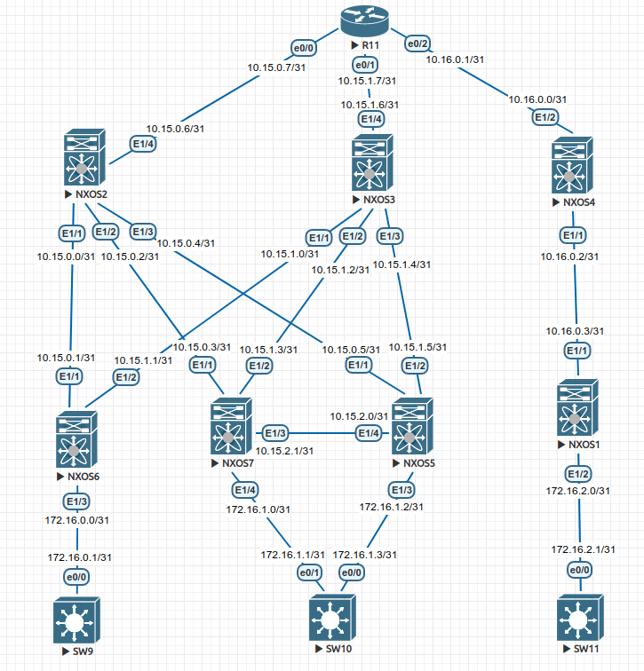

# Address Space Design

**Objective:** Build a CLOS topology and distribute the address space.

**Lab tasks:**

1. Build a CLOS topology with 3 Spine and 4 Leaf switches. 3 Leaf switches connect to 2 Spine switches. 1 Leaf switch connects to the remaining Spine. All Spine switches are interconnected via an additional router (IOL is recommended).
2. Connect Leaf switches to each other for future vPC pair configuration.
3. Add 3 clients to the fabric. One client connects to the vPC pair; the remaining clients connect to the other Leaf switches (IOL images are recommended for clients).
4. Distribute the address space for the Underlay network.
5. Document the work plan, address space, network diagram, and device configurations.

