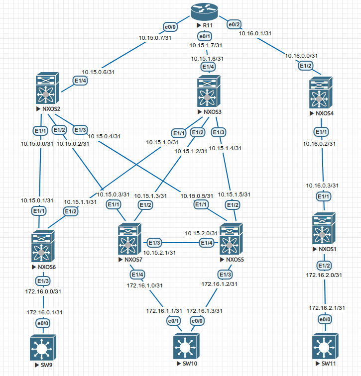

# Designing the address space

**Goal: Build a CLOS circuit; Allocate address space;** 

**In this independent work, we expect you to:**

In this independent work, we expect you to be on your own:

1. Assemble a CLOS topology with 3 Spine and 4 Leaf. 3 Leaf connected to 2 Spine. 1 Leaf is connected to the remaining Spine. All Spines are connected through an additional router (IOL is recommended)

2. Leaf must be linked together to further configure the VPC pair

3. Add 3 clients of the future factory. One client is connected to a VPC pair. The remaining clients are connected to the remaining Leaf (it is recommended to use IOL images as clients)

4. Allocate address space for the Underlay network

5. Work plan, address space, network diagram, settings - recorded in the documentation

   

   
