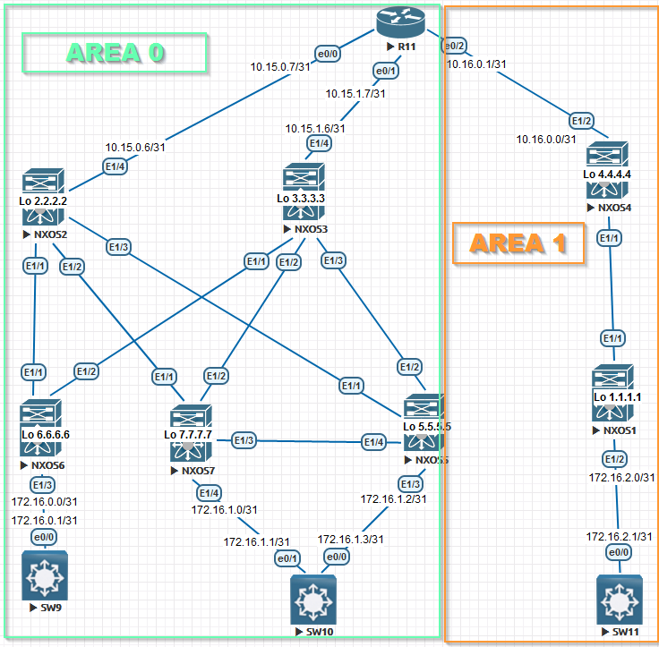

# Underlay. OSPF

Goal: Configure OSPF for the Underlay Network

In this independent work, we expect you to be on your own:

1. Configure OSPF in the Underlay network, for IP connectivity between all NXOS devices
2. The work plan, address space, network diagram, settings are fixed in the documentation


A little introductory information:

We have not 1 DC (Data Center) on the diagram, but 2 DC. Therefore, OSPF zones 0 and 1 will appear, which "conditionally" share our scheme. 
We will also add Loopback interfaces to the devices so that in the future it will be convenient to build an Overlay network through Loopback. First, I specify the device configuration settings, and later the output to show the connectivity between them.



Configuring NEXUS:
 <details>
<summary>NXOS1</summary>
<pre><code>
conf t
! 
hostname NX1
feature ospf
!
router ospf 1
  router-id 1.1.1.1
  passive-interface default
!
interface Ethernet1/1
  no switchport
  medium p2p
  ip unnumbered loopback0
  ip ospf authentication-key OTUS
  ip ospf network point-to-point
  no ip ospf passive-interface
  ip router ospf 1 area 0.0.0.1
  no shutdown
!
interface Ethernet1/2
  no switchport
  ip address 172.16.2.0/31
  ip router ospf 1 area 0.0.0.1
  no shutdown
!
interface loopback0
  ip address 1.1.1.1/24
  ip router ospf 1 area 0.0.0.1
!
end
copy run star 
</code></pre>
</details>


<details>
<summary>NXOS2</summary>
<pre><code>
conf t
!
hostname NX2
feature ospf
!
router ospf 1
  router-id 1.1.1.2
  passive-interface default
!
interface Ethernet1/1
  no switchport
  medium p2p
  ip unnumbered loopback0
  ip ospf authentication-key OTUS
  ip ospf network point-to-point
  no ip ospf passive-interface
  ip router ospf 1 area 0.0.0.0
  no shutdown
!
interface Ethernet1/2
  no switchport
  medium p2p
  ip unnumbered loopback0
  ip ospf authentication-key OTUS
  ip ospf network point-to-point
  no ip ospf passive-interface
  ip router ospf 1 area 0.0.0.0
  no shutdown
!
interface Ethernet1/3
  no switchport
  medium p2p
  ip unnumbered loopback0
  ip ospf authentication-key OTUS
  ip ospf network point-to-point
  no ip ospf passive-interface
  ip router ospf 1 area 0.0.0.0
  no shutdown
!
interface Ethernet1/4
  no switchport
  ip address 10.15.0.6/31
  ip ospf authentication-key OTUS
  ip ospf network point-to-point
  no ip ospf passive-interface
  ip router ospf 1 area 0.0.0.0
  no shutdown
!
interface loopback0
  ip address 1.1.1.2/24
  ip router ospf 1 area 0.0.0.0
!
end
copy run star
</code></pre>
</details>
<details>
  <summary>NXOS3</summary>
<pre><code>
 conf t
!
hostname NX3
feature ospf
!
router ospf 1
  router-id 1.1.1.3
  passive-interface default
!
interface Ethernet1/1
  no switchport
  medium p2p
  ip unnumbered loopback0
  ip ospf authentication-key OTUS
  ip ospf network point-to-point
  no ip ospf passive-interface
  ip router ospf 1 area 0.0.0.0
  no shutdown
!
interface Ethernet1/2
  no switchport
  medium p2p
  ip unnumbered loopback0
  ip ospf authentication-key OTUS
  ip ospf network point-to-point
  no ip ospf passive-interface
  ip router ospf 1 area 0.0.0.0
  no shutdown
!
interface Ethernet1/3
  no switchport
  medium p2p
  ip unnumbered loopback0
  ip ospf authentication-key OTUS
  ip ospf network point-to-point
  no ip ospf passive-interface
  ip router ospf 1 area 0.0.0.0
  no shutdown
!
interface Ethernet1/4
  no switchport
  ip address 10.15.1.6/31
  ip ospf authentication-key OTUS
  ip ospf network point-to-point
  no ip ospf passive-interface
  ip router ospf 1 area 0.0.0.0
  no shutdown
!
interface loopback0
  ip address 1.1.1.3/24
  ip router ospf 1 area 0.0.0.0
!
end
copy run star
</code></pre>
</details>
<details>
  <summary>NXOS4</summary>
<pre><code>
conf t
!
hostname NX4
feature ospf
!
router ospf 1
  router-id 1.1.1.4
  passive-interface default
!
interface Ethernet1/1
  no switchport
  medium p2p
  ip unnumbered loopback0
  ip ospf authentication-key OTUS
  ip ospf network point-to-point
  no ip ospf passive-interface
  ip router ospf 1 area 0.0.0.1
  no shutdown
!
interface Ethernet1/2
  no switchport
  ip address 10.16.0.0/31
  ip ospf authentication-key OTUS
  ip ospf network point-to-point
  no ip ospf passive-interface
  ip router ospf 1 area 0.0.0.1
  no shutdown
!
interface loopback0
  ip address 1.1.1.4/24
  ip router ospf 1 area 0.0.0.1
!
end
copy run star
</code></pre>
</details>
<details>
<summary>NXOS5</summary>
<pre><code>
conf t
!
feature ospf
hostname NX5
!
router ospf 1
  router-id 1.1.1.5
  passive-interface default
!
interface Ethernet1/1
  no switchport
  medium p2p
  ip unnumbered loopback0
  ip ospf authentication-key OTUS
  ip ospf network point-to-point
  no ip ospf passive-interface
  ip router ospf 1 area 0.0.0.0
  no shutdown
!
interface Ethernet1/2
  no switchport
  medium p2p
  ip unnumbered loopback0
  ip ospf authentication-key OTUS
  ip ospf network point-to-point
  no ip ospf passive-interface
  ip router ospf 1 area 0.0.0.0
  no shutdown
!
interface Ethernet1/3
  no switchport
  ip address 172.16.1.2/31
  ip router ospf 1 area 0.0.0.0
  no shutdown
!
interface Ethernet1/4
  no switchport
  medium p2p
  ip unnumbered loopback0
  ip ospf authentication-key OTUS
  ip ospf network point-to-point
  no ip ospf passive-interface
  ip router ospf 1 area 0.0.0.0
  no shutdown
!
interface loopback0
  ip address 1.1.1.5/24
  ip router ospf 1 area 0.0.0.0
!
end
copy run star
 </code></pre>
</details>
<details>
<summary>NXOS6</summary>
<pre><code>
conf t
!
feature ospf
hostname NX6
!
router ospf 1
  router-id 1.1.1.6
  passive-interface default
!
interface Ethernet1/1
  no switchport
  medium p2p
  ip unnumbered loopback0
  ip ospf authentication-key OTUS
  ip ospf network point-to-point
  no ip ospf passive-interface
  ip router ospf 1 area 0.0.0.0
  no shutdown
!
interface Ethernet1/2
  no switchport
  medium p2p
  ip unnumbered loopback0
  ip ospf authentication-key OTUS
  ip ospf network point-to-point
  no ip ospf passive-interface
  ip router ospf 1 area 0.0.0.0
  no shutdown
!
interface Ethernet1/3
  no switchport
  ip address 172.16.0.0/31
  ip router ospf 1 area 0.0.0.0
  no shutdown
!
interface loopback0
  ip address 1.1.1.6/24
  ip router ospf 1 area 0.0.0.0
!
end
copy run star
 </code></pre>
</details>
<details>
<summary>NXOS7</summary>
<pre><code>
conf t
hostname NX7
feature ospf
!
router ospf 1
  router-id 1.1.1.7
  passive-interface default
!
interface Ethernet1/1
  no switchport
  medium p2p
  ip unnumbered loopback0
  ip ospf authentication-key OTUS
  ip ospf network point-to-point
  no ip ospf passive-interface
  ip router ospf 1 area 0.0.0.0
  no shutdown
!
interface Ethernet1/2
  no switchport
  medium p2p
  ip unnumbered loopback0
  ip ospf authentication-key OTUS
  ip ospf network point-to-point
  no ip ospf passive-interface
  ip router ospf 1 area 0.0.0.0
  no shutdown
!
interface Ethernet1/3
  no switchport
  medium p2p
  ip unnumbered loopback0
  ip ospf authentication-key OTUS
  ip ospf network point-to-point
  no ip ospf passive-interface
  ip router ospf 1 area 0.0.0.0
  no shutdown
!
interface Ethernet1/4
  no switchport
  ip address 172.16.1.0/31
  ip router ospf 1 area 0.0.0.0
  no shutdown
!
interface loopback0
  ip address 1.1.1.7/24
  ip router ospf 1 area 0.0.0.0
!
end
copy run star
</code></pre>
</details>
<details>
<summary>Роутер R11</summary>
<pre><code>
enable
configure terminal
!
hostname R11
line con 0
exec-t 0 0
exit
no ip domain loo
!
router ospf 1
router-id 1.1.1.11
!
interface e0/0
ip addr 10.15.0.7 255.255.255.254
ip ospf authentication-key OTUS
ip ospf 1 area 0
ip ospf network point-to-point
duplex full
no sh
exit
!
interface e0/1
ip addr 10.15.1.7 255.255.255.254
ip ospf authentication-key OTUS
ip ospf 1 area 0
ip ospf network point-to-point
duplex full
no sh
exit
!
interface e0/2
ip addr 10.16.0.1 255.255.255.254
ip ospf authentication-key OTUS
ip ospf network point-to-point
ip ospf 1 area 1
duplex full
no sh
!
interface loopback0
ip address 1.1.1.11 255.255.255.0
ip ospf 1 area 0
!
end
wr
</code></pre>
</details>
 

Next, the settings of client devices will go:

<details>
<summary>SW11</summary>
<pre><code>
enable
configure terminal
!
hostname SW11
line con 0
exec-t 0 0
exit
no ip domain loo
!
interface e0/0
no sw
ip addr 172.16.2.1 255.255.255.254
duplex full
no sh
exit
!
ip route 0.0.0.0 0.0.0.0 172.16.2.0 
end
wr
 </code></pre>
</details>
<details>
<summary>SW10</summary>
<pre><code>
enable
configure terminal
!
hostname SW10
line con 0
exec-t 0 0
exit
no ip domain loo
!
interface e0/0
no sw
ip addr 172.16.1.3 255.255.255.254
duplex full
no sh
exit
!
interface e0/1
no sw
ip addr 172.16.1.1 255.255.255.254
duplex full
no sh
exit
!
!
ip sla 1
icmp-echo 172.16.1.2 source-interface e0/0
frequency 10
ip sla schedule 1 start-time now life forever 
track 1 ip sla 1 reachability
ip route 0.0.0.0 0.0.0.0 172.16.1.2 track 1
!
ip route 0.0.0.0 0.0.0.0 172.16.1.0 10
end
wr
</code></pre>
</details> 
<details>
<summary>SW9</summary>
<pre><code>
enable
configure terminal
!
hostname SW9
line con 0
exec-t 0 0
exit
no ip domain loo
!
interface e0/0
no sw
ip addr 172.16.0.1 255.255.255.254
duplex full
no sh
exit
!
ip route 0.0.0.0 0.0.0.0 172.16.0.0 
end
wr
</code></pre>
</details> 

Output of multiple devices after configuration:

```
 R11#show ip route ospf    
Codes: L - local, C - connected, S - static, R - RIP, M - mobile, B - BGP
       D - EIGRP, EX - EIGRP external, O - OSPF, IA - OSPF inter area 
       N1 - OSPF NSSA external type 1, N2 - OSPF NSSA external type 2
       E1 - OSPF external type 1, E2 - OSPF external type 2
       i - IS-IS, su - IS-IS summary, L1 - IS-IS level-1, L2 - IS-IS level-2
       ia - IS-IS inter area,  - candidate default, U - per-user static route
       o - ODR, P - periodic downloaded static route, H - NHRP, l - LISP
       + - replicated route, % - next hop override

Gateway of last resort is not set

      1.0.0.0/8 is variably subnetted, 9 subnets, 2 masks
O        1.1.1.1/32 [110/51] via 10.16.0.0, 02:11:18, Ethernet0/2
O        1.1.1.2/32 [110/11] via 10.15.0.6, 02:06:47, Ethernet0/0
O        1.1.1.3/32 [110/11] via 10.15.1.6, 02:12:53, Ethernet0/1
O        1.1.1.4/32 [110/11] via 10.16.0.0, 02:12:53, Ethernet0/2
O        1.1.1.5/32 [110/51] via 10.15.1.6, 02:12:53, Ethernet0/1
                    [110/51] via 10.15.0.6, 02:12:43, Ethernet0/0
O        1.1.1.6/32 [110/51] via 10.15.1.6, 02:12:53, Ethernet0/1
                    [110/51] via 10.15.0.6, 02:12:43, Ethernet0/0
O        1.1.1.7/32 [110/51] via 10.15.1.6, 02:12:53, Ethernet0/1
                    [110/51] via 10.15.0.6, 02:12:43, Ethernet0/0
      172.16.0.0/31 is subnetted, 4 subnets
O        172.16.0.0 [110/90] via 10.15.1.6, 02:12:53, Ethernet0/1
                    [110/90] via 10.15.0.6, 02:12:43, Ethernet0/0
O        172.16.1.0 [110/90] via 10.15.1.6, 02:12:53, Ethernet0/1
                    [110/90] via 10.15.0.6, 02:12:43, Ethernet0/0
O        172.16.1.2 [110/90] via 10.15.1.6, 02:02:32, Ethernet0/1
                    [110/90] via 10.15.0.6, 02:02:32, Ethernet0/0
O        172.16.2.0 [110/90] via 10.16.0.0, 02:11:18, Ethernet0/2
R11# show ip ospf neighbor

Neighbor ID     Pri   State           Dead Time   Address         Interface
1.1.1.3           0   FULL/  -        00:00:36    10.15.1.6       Ethernet0/1
1.1.1.2           0   FULL/  -        00:00:37    10.15.0.6       Ethernet0/0
1.1.1.4           0   FULL/  -        00:00:38    10.16.0.0       Ethernet0/2
```


Next, I will indicate the output of the neighborhood by OSPF:

NXOS4

```
NX4# show ip ospf neighbors 
 OSPF Process ID 1 VRF default
 Total number of neighbors: 2
 Neighbor ID     Pri State            Up Time  Address         Interface
 1.1.1.1           1 FULL/ -          02:16:54 1.1.1.1         Eth1/1 
 1.1.1.11          1 FULL/ -          02:18:16 10.16.0.1       Eth1/2 
```

NXOS3

```
NX3# show ip ospf neighbors 
 OSPF Process ID 1 VRF default
 Total number of neighbors: 4
 Neighbor ID     Pri State            Up Time  Address         Interface
 1.1.1.6           1 FULL/ -          03:13:18 1.1.1.6         Eth1/1 
 1.1.1.7           1 FULL/ -          02:47:30 1.1.1.7         Eth1/2 
 1.1.1.5           1 FULL/ -          02:47:33 1.1.1.5         Eth1/3 
 1.1.1.11          1 FULL/ -          02:18:51 10.15.1.7       Eth1/4
```


NXOS2

```
NX2# show ip ospf neighbors 
 OSPF Process ID 1 VRF default
 Total number of neighbors: 4
 Neighbor ID     Pri State            Up Time  Address         Interface
 1.1.1.6           1 FULL/ -          02:56:17 1.1.1.6         Eth1/1 
 1.1.1.7           1 FULL/ -          02:54:03 1.1.1.7         Eth1/2 
 1.1.1.5           1 FULL/ -          02:50:40 1.1.1.5         Eth1/3 
 1.1.1.11          1 FULL/ -          02:19:07 10.15.0.7       Eth1/4
```

Let's check the connection between the DC:

SW9

```
SW9#ping 172.16.2.1 repeat 100
Type escape sequence to abort.
Sending 100, 100-byte ICMP Echos to 172.16.2.1, timeout is 2 seconds:
!!!!!!!!!!!!!!!!!!!!!!!!!!!!!!!!!!!!!!!!!!!!!!!!!!!!!!!!!!!!!!!!!!!!!!
!!!!!!!!!!!!!!!!!!!!!!!!!!!!!!
Success rate is 100 percent (100/100), round-trip min/avg/max = 9/11/19 ms
SW9#traceroute 172.16.2.1
Type escape sequence to abort.
Tracing the route to 172.16.2.1
VRF info: (vrf in name/id, vrf out name/id)
  1 172.16.0.0 2 msec 1 msec 1 msec
  2 1.1.1.2 3 msec 4 msec
    1.1.1.3 4 msec
  3 10.15.0.7 5 msec
    10.15.1.7 5 msec 7 msec
  4 10.16.0.0 7 msec 7 msec 6 msec
  5 1.1.1.1 9 msec 9 msec 9 msec
  6 172.16.2.1 10 msec   11 msec
```
SW10

```
SW10#traceroute 172.16.0.1
Type escape sequence to abort.
Tracing the route to 172.16.0.1
VRF info: (vrf in name/id, vrf out name/id)
  1 172.16.1.2 2 msec 1 msec 2 msec
  2 1.1.1.3 4 msec
    1.1.1.2 5 msec
    1.1.1.3 3 msec
  3 1.1.1.6 6 msec 7 msec 7 msec
  4 172.16.0.1 9 msec   9 msec
SW10#traceroute 172.16.2.1
Type escape sequence to abort.
Tracing the route to 172.16.2.1
VRF info: (vrf in name/id, vrf out name/id)
  1 172.16.1.2 2 msec 2 msec 1 msec
  2 1.1.1.3 3 msec
    1.1.1.2 4 msec
    1.1.1.3 4 msec
  3 10.15.0.7 5 msec 4 msec 4 msec
  4 10.16.0.0 5 msec 7 msec 6 msec
  5 1.1.1.1 9 msec 9 msec 9 msec
  6 172.16.2.1 14 msec   15 msec
```
SW11

```
SW11#ping 172.16.0.1 repeat 100
Type escape sequence to abort.
Sending 100, 100-byte ICMP Echos to 172.16.0.1, timeout is 2 seconds:
!!!!!!!!!!!!!!!!!!!!!!!!!!!!!!!!!!!!!!!!!!!!!!!!!!!!!!!!!!!!!!!!!!!!!!
!!!!!!!!!!!!!!!!!!!!!!!!!!!!!!
Success rate is 100 percent (100/100), round-trip min/avg/max = 9/10/14 ms
```

Conclusion:

A conditional network for two DC has been built, the OSPF protocol is working , communication between the endpoints of the network is present.