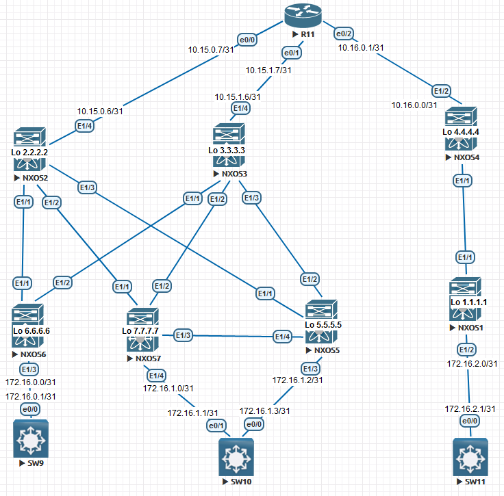

Проектирование адресного пространства

Цель: Настроить OSPF для Underlay сети

В этой самостоятельной работе мы ожидаем, что вы самостоятельно:

1. настроить OSPF в Underlay сети, для IP связанности между всеми устройствами NXOS
2. План работы, адресное пространство, схема сети, настройки - зафиксированы в документации



Настройка NEXUS:

 NXOS1

```
configure terminal
feature ospf

router ospf 1
router-id 1.1.1.1
passive-interface default

int e1/1
no sw
ip addr 10.16.0.3/31
ip router ospf 1 area 0
no ip ospf passive-interface
ip ospf network point-to-point
no shutdown

int e1/2
no sw
ip addr 172.16.2.0/31
ip router ospf 1 area 0
no shutdown

end
copy run star
```

NXOS2

```
conf t
feature ospf

router ospf 1
router-id 2.2.2.2
passive-interface default

int e1/1
no switchport
ip addr 10.15.0.0/31
ip router ospf 1 area 0
no ip ospf passive-interface
ip ospf network point-to-point
no shutdown

int e1/2
no switchport
ip addr 10.15.0.2/31
ip router ospf 1 area 0
no ip ospf passive-interface
ip ospf network point-to-point
no shutdown

int e1/3
no switchport
ip addr 10.15.0.4/31
ip router ospf 1 area 0
no ip ospf passive-interface
ip ospf network point-to-point
no shutdown

int e1/4
no switchport
ip addr 10.15.0.6/31
ip router ospf 1 area 0
no ip ospf passive-interface
ip ospf network point-to-point
no shutdown

exit

end
copy run star
```

NXOS3

```
conf t
feature ospf

router ospf 1
router-id 3.3.3.3
passive-interface default

int e1/1
no switchport
ip addr 10.15.1.0/31
ip router ospf 1 area 0
no ip ospf passive-interface
ip ospf network point-to-point
no shutdown

int e1/2
no switchport
ip addr 10.15.1.2/31
ip router ospf 1 area 0
no ip ospf passive-interface
ip ospf network point-to-point
no shutdown

int e1/3
no switchport
ip addr 10.15.1.4/31
ip router ospf 1 area 0
no ip ospf passive-interface
ip ospf network point-to-point
no shutdown

int e1/4
no switchport
ip addr 10.15.1.6/31
ip router ospf 1 area 0
no ip ospf passive-interface
ip ospf network point-to-point
no shutdown

exit

end
copy run star
```

NXOS4

```
conf t
feature ospf

router ospf 1
router-id 4.4.4.4
passive-interface default

int e1/1
no sw
ip addr 10.16.0.2/31
ip router ospf 1 area 0
no ip ospf passive-interface
ip ospf network point-to-point
no shutdown

int e1/2
no sw
ip addr 10.16.0.0/31
no ip ospf passive-interface
ip ospf network point-to-point
ip router ospf 1 area 0
no shutdown

end
copy run star
```

NXOS5

```
conf t
feature ospf

router ospf 1
router-id 5.5.5.5
passive-interface default

int e1/1
no sw
ip addr 10.15.0.5/31
ip ospf network point-to-point
ip router ospf 1 area 0
no ip ospf passive-interface
no sh

int e1/2
no sw
ip addr 10.15.1.5/31
ip ospf network point-to-point
ip router ospf 1 area 0
no ip ospf passive-interface
no sh

int e1/3
no sw
ip addr 172.16.1.2/31
ip router ospf 1 area 0
no sh

int e1/4
no sw
ip addr 10.15.2.0/31
ip router ospf 1 area 0
no ip ospf passive-interface
ip ospf network point-to-point 
no sh

exit

end
copy run star
```

NXOS6

```
conf t
feature ospf

router ospf 1
router-id 6.6.6.6
passive-interface default

int e1/1
no switchport
ip addr 10.15.0.1/31
ip router ospf 1 area 0
no ip ospf passive-interface
ip ospf network point-to-point
no shutdown

int e1/2
no switchport
ip addr 10.15.1.1/31
ip router ospf 1 area 0
no ip ospf passive-interface
ip ospf network point-to-point
no shutdown

int e1/3
no switchport
ip addr 172.16.1.6/30
ip router ospf 1 area 0
no shutdown

exit

end
copy run star
```

NXOS7

```
conf t
feature ospf

router ospf 1
router-id 7.7.7.7
passive-interface default

int e1/1
no sw
ip addr 10.15.0.3/31
ip ospf network point-to-point
ip router ospf 1 area 0
no ip ospf passive-interface
no sh

int e1/2
no sw
ip addr 10.15.1.3/31
ip ospf network point-to-point
ip router ospf 1 area 0
no ip ospf passive-interface
no sh

int e1/3
no sw
ip addr 10.15.2.1/31
ip router ospf 1 area 0
ip ospf network point-to-point
no ip ospf passive-interface
no sh

int e1/4
no sw
ip addr 172.16.1.0/31
ip router ospf 1 area 0
no sh

exit

end
copy run star
```

Роутер R11

```
enable
configure terminal

router ospf 1
router-id 11.11.11.11

interface e0/0
ip addr 10.15.0.7 255.255.255.254
ip ospf 1 area 0
ip ospf network point-to-point
duplex full
no sh
exit

interface e0/1
ip addr 10.15.1.7 255.255.255.254
ip ospf 1 area 0
ip ospf network point-to-point
duplex full
no sh
exit

interface e0/2
ip addr 10.16.0.1 255.255.255.254
ip ospf network point-to-point
ip ospf 1 area 0
duplex full
no sh

end
wr
```

Далее пойдут настройки клиентских устройств:

SW11

```
enable
configure terminal

interface e0/0
no sw
ip addr 172.16.2.1 255.255.255.254
duplex full
no sh
exit

ip route 0.0.0.0 0.0.0.0 172.16.2.0 
end
wr
```

SW10

```
enable
configure terminal

interface e0/0
no sw
ip addr 172.16.1.3 255.255.255.254
duplex full
no sh
exit

interface e0/1
no sw
ip addr 172.16.1.1 255.255.255.254
duplex full
no sh
exit

ip sla 1
icmp-echo 172.16.1.2 source-interface e0/0
frequency 10
ip sla schedule 1 start-time now life forever 
track 1 ip sla 1 reachability
ip route 0.0.0.0 0.0.0.0 172.16.1.2 track 1

ip route 0.0.0.0 0.0.0.0 172.16.1.0 10
end
wr
```

SW9

```
enable
configure terminal

interface e0/0
no sw
ip addr 172.16.0.1 255.255.255.254
duplex full
no sh
exit

ip route 0.0.0.0 0.0.0.0 172.16.0.0 
end
wr
```

