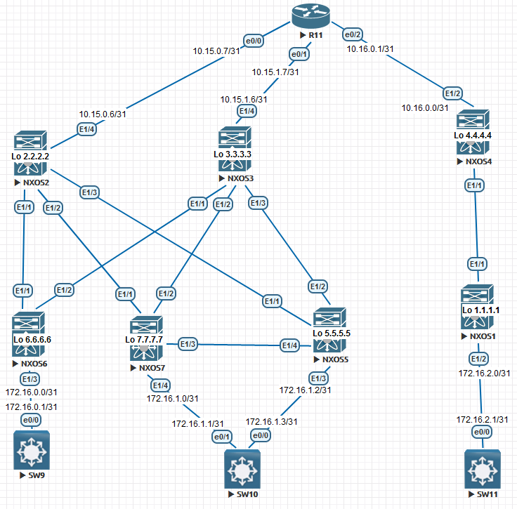
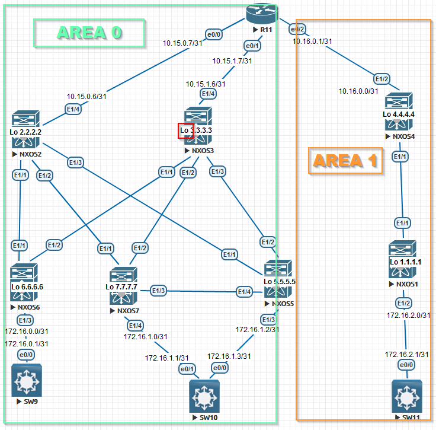

Проектирование адресного пространства

Цель: Настроить OSPF для Underlay сети

В этой самостоятельной работе мы ожидаем, что вы самостоятельно:

1. настроить OSPF в Underlay сети, для IP связанности между всеми устройствами NXOS
2. План работы, адресное пространство, схема сети, настройки - зафиксированы в документации



Немного вводной информации:

У нас на схеме не 1 DC(Data Center) , а 2 DC. Поэтому появятся зоны 0 и 1 OSPF ,которые разделят "уcловно" нашу схему. 
Добавим также на устройства Loopback интерфейсы , чтобы  в дальнейшем через Loopback'и было удобно строить Overlay сеть. Вначале указываю настройки конфигурации устройств ,а позже вывод ,чтобы показать связанность между ними.



Настройка NEXUS:

 <details><summary>NXOS1</summary>

```
conf t

host NX1
feature ospf

router ospf 1
router-id 1.1.1.1
passive-interface default

int e1/1
no sw
ip addr 10.16.0.3/31
ip router ospf 1 area 1
no ip ospf passive-interface
ip ospf network point-to-point
no shutdown

int e1/2
no sw
ip addr 172.16.2.0/31
ip router ospf 1 area 1
no shutdown

interface loopback0
ip address 1.1.1.1/24
ip router ospf 1 area 0.0.0.1

end
copy run star
```

```
</details>
```

```
<details><summary>NXOS2</summary>
```

```
 conf t

host NX2
feature ospf

router ospf 1
router-id 1.1.1.2
passive-interface default

int e1/1
no switchport
ip addr 10.15.0.0/31
ip router ospf 1 area 0
no ip ospf passive-interface
ip ospf network point-to-point
no shutdown

int e1/2
no switchport
ip addr 10.15.0.2/31
ip router ospf 1 area 0
no ip ospf passive-interface
ip ospf network point-to-point
no shutdown

int e1/3
no switchport
ip addr 10.15.0.4/31
ip router ospf 1 area 0
no ip ospf passive-interface
ip ospf network point-to-point
no shutdown

int e1/4
no switchport
ip addr 10.15.0.6/31
ip router ospf 1 area 0
no ip ospf passive-interface
ip ospf network point-to-point
no shutdown
exit

interface loopback0
ip address 1.1.1.2/24
ip router ospf 1 area 0

end
copy run star
```

</details>

NXOS3

```
conf t

host NX3
feature ospf

router ospf 1
router-id 1.1.1.3
passive-interface default

int e1/1
no switchport
ip addr 10.15.1.0/31
ip router ospf 1 area 0
no ip ospf passive-interface
ip ospf network point-to-point
no shutdown

int e1/2
no switchport
ip addr 10.15.1.2/31
ip router ospf 1 area 0
no ip ospf passive-interface
ip ospf network point-to-point
no shutdown

int e1/3
no switchport
ip addr 10.15.1.4/31
ip router ospf 1 area 0
no ip ospf passive-interface
ip ospf network point-to-point
no shutdown

int e1/4
no switchport
ip addr 10.15.1.6/31
ip router ospf 1 area 0
no ip ospf passive-interface
ip ospf network point-to-point
no shutdown
exit

interface loopback0
ip address 1.1.1.3/24
ip router ospf 1 area 0

end
copy run star
```

NXOS4

```
conf t

host NX4
feature ospf

router ospf 1
router-id 1.1.1.4
passive-interface default

int e1/1
no sw
ip addr 10.16.0.2/31
ip router ospf 1 area 1
no ip ospf passive-interface
ip ospf network point-to-point
no shutdown

int e1/2
no sw
ip addr 10.16.0.0/31
no ip ospf passive-interface
ip ospf network point-to-point
ip router ospf 1 area 1
no shutdown


interface loopback0
ip address 1.1.1.4/24
ip router ospf 1 area 0.0.0.1

end
copy run star
```

NXOS5

```
conf t

feature ospf
host NX5

router ospf 1
router-id 1.1.1.5
passive-interface default

int e1/1
no sw
ip addr 10.15.0.5/31
ip ospf network point-to-point
ip router ospf 1 area 0
no ip ospf passive-interface
no sh

int e1/2
no sw
ip addr 10.15.1.5/31
ip ospf network point-to-point
ip router ospf 1 area 0
no ip ospf passive-interface
no sh

int e1/3
no sw
ip addr 172.16.1.2/31
ip router ospf 1 area 0
no sh

int e1/4
no sw
ip addr 10.15.2.0/31
ip router ospf 1 area 0
no ip ospf passive-interface
ip ospf network point-to-point 
no sh
exit

interface loopback0
ip address 1.1.1.5/24
ip router ospf 1 area 0

end
copy run star
```

NXOS6

```
 
conf t

feature ospf
host NX6

router ospf 1
router-id 1.1.1.6
passive-interface default

int e1/1
no switchport
ip addr 10.15.0.1/31
ip router ospf 1 area 0
no ip ospf passive-interface
ip ospf network point-to-point
no shutdown

int e1/2
no switchport
ip addr 10.15.1.1/31
ip router ospf 1 area 0
no ip ospf passive-interface
ip ospf network point-to-point
no shutdown

int e1/3
no switchport
ip addr 172.16.0.0/30
ip router ospf 1 area 0
no shutdown
exit

interface loopback0
ip address 1.1.1.6/24
ip router ospf 1 area 0

end
copy run star
```

NXOS7

```
conf t
host NX7
feature ospf

router ospf 1
router-id 1.1.1.7
passive-interface default

int e1/1
no sw
ip addr 10.15.0.3/31
ip ospf network point-to-point
ip router ospf 1 area 0
no ip ospf passive-interface
no sh

int e1/2
no sw
ip addr 10.15.1.3/31
ip ospf network point-to-point
ip router ospf 1 area 0
no ip ospf passive-interface
no sh

int e1/3
no sw
ip addr 10.15.2.1/31
ip router ospf 1 area 0
ip ospf network point-to-point
no ip ospf passive-interface
no sh


int e1/4
no sw
ip addr 172.16.1.0/31
ip router ospf 1 area 0
no sh
exit

interface loopback0
ip address 1.1.1.7/24
ip router ospf 1 area 0

end
copy run star
```

Роутер R11

```
enable
configure terminal

host R11
line con 0
exec-t 0 0
exit
no ip domain loo

router ospf 1
router-id 1.1.1.11

interface e0/0
ip addr 10.15.0.7 255.255.255.254
ip ospf 1 area 0
ip ospf network point-to-point
duplex full
no sh
exit

interface e0/1
ip addr 10.15.1.7 255.255.255.254
ip ospf 1 area 0
ip ospf network point-to-point
duplex full
no sh
exit

interface e0/2
ip addr 10.16.0.1 255.255.255.254
ip ospf network point-to-point
ip ospf 1 area 1
duplex full
no sh

interface loopback0
ip address 1.1.1.11 255.255.255.0
ip ospf 1 area 0

end
wr
```

Далее пойдут настройки клиентских устройств:

SW11

```
enable
configure terminal

host SW11
line con 0
exec-t 0 0
exit
no ip domain loo

interface e0/0
no sw
ip addr 172.16.2.1 255.255.255.254
duplex full
no sh
exit

ip route 0.0.0.0 0.0.0.0 172.16.2.0 
end
wr
```

SW10

```
enable
configure terminal

host SW10
line con 0
exec-t 0 0
exit
no ip domain loo

interface e0/0
no sw
ip addr 172.16.1.3 255.255.255.254
duplex full
no sh
exit

interface e0/1
no sw
ip addr 172.16.1.1 255.255.255.254
duplex full
no sh
exit


ip sla 1
icmp-echo 172.16.1.2 source-interface e0/0
frequency 10
ip sla schedule 1 start-time now life forever 
track 1 ip sla 1 reachability
ip route 0.0.0.0 0.0.0.0 172.16.1.2 track 1

ip route 0.0.0.0 0.0.0.0 172.16.1.0 10
end
wr
```

SW9

```
enable
configure terminal

host SW9
line con 0
exec-t 0 0
exit
no ip domain loo

interface e0/0
no sw
ip addr 172.16.0.1 255.255.255.254
duplex full
no sh
exit

ip route 0.0.0.0 0.0.0.0 172.16.0.0 
end
wr
```


Вывод  нескольких устройств:

```
R11#show ip route ospf
Codes: L - local, C - connected, S - static, R - RIP, M - mobile, B - BGP
       D - EIGRP, EX - EIGRP external, O - OSPF, IA - OSPF inter area 
       N1 - OSPF NSSA external type 1, N2 - OSPF NSSA external type 2
       E1 - OSPF external type 1, E2 - OSPF external type 2
       i - IS-IS, su - IS-IS summary, L1 - IS-IS level-1, L2 - IS-IS level-2
       ia - IS-IS inter area, * - candidate default, U - per-user static route
       o - ODR, P - periodic downloaded static route, H - NHRP, l - LISP
       a - application route
       + - replicated route, % - next hop override

Gateway of last resort is not set

     1.0.0.0/8 is variably subnetted, 9 subnets, 2 masks
O        1.1.1.1/32 [110/51] via 10.16.0.0, 01:03:22, Ethernet0/2
O        1.1.1.2/32 [110/11] via 10.15.0.6, 00:51:38, Ethernet0/0
O        1.1.1.3/32 [110/11] via 10.15.1.6, 00:49:44, Ethernet0/1
O        1.1.1.4/32 [110/11] via 10.16.0.0, 00:52:55, Ethernet0/2
O        1.1.1.5/32 [110/51] via 10.15.1.6, 00:48:39, Ethernet0/1
                    [110/51] via 10.15.0.6, 00:48:39, Ethernet0/0
O        1.1.1.6/32 [110/51] via 10.15.1.6, 00:46:46, Ethernet0/1
                    [110/51] via 10.15.0.6, 00:46:46, Ethernet0/0
O        1.1.1.7/32 [110/51] via 10.15.1.6, 00:45:56, Ethernet0/1
                    [110/51] via 10.15.0.6, 00:45:56, Ethernet0/0
      10.0.0.0/8 is variably subnetted, 14 subnets, 2 masks
O        10.15.0.0/31 [110/50] via 10.15.0.6, 01:05:51, Ethernet0/0
O        10.15.0.2/31 [110/50] via 10.15.0.6, 01:05:51, Ethernet0/0
O        10.15.0.4/31 [110/50] via 10.15.0.6, 01:05:51, Ethernet0/0
O        10.15.1.0/31 [110/50] via 10.15.1.6, 00:49:44, Ethernet0/1
O        10.15.1.2/31 [110/50] via 10.15.1.6, 00:49:44, Ethernet0/1
O        10.15.1.4/31 [110/50] via 10.15.1.6, 00:49:44, Ethernet0/1
O        10.15.2.0/31 [110/90] via 10.15.1.6, 00:49:16, Ethernet0/1
                      [110/90] via 10.15.0.6, 01:05:51, Ethernet0/0
O        10.16.0.2/31 [110/50] via 10.16.0.0, 01:05:36, Ethernet0/2
      172.16.0.0/16 is variably subnetted, 3 subnets, 2 masks
O        172.16.1.0/31 [110/90] via 10.15.1.6, 00:45:56, Ethernet0/1
                       [110/90] via 10.15.0.6, 00:45:56, Ethernet0/0
O        172.16.1.2/31 [110/90] via 10.15.1.6, 00:49:16, Ethernet0/1
                       [110/90] via 10.15.0.6, 01:05:51, Ethernet0/0
O        172.16.1.4/30 [110/90] via 10.15.1.6, 00:46:46, Ethernet0/1
                       [110/90] via 10.15.0.6, 00:46:46, Ethernet0/0


R11#show ip ospf neighbor 

Neighbor ID     Pri   State           Dead Time   Address         Interface
1.1.1.3           0   FULL/  -        00:00:37    10.15.1.6       Ethernet0/1
1.1.1.2           0   FULL/  -        00:00:39    10.15.0.6       Ethernet0/0
1.1.1.4           0   FULL/  -        00:00:38    10.16.0.0       Ethernet0/2
```

Далее укажу вывод соседства по OSPF:

NXOS4

```
NX4# show ip ospf neighbors 
 OSPF Process ID 1 VRF default
 Total number of neighbors: 2
 Neighbor ID     Pri State            Up Time  Address         Interface
 1.1.1.1           1 FULL/ -          00:04:01 10.16.0.3       Eth1/1
 1.1.1.11          1 FULL/ -          00:02:13 10.16.0.1       Eth1/2
```

NXOS3

```
NX3# show ip ospf neighbors 
 OSPF Process ID 1 VRF default
 Total number of neighbors: 4
 Neighbor ID     Pri State            Up Time  Address         Interface
 1.1.1.6           1 FULL/ -          00:04:14 10.15.1.1       Eth1/1
 1.1.1.7           1 FULL/ -          00:02:28 10.15.1.3       Eth1/2
 1.1.1.5           1 FULL/ -          00:03:04 10.15.1.5       Eth1/3
 1.1.1.11          1 FULL/ -          00:01:48 10.15.1.7       Eth1/4
```

NXOS2

```
NX2# show ip ospf neighbors 
 OSPF Process ID 1 VRF default
 Total number of neighbors: 4
 Neighbor ID     Pri State            Up Time  Address         Interface
 1.1.1.6           1 FULL/ -          00:00:05 10.15.0.1       Eth1/1
 1.1.1.7           1 FULL/ -          00:00:03 10.15.0.3       Eth1/2
 1.1.1.5           1 FULL/ -          00:00:04 10.15.0.5       Eth1/3
 1.1.1.11          1 FULL/ -          00:00:12 10.15.0.7       Eth1/4
```


Проверим связь между ДЦ:

SW9

```
SW9#ping 172.16.2.1 repeat 100
Type escape sequence to abort.
Sending 100, 100-byte ICMP Echos to 172.16.2.1, timeout is 2 seconds:
!!!!!!!!!!!!!!!!!!!!!!!!!!!!!!!!!!!!!!!!!!!!!!!!!!!!!!!!!!!!!!!!!!!!!!
!!!!!!!!!!!!!!!!!!!!!!!!!!!!!!
Success rate is 100 percent (100/100), round-trip min/avg/max = 21/48/143 ms
```

SW11

```
SW11#ping 172.16.0.1 repeat 100
Type escape sequence to abort.
Sending 100, 100-byte ICMP Echos to 172.16.0.1, timeout is 2 seconds:
!!!!!!!!!!!!!!!!!!!!!!!!!!!!!!!!!!!!!!!!!!!!!!!!!!!!!!!!!!!!!!!!!!!!!!
!!!!!!!!!!!!!!!!!!!!!!!!!!!!!!
Success rate is 100 percent (100/100), round-trip min/avg/max = 18/44/193 ms
```


Вывод:

Условная сеть для двух ДЦ была построена , протокол OSPF работает , связь между конечными точками сети присутствует.   