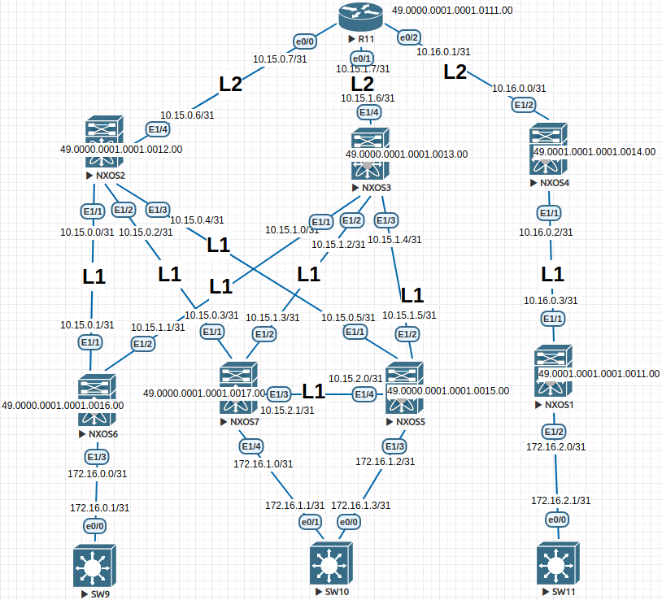

## Домашнее задание

Underlay. IS-IS

Goal: Configure ISIS for the Underlay Network

In this independent work, we expect you to be on your own:

1. Configure ISIS in the Underlay network, for IP connectivity between all NXOS devices
2. The work plan, address space, network diagram, settings are fixed in the documentation



A little introductory information:

The NXOS2 and NXOS3 switches will be located in ISIS area 0 (0000), hence the LEAF below is similarly in the same zone. R11 is a connecting router that will be located in area 0 and transmit routes towards NXOS4 where area 1 (0001) is located.  Basically, the routes will be transmitted as indicated in the diagram, the exception will be Loopback interfaces, which will be transmitted L1/L2, so as not to remember Connected networks.

Configuring NEXUS:

<details>
<summary>NXOS1</summary>
<pre><code>
configure terminal
hostname NX1
!
feature isis
!
router isis 1
  net 49.0001.0001.0001.0011.00
  is-type level-1
  log-adjacency-changes
!
no ip domain-lookup
!
interface Ethernet1/1
  no switchport
  ip address 10.16.0.3/31
  isis network point-to-point
  isis circuit-type level-1
  ip router isis 1
  no shutdown
!
interface Ethernet1/2
  no switchport
  ip address 172.16.2.0/31
  default isis passive-interface 
  isis network point-to-point
  isis circuit-type level-1
  ip router isis 1
  no shutdown
!
interface loopback0
  ip address 1.1.1.1/32
  isis circuit-type level-1
  ip router isis 1
!
end
copy run star
</code></pre>
</details>

<details>
<summary>NXOS2</summary>
<pre><code>
configure terminal
hostname NX2
!
feature isis
!
router isis 1
  net 49.0000.0001.0001.0012.00
  distribute level-1 into level-2 all
  summary-address 10.15.0.0/24 level-1-2
  is-type level-1-2
  log-adjacency-changes
!
no ip domain-lookup
!
interface Ethernet1/1
  no switchport
  ip address 10.15.0.0/31
  isis network point-to-point
  isis circuit-type level-1
  ip router isis 1
  no shutdown
!
interface Ethernet1/2
  no switchport
  ip address 10.15.0.2/31
  isis network point-to-point
  isis circuit-type level-1
  ip router isis 1
  no shutdown
!
interface Ethernet1/3
  no switchport
  ip address 10.15.0.4/31
  isis network point-to-point
  isis circuit-type level-1
  ip router isis 1
  no shutdown
!
interface Ethernet1/4
  no switchport
  ip address 10.15.0.6/31
  isis network point-to-point
  isis circuit-type level-2
  ip router isis 1
  no shutdown
!
interface loopback0
  ip address 1.1.1.2/32
  isis circuit-type level-2
  ip router isis 1
!
end
copy run star
</code></pre>
</details>

<details>
<summary>NXOS3</summary>
<pre><code>
configure terminal 
hostname NX3
!
feature isis
!
router isis 1
  net 49.0000.0001.0001.0013.00
  is-type level-1-2
  distribute level-1 into level-2 all
  summary-address 10.15.1.0/24 level-1-2
  log-adjacency-changes
!
no ip domain-lookup
!
interface Ethernet1/1
  no switchport
  ip address 10.15.1.0/31
  isis network point-to-point
  isis circuit-type level-1
  ip router isis 1
  no shutdown
!
interface Ethernet1/2
  no switchport
  ip address 10.15.1.2/31
  isis network point-to-point
  isis circuit-type level-1
  ip router isis 1
  no shutdown
!
interface Ethernet1/3
  no switchport
  ip address 10.15.1.4/31
  isis network point-to-point
  isis circuit-type level-1
  ip router isis 1
  no shutdown
!
interface Ethernet1/4
  no switchport
  ip address 10.15.1.6/31
  isis network point-to-point
  isis circuit-type level-2
  ip router isis 1
  no shutdown
!
interface loopback0
  ip address 1.1.1.3/32
  isis circuit-type level-2
  ip router isis 1
!
end
copy run star
</code></pre>
</details>

<details>
<summary>NXOS4</summary>
<pre><code>
configure terminal
hostname NX4
!
no feature isis
feature isis
!
router isis 1
  net 49.0001.0001.0001.0014.00
  distribute level-1 into level-2 all
  summary-address 10.16.0.0/24 level-1-2
  is-type level-1-2
  log-adjacency-changes
!
no ip domain-lookup
!
interface Ethernet1/1
  no switchport
  ip address 10.16.0.2/31
  isis network point-to-point
  isis circuit-type level-1
  ip router isis 1
  no shutdown
!
interface Ethernet1/2
  no switchport
  ip address 10.16.0.0/31
  isis network point-to-point
  isis circuit-type level-2
  ip router isis 1
  no shutdown
!
interface loopback0
  ip address 1.1.1.4/32
  isis circuit-type level-1
  ip router isis 1
!
end
copy run star
</code></pre>
</details>

<details>
<summary>NXOS5</summary>
<pre><code>
configure terminal 
hostname NX5
!
no feature isis
feature isis
!
router isis 1
  net 49.0000.0001.0001.0015.00
  is-type level-1
  log-adjacency-changes
!
ip domain-lookup
!
interface Ethernet1/1
  no switchport
  ip address 10.15.0.5/31
  isis network point-to-point
  isis circuit-type level-1
  ip router isis 1
  no shutdown
!
interface Ethernet1/2
  no switchport
  ip address 10.15.1.5/31
  isis network point-to-point
  isis circuit-type level-1
  ip router isis 1
  no shutdown
!
interface Ethernet1/3
  no switchport
  ip address 172.16.1.2/31
  default isis passive-interface 
  isis network point-to-point
  isis circuit-type level-1
  ip router isis 1
  no shutdown
!
interface Ethernet1/4
  no switchport
  ip address 10.15.2.0/31
  isis network point-to-point
  isis circuit-type level-1
  ip router isis 1
  no shutdown
!
interface loopback0
  ip address 1.1.1.5/32
  isis circuit-type level-1
  ip router isis 1
!
end
copy run star 
</code></pre>
</details>

<details>
<summary>NXOS6</summary>
<pre><code>
configure terminal
hostname NX6
!
no feature isis
feature isis
!
router isis 1
  net 49.0000.0001.0001.0016.00
  is-type level-1
  log-adjacency-changes
!
no ip domain-lookup
!
interface Ethernet1/1
  no switchport
  ip address 10.15.0.1/31
  isis network point-to-point
  isis circuit-type level-1
  ip router isis 1
  no shutdown
!
interface Ethernet1/2
  no switchport
  ip address 10.15.1.1/31
  isis network point-to-point
  isis circuit-type level-1
  ip router isis 1
  no shutdown
!
interface Ethernet1/3
  no switchport
  ip address 172.16.0.0/31
  default isis passive-interface 
  isis network point-to-point
  isis circuit-type level-1
  ip router isis 1
  no shutdown
!
interface loopback0
  ip address 1.1.1.6/32
  isis circuit-type level-1-2
  ip router isis 1
!
end
copy run star 
</code></pre>
</details>

<details>
<summary>NXOS7</summary>
<pre><code>
configure terminal
hostname NX7
!
no feature isis
feature isis
!
router isis 1
  net 49.0000.0001.0001.0017.00
  is-type level-1
  log-adjacency-changes
!
no ip domain-lookup
!
interface Ethernet1/1
  no switchport
  ip address 10.15.0.3/31
  isis network point-to-point
  isis circuit-type level-1
  ip router isis 1
  no shutdown
!
interface Ethernet1/2
  no switchport
  ip address 10.15.1.3/31
  isis network point-to-point
  isis circuit-type level-1
  ip router isis 1
  no shutdown
!
interface Ethernet1/3
  no switchport
  ip address 10.15.2.1/31
  isis network point-to-point
  isis circuit-type level-1
  ip router isis 1
  no shutdown
!
interface Ethernet1/4
  no switchport
  ip address 172.16.1.0/31
  default isis passive-interface
  isis network point-to-point
  isis circuit-type level-1
  ip router isis 1
  no shutdown
!
interface loopback0
  ip address 1.1.1.7/32
  isis circuit-type level-1
  ip router isis 1
!
end
copy run star 
</code></pre>
</details>

<details>
<summary>R11</summary>
<pre><code>
enable
configure terminal
!
hostname R11
!
no ip domain lookup
!
interface Loopback0
 no shutdown
 ip address 1.1.1.11 255.255.255.255
 ip router isis 1
 isis circuit-type level-2-only
!
interface Ethernet0/0
 no shutdown
 ip address 10.15.0.7 255.255.255.254
 ip router isis 1
 isis circuit-type level-2-only
 isis network point-to-point 
!
interface Ethernet0/1
 no shutdown
 ip address 10.15.1.7 255.255.255.254
 ip router isis 1
 isis circuit-type level-2-only
 isis network point-to-point 
!
interface Ethernet0/2
 no shutdown
 ip address 10.16.0.1 255.255.255.254
 ip router isis 1
 isis circuit-type level-2-only
 isis network point-to-point 
!
interface Ethernet0/3
 no shutdown
 no ip address
 shutdown
!
router isis 1
 net 49.0000.0001.0001.0111.00
 is-type level-2-only
 metric-style wide
 log-adjacency-changes
!
line con 0
 exec-timeout 0 0
!
end
copy run star 
</code></pre>
</details>

Next, the settings of client devices will go:

<details>
<summary>SW11</summary>
<pre><code>
enable
configure terminal
!
host SW11
line con 0
exec-t 0 0
exit
no ip domain loo
!
interface e0/0
no sw
ip addr 172.16.2.1 255.255.255.254
duplex full
no sh
exit
!
ip route 0.0.0.0 0.0.0.0 172.16.2.0 
end
wr
</code></pre>
</details>

<details>
<summary>SW10</summary>
<pre><code>
enable
configure terminal
!
host SW10
line con 0
exec-t 0 0
exit
no ip domain loo
!
interface e0/0
no sw
ip addr 172.16.1.3 255.255.255.254
duplex full
no sh
exit
!
interface e0/1
no sw
ip addr 172.16.1.1 255.255.255.254
duplex full
no sh
exit
!
ip sla 1
icmp-echo 172.16.1.2 source-interface e0/0
frequency 10
ip sla schedule 1 start-time now life forever 
track 1 ip sla 1 reachability
ip route 0.0.0.0 0.0.0.0 172.16.1.2 track 1
!
ip route 0.0.0.0 0.0.0.0 172.16.1.0 10
end
wr
</code></pre>
</details>

<details>
<summary>SW9</summary>
<pre><code>
enable
configure terminal
!
host SW9
line con 0
exec-t 0 0
exit
no ip domain loo
!
interface e0/0
no sw
ip addr 172.16.0.1 255.255.255.254
duplex full
no sh
exit
!
ip route 0.0.0.0 0.0.0.0 172.16.0.0 
end
wr
</code></pre>
</details>

Output of multiple devices:

```
R11#show ip route isis 
Codes: L - local, C - connected, S - static, R - RIP, M - mobile, B - BGP
       D - EIGRP, EX - EIGRP external, O - OSPF, IA - OSPF inter area 
       N1 - OSPF NSSA external type 1, N2 - OSPF NSSA external type 2
       E1 - OSPF external type 1, E2 - OSPF external type 2
       i - IS-IS, su - IS-IS summary, L1 - IS-IS level-1, L2 - IS-IS level-2
       ia - IS-IS inter area, * - candidate default, U - per-user static route
       o - ODR, P - periodic downloaded static route, H - NHRP, l - LISP
       a - application route
       + - replicated route, % - next hop override

Gateway of last resort is not set

      1.0.0.0/32 is subnetted, 8 subnets
i L2     1.1.1.1 [115/51] via 10.16.0.0, 08:16:35, Ethernet0/2
i L2     1.1.1.2 [115/11] via 10.15.0.6, 2d11h, Ethernet0/0
i L2     1.1.1.3 [115/11] via 10.15.1.6, 08:48:48, Ethernet0/1
i L2     1.1.1.4 [115/11] via 10.16.0.0, 08:16:35, Ethernet0/2
i L2     1.1.1.5 [115/51] via 10.15.0.6, 08:59:37, Ethernet0/0
i L2     1.1.1.6 [115/51] via 10.15.0.6, 00:12:00, Ethernet0/0
i L2     1.1.1.7 [115/51] via 10.15.0.6, 00:13:57, Ethernet0/0
      10.0.0.0/8 is variably subnetted, 12 subnets, 3 masks
i L2     10.15.0.0/24 [115/50] via 10.15.0.6, 09:42:11, Ethernet0/0
i L2     10.15.1.0/31 [115/50] via 10.15.1.6, 08:48:48, Ethernet0/1
i L2     10.15.1.2/31 [115/50] via 10.15.1.6, 08:48:48, Ethernet0/1
i L2     10.15.1.4/31 [115/50] via 10.15.1.6, 08:48:48, Ethernet0/1
i L2     10.15.2.0/31 [115/90] via 10.15.0.6, 08:59:37, Ethernet0/0
i L2     10.16.0.0/24 [115/50] via 10.16.0.0, 08:16:35, Ethernet0/2
      172.16.0.0/31 is subnetted, 4 subnets
i L2     172.16.0.0 [115/90] via 10.15.0.6, 00:12:00, Ethernet0/0
i L2     172.16.1.0 [115/90] via 10.15.0.6, 00:13:57, Ethernet0/0
i L2     172.16.1.2 [115/90] via 10.15.0.6, 08:59:37, Ethernet0/0
i L2     172.16.2.0 [115/90] via 10.16.0.0, 08:16:35, Ethernet0/2


R11#show isis neighbors 

Tag 1:
System Id      Type Interface   IP Address      State Holdtime Circuit Id
NX2            L2   Et0/0       10.15.0.6       UP    29       01
NX3            L2   Et0/1       10.15.1.6       UP    23       01
NX4            L2   Et0/2       10.16.0.0       UP    29       01
```

Next, I will indicate the output of the neighborhood by IS-IS:

NXOS4

```
NX4# show isis adjacency 
IS-IS process: 1 VRF: default
IS-IS adjacency database:
Legend: '!': No AF level connectivity in given topology
System ID       SNPA            Level  State  Hold Time  Interface
NX1             N/A             1      UP     00:00:26   Ethernet1/1
R11             N/A             2      UP     00:00:28   Ethernet1/2
```

NXOS3

```
NX3# show isis adjacency 
IS-IS process: 1 VRF: default
IS-IS adjacency database:
Legend: '!': No AF level connectivity in given topology
System ID       SNPA            Level  State  Hold Time  Interface
NX6             N/A             1      UP     00:00:25   Ethernet1/1
NX7             N/A             1      UP     00:00:26   Ethernet1/2
NX5             N/A             1      UP     00:00:30   Ethernet1/3
R11             N/A             2      UP     00:00:29   Ethernet1/4
```

NXOS2

```
NX2# show isis adjacency 
IS-IS process: 1 VRF: default
IS-IS adjacency database:
Legend: '!': No AF level connectivity in given topology
System ID       SNPA            Level  State  Hold Time  Interface
NX6             N/A             1      UP     00:00:23   Ethernet1/1
NX7             N/A             1      UP     00:00:29   Ethernet1/2
NX5             N/A             1      UP     00:00:25   Ethernet1/3
R11             N/A             2      UP     00:00:26   Ethernet1/4
```

Let's check the connection between the DC:

SW9

```
SW9#ping 172.16.2.1 repeat 100
Type escape sequence to abort.
Sending 100, 100-byte ICMP Echos to 172.16.2.1, timeout is 2 seconds:
!!!!!!!!!!!!!!!!!!!!!!!!!!!!!!!!!!!!!!!!!!!!!!!!!!!!!!!!!!!!!!!!!!!!!!
!!!!!!!!!!!!!!!!!!!!!!!!!!!!!!
Success rate is 100 percent (100/100), round-trip min/avg/max = 27/78/608 ms

SW9#ping 172.16.1.3 repeat 100
Type escape sequence to abort.
Sending 100, 100-byte ICMP Echos to 172.16.1.3, timeout is 2 seconds:
!!!!!!!!!!!!!!!!!!!!!!!!!!!!!!!!!!!!!!!!!!!!!!!!!!!!!!!!!!!!!!!!!!!!!!
!!!!!!!!!!!!!!!!!!!!!!!!!!!!!!
Success rate is 100 percent (100/100), round-trip min/avg/max = 12/36/106 ms
```

SW11

```
SW11#ping 172.16.0.1 repeat 100
Type escape sequence to abort.
Sending 100, 100-byte ICMP Echos to 172.16.0.1, timeout is 2 seconds:
!!!!!!!!!!!!!!!!!!!!!!!!!!!!!!!!!!!!!!!!!!!!!!!!!!!!!!!!!!!!!!!!!!!!!!
!!!!!!!!!!!!!!!!!!!!!!!!!!!!!!
Success rate is 100 percent (100/100), round-trip min/avg/max = 27/71/433 ms
```

Conclusion:

A conditional network for two DC has been built, the IS-IS protocol is working, communication between the endpoints of the network is present.
