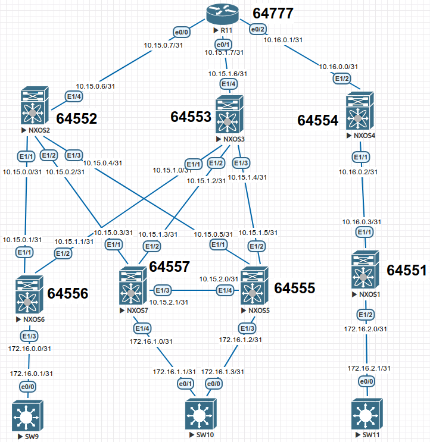

## Домашнее задание

Underlay.BGP

Цель: Настроить BGP для Underlay сети

В этой самостоятельной работе мы ожидаем, что вы самостоятельно:

1. настроить BGP в Underlay сети, для IP связанности между всеми устройствами NXOS
2. План работы, адресное пространство, схема сети, настройки - зафиксированы в документации



Немного вводной информации:

 Все маршруты завожу по средствам route-map и прикреплению его к шаблону устройства ,так как это более удобный способ менять политики .  Для установления соседства по BGP используется адреса ,указанные на физических интерфейсах. Маршруты для анонса используются loopback и connected сети . 

Настройка NEXUS:


<details>
  <summary>NXOS1</summary>
<pre><code>
configure terminal
hostname NX1
!
feature bgp
!
no ip domain-lookup
!
interface Ethernet1/1
  no switchport
  ip address 10.16.0.3/31
  no shutdown
!
interface Ethernet1/2
  no switchport
  ip address 172.16.2.0/31
  no shutdown
!
interface loopback0
  ip address 1.1.1.1/32
  no shutdown
!
route-map BGP-OUT permit 10
 match ip address prefix-list LOOPBACK P2P
!
ip prefix-list LOOPBACK seq 5 permit 1.1.1.1/32 
ip prefix-list P2P permit 10.16.0.3/31 
ip prefix-list P2P permit 172.16.2.0/31 
!
router bgp 64551
  router-id 1.1.1.1
  bestpath as-path multipath-relax
  address-family ipv4 unicast
    redistribute direct route-map BGP-OUT
    maximum-paths 4
  template peer NXOS4
    remote-as 64554
    password cisco
    address-family ipv4 unicast
    log-neighbor-changes
    exit
  neighbor 10.16.0.2
    inherit peer NXOS4
    exit
!
end
copy run star
</code></pre>
</details>
<details>
  <summary>NXOS2</summary>
<pre><code>
configure terminal
!
hostname NX2
!
!
feature bgp
!
no ip domain-lookup
!
interface Ethernet1/1
  no switchport
  ip address 10.15.0.0/31
  no shutdown
!
interface Ethernet1/2
  no switchport
  ip address 10.15.0.2/31
  no shutdown
!
interface Ethernet1/3
  no switchport
  ip address 10.15.0.4/31
  no shutdown
!
interface Ethernet1/4
  no switchport
  ip address 10.15.0.6/31
  no shutdown
!
interface loopback0
  ip address 1.1.1.2/32
!
route-map BGP-OUT permit 10
 match ip address prefix-list LOOPBACK P2P
!
ip prefix-list LOOPBACK seq 5 permit 1.1.1.2/32 
ip prefix-list P2P permit 10.15.0.0/31 
ip prefix-list P2P permit 10.15.0.2/31 
ip prefix-list P2P permit 10.15.0.4/31 
ip prefix-list P2P permit 10.15.0.6/31 
!
router bgp 64552
  router-id 1.1.1.2
  bestpath as-path multipath-relax
  address-family ipv4 unicast
    redistribute direct route-map BGP-OUT
    maximum-paths 4
!
 template peer R11
    remote-as 64777
    password cisco
    address-family ipv4 unicast
    log-neighbor-changes
    exit
  template peer NXOS6
    remote-as 64556
    password cisco
    address-family ipv4 unicast
    log-neighbor-changes
    exit
  template peer NXOS5
    remote-as 64555
    password cisco
    address-family ipv4 unicast
    log-neighbor-changes
    exit
  template peer NXOS7
    remote-as 64557
    password cisco
    address-family ipv4 unicast
    exit
    exit
  neighbor 10.15.0.7
    inherit peer R11
    exit
  neighbor 10.15.0.5
    inherit peer NXOS5
    exit
  neighbor 10.15.0.3
    inherit peer NXOS7
    exit
  neighbor 10.15.0.1
    inherit peer NXOS6
    exit
!
end
copy run star
</code></pre>
</details>
<details>
  <summary>NXOS3</summary>
<pre><code>
configure terminal 
!
hostname NX3
!
!
feature bgp
!
no ip domain-lookup
!
interface Ethernet1/1
  no switchport
  ip address 10.15.1.0/31
  no shutdown
!
interface Ethernet1/2
  no switchport
  ip address 10.15.1.2/31
  no shutdown
!
interface Ethernet1/3
  no switchport
  ip address 10.15.1.4/31
  no shutdown
!
interface Ethernet1/4
  no switchport
  ip address 10.15.1.6/31
  no shutdown
!
interface loopback0
  ip address 1.1.1.3/32
!
route-map BGP-OUT permit 10
 match ip address prefix-list LOOPBACK P2P
!
ip prefix-list LOOPBACK seq 5 permit 1.1.1.3/32 
ip prefix-list P2P seq 5 permit 10.15.1.0/24 
ip prefix-list P2P seq 10 permit 10.15.1.0/31 
ip prefix-list P2P seq 15 permit 10.15.1.2/31 
ip prefix-list P2P seq 20 permit 10.15.1.4/31 
ip prefix-list P2P seq 25 permit 10.15.1.6/31 
!
router bgp 64552
  router-id 1.1.1.3
  bestpath as-path multipath-relax
  address-family ipv4 unicast
    redistribute direct route-map BGP-OUT
    maximum-paths 4
!
   template peer R11
    remote-as 64777
    password cisco
    address-family ipv4 unicast
    log-neighbor-changes
    exit
  template peer NXOS6
    remote-as 64556
    password cisco
    address-family ipv4 unicast
    log-neighbor-changes
    exit
  template peer NXOS5
    remote-as 64555
    password cisco
    address-family ipv4 unicast
    log-neighbor-changes
    exit
  template peer NXOS7
    remote-as 64557
    password cisco
    address-family ipv4 unicast
    exit
    exit
  neighbor 10.15.1.1
    inherit peer NXOS6
    exit
  neighbor 10.15.1.3
    inherit peer NXOS7
    exit
  neighbor 10.15.1.5
    inherit peer NXOS5
    exit
  neighbor 10.15.1.7
    inherit peer R11
    exit
!
end
copy run star
</code></pre>
</details>
<details>
  <summary>NXOS4</summary>
<pre><code>
 configure terminal
!
hostname NX4
!
!
feature bgp
!
no ip domain-lookup
!
interface Ethernet1/1
  no switchport
  ip address 10.16.0.2/31
  no shutdown
!
interface Ethernet1/2
  no switchport
  ip address 10.16.0.0/31
  no shutdown
!
interface loopback0
  ip address 1.1.1.4/32
!
route-map BGP-OUT permit 10
 match ip address prefix-list LOOPBACK P2P
!
ip prefix-list LOOPBACK permit 1.1.1.4/32 
ip prefix-list P2P permit 10.16.0.2/31 
ip prefix-list P2P permit 10.16.0.0/31 
!
router bgp 64554
  router-id 1.1.1.4
  bestpath as-path multipath-relax
  address-family ipv4 unicast
    redistribute direct route-map BGP-OUT
    maximum-paths 4
  template peer R11
    remote-as 64777
    password cisco
    address-family ipv4 unicast
    log-neighbor-changes
    exit
  template peer NXOS1
    remote-as 64551
    password cisco
    address-family ipv4 unicast
    log-neighbor-changes
    exit
  neighbor 10.16.0.3
    inherit peer NXOS1
    exit
  neighbor 10.16.0.1
    inherit peer R11
    exit
!
end
copy run star 
</code></pre>
</details>
<details>
  <summary>NXOS5</summary>
<pre><code>
configure terminal 
!
hostname NX5
!
!
feature bgp
!
no ip domain-lookup
!
interface Ethernet1/1
  no switchport
  ip address 10.15.0.5/31
  no shutdown
!
interface Ethernet1/2
  no switchport
  ip address 10.15.1.5/31
  no shutdown
!
interface Ethernet1/3
  no switchport
  ip address 172.16.1.2/31
  no shutdown
!
interface Ethernet1/4
  no switchport
  ip address 10.15.2.0/31
  no shutdown
!
interface loopback0
  ip address 1.1.1.5/32
!
route-map BGP-OUT permit 10
 match ip address prefix-list LOOPBACK P2P
!
ip prefix-list LOOPBACK permit 1.1.1.5/32 
ip prefix-list P2P permit 10.15.0.5/31 
ip prefix-list P2P permit 10.15.1.5/31 
ip prefix-list P2P permit 10.15.2.0/31 
ip prefix-list P2P permit 172.16.1.2/31 
!
router bgp 64555
  router-id 1.1.1.5
  bestpath as-path multipath-relax
  address-family ipv4 unicast
    redistribute direct route-map BGP-OUT
    maximum-paths 4
!
  template peer NXOS2
    remote-as 64552
    password cisco
    address-family ipv4 unicast
    log-neighbor-changes
    exit
  template peer NXOS7
    remote-as 64557
    password cisco
    address-family ipv4 unicast
    log-neighbor-changes
    exit
  template peer NXOS3
    remote-as 64552
    password cisco
    address-family ipv4 unicast
    exit
    exit
  neighbor 10.15.0.4
    inherit peer NXOS2
    exit
  neighbor 10.15.1.4
    inherit peer NXOS3
    exit
  neighbor 10.15.2.1
    inherit peer NXOS7
    exit
!
end
copy run star 
</code></pre>
</details>
<details>
  <summary>NXOS6</summary>
<pre><code>
configure terminal
!
hostname NX6
!
!
feature bgp
!
no ip domain-lookup
!
interface Ethernet1/1
  no switchport
  ip address 10.15.0.1/31
  no shutdown
!
interface Ethernet1/2
  no switchport
  ip address 10.15.1.1/31
  no shutdown
!
interface Ethernet1/3
  no switchport
  ip address 172.16.0.0/31
  no shutdown
!
interface loopback0
  ip address 1.1.1.6/32
!
route-map BGP-OUT permit 10
 match ip address prefix-list LOOPBACK P2P
!
ip prefix-list LOOPBACK seq 5 permit 1.1.1.6/32 
ip prefix-list P2P permit 10.15.0.1/31 
ip prefix-list P2P permit 10.15.1.1/31 
ip prefix-list P2P permit 172.16.0.0/31 
!
router bgp 64556
  router-id 1.1.1.6
  bestpath as-path multipath-relax
  address-family ipv4 unicast
    redistribute direct route-map BGP-OUT
    maximum-paths 4
!
  template peer NXOS2
    remote-as 64552
    password cisco
    address-family ipv4 unicast
    log-neighbor-changes
    exit
  template peer NXOS3
    remote-as 64552
    password cisco
    address-family ipv4 unicast
    exit
    exit
  neighbor 10.15.0.0
    inherit peer NXOS2
    exit
  neighbor 10.15.1.0
    inherit peer NXOS3
    exit
!
end
copy run star 
</code></pre>
</details>
<details>
  <summary>NXOS7</summary>
<pre><code>
configure terminal
!
hostname NX7
!
!
feature bgp
!
no ip domain-lookup
!
interface Ethernet1/1
  no switchport
  ip address 10.15.0.3/31
  no shutdown
!
interface Ethernet1/2
  no switchport
  ip address 10.15.1.3/31
  no shutdown
!
interface Ethernet1/3
  no switchport
  ip address 10.15.2.1/31
  no shutdown
!
interface Ethernet1/4
  no switchport
  ip address 172.16.1.0/31
  no shutdown
!
interface loopback0
  ip address 1.1.1.7/32
!
route-map BGP-OUT permit 10
 match ip address prefix-list LOOPBACK P2P
!
ip prefix-list LOOPBACK permit 1.1.1.7/32 
ip prefix-list P2P permit 10.15.0.3/31 
ip prefix-list P2P permit 10.15.1.3/31 
ip prefix-list P2P permit 10.15.2.1/31 
ip prefix-list P2P permit 172.16.1.0/31 
!
router bgp 64557
  router-id 1.1.1.7
  bestpath as-path multipath-relax
  address-family ipv4 unicast
    redistribute direct route-map BGP-OUT
    maximum-paths 4
!
   template peer NXOS2
    remote-as 64552
    password cisco
    address-family ipv4 unicast
    log-neighbor-changes
    exit
  template peer NXOS5
    remote-as 64555
    password cisco
    address-family ipv4 unicast
    log-neighbor-changes
    exit
  template peer NXOS3
    remote-as 64552
    password cisco
    address-family ipv4 unicast
    exit
    exit
  neighbor 10.15.0.2
    inherit peer NXOS2
    exit
  neighbor 10.15.1.2
    inherit peer NXOS3
    exit
  neighbor 10.15.2.0
    inherit peer NXOS5
    exit
!
end
copy run star 
</code></pre>
</details>
<details>
  <summary>R11</summary>
<pre><code>
  enable
configure terminal
!
service password-encryption
!
hostname R11
no router bgp 64777
!
no ip domain lookup
!
interface Loopback0
 no shutdown
 ip address 1.1.1.11 255.255.255.255
 duplex full
!
interface Ethernet0/0
 no shutdown
 ip address 10.15.0.7 255.255.255.254
 duplex full
!
interface Ethernet0/1
 no shutdown
 ip address 10.15.1.7 255.255.255.254
 duplex full
!
interface Ethernet0/2
 no shutdown
 ip address 10.16.0.1 255.255.255.254
 duplex full
!
route-map BGP-OUT permit 10
 match ip address prefix-list LOOPBACK P2P
!
ip prefix-list LOOPBACK permit 1.1.1.11/32 
ip prefix-list P2P permit 10.15.0.7/31 
ip prefix-list P2P permit 10.15.1.7/31 
ip prefix-list P2P permit 10.16.0.1/31 
!
router bgp 64777
!
 template peer-session NXOS2
  remote-as 64552
  password cisco
 exit-peer-session
 !
 template peer-session NXOS3
  remote-as 64552
  password cisco
 exit-peer-session
 !
 template peer-session NXOS4
  remote-as 64554
  password cisco
 exit-peer-session
 !
 bgp log-neighbor-changes
 no bgp default ipv4-unicast
 neighbor 10.15.0.6 inherit peer-session NXOS2
 neighbor 10.15.1.6 inherit peer-session NXOS3
 neighbor 10.16.0.0 inherit peer-session NXOS4
 !
 address-family ipv4
  redistribute connected route-map BGP-OUT
  neighbor 10.15.0.6 activate
  neighbor 10.15.1.6 activate
  neighbor 10.16.0.0 activate
  maximum-paths 4
 exit-address-family
!
line con 0
 exec-timeout 0 0
!
end
copy run star 
</code></pre>
</details>

Далее пойдут настройки клиентских устройств:

<details>
  <summary>SW11</summary>
<pre><code>
  enable
configure terminal
!
host SW11
line con 0
exec-t 0 0
exit
no ip domain loo
!
interface e0/0
no sw
ip addr 172.16.2.1 255.255.255.254
duplex full
no sh
exit
!
ip route 0.0.0.0 0.0.0.0 172.16.2.0 
end
wr
</code></pre>
</details>
<details>
  <summary>SW10</summary>
<pre><code>
enable
configure terminal
!
host SW10
line con 0
exec-t 0 0
exit
no ip domain loo
!
interface e0/0
no sw
ip addr 172.16.1.3 255.255.255.254
duplex full
no sh
exit
!
interface e0/1
no sw
ip addr 172.16.1.1 255.255.255.254
duplex full
no sh
exit
!
ip sla 1
icmp-echo 172.16.1.2 source-interface e0/0
frequency 10
ip sla schedule 1 start-time now life forever 
track 1 ip sla 1 reachability
ip route 0.0.0.0 0.0.0.0 172.16.1.2 track 1
!
ip route 0.0.0.0 0.0.0.0 172.16.1.0 10
end
wr
</code></pre>
</details>
<details>
  <summary>SW9</summary>
<pre><code>
enable
configure terminal
!
host SW9
line con 0
exec-t 0 0
exit
no ip domain loo
!
interface e0/0
no sw
ip addr 172.16.0.1 255.255.255.254
duplex full
no sh
exit
!
ip route 0.0.0.0 0.0.0.0 172.16.0.0 
end
wr
</code></pre>
</details>


Вывод нескольких устройств:

```
R11#show ip route bgp 
Codes: L - local, C - connected, S - static, R - RIP, M - mobile, B - BGP
       D - EIGRP, EX - EIGRP external, O - OSPF, IA - OSPF inter area 
       N1 - OSPF NSSA external type 1, N2 - OSPF NSSA external type 2
       E1 - OSPF external type 1, E2 - OSPF external type 2
       i - IS-IS, su - IS-IS summary, L1 - IS-IS level-1, L2 - IS-IS level-2
       ia - IS-IS inter area, * - candidate default, U - per-user static route
       o - ODR, P - periodic downloaded static route, H - NHRP, l - LISP
       a - application route
       + - replicated route, % - next hop override

Gateway of last resort is not set

      1.0.0.0/32 is subnetted, 8 subnets
B        1.1.1.1 [20/0] via 10.16.0.0, 04:36:50
B        1.1.1.2 [20/0] via 10.15.0.6, 05:34:27
B        1.1.1.3 [20/0] via 10.15.1.6, 1w1d
B        1.1.1.4 [20/0] via 10.16.0.0, 05:06:43
B        1.1.1.5 [20/0] via 10.15.1.6, 00:37:47
                 [20/0] via 10.15.0.6, 00:37:47
B        1.1.1.6 [20/0] via 10.15.1.6, 05:34:27
                 [20/0] via 10.15.0.6, 05:34:27
B        1.1.1.7 [20/0] via 10.15.1.6, 00:09:56
                 [20/0] via 10.15.0.6, 00:09:56
      10.0.0.0/8 is variably subnetted, 14 subnets, 2 masks
B        10.15.0.0/31 [20/0] via 10.15.0.6, 05:34:27
B        10.15.0.2/31 [20/0] via 10.15.0.6, 05:34:27
B        10.15.0.4/31 [20/0] via 10.15.0.6, 05:34:27
B        10.15.1.0/31 [20/0] via 10.15.1.6, 1w1d
B        10.15.1.2/31 [20/0] via 10.15.1.6, 1w1d
B        10.15.1.4/31 [20/0] via 10.15.1.6, 1w1d
B        10.15.2.0/31 [20/0] via 10.15.1.6, 00:37:47
                      [20/0] via 10.15.0.6, 00:37:47
B        10.16.0.2/31 [20/0] via 10.16.0.0, 05:06:43
      172.16.0.0/31 is subnetted, 4 subnets
B        172.16.0.0 [20/0] via 10.15.1.6, 05:34:27
                    [20/0] via 10.15.0.6, 05:34:27
B        172.16.1.0 [20/0] via 10.15.1.6, 00:09:56
                    [20/0] via 10.15.0.6, 00:09:56
B        172.16.1.2 [20/0] via 10.15.1.6, 00:37:47
                    [20/0] via 10.15.0.6, 00:37:47
B        172.16.2.0 [20/0] via 10.16.0.0, 04:36:49

R11#traceroute 172.16.1.3
Type escape sequence to abort.
Tracing the route to 172.16.1.3
VRF info: (vrf in name/id, vrf out name/id)
  1 10.15.0.6 404 msec
    10.15.1.6 367 msec
    10.15.0.6 102 msec
  2 10.15.1.5 [AS 64552] 159 msec
    10.15.0.5 [AS 64552] 12 msec
    10.15.1.5 [AS 64552] 19 msec
  3 172.16.1.3 [AS 64555] 26 msec *  51 msec
```

```
R11#show ip bgp summary 
BGP router identifier 1.1.1.11, local AS number 64777
BGP table version is 48, main routing table version 48
23 network entries using 3220 bytes of memory
39 path entries using 3120 bytes of memory
7 multipath network entries and 14 multipath paths
7/7 BGP path/bestpath attribute entries using 1008 bytes of memory
6 BGP AS-PATH entries using 144 bytes of memory
0 BGP route-map cache entries using 0 bytes of memory
0 BGP filter-list cache entries using 0 bytes of memory
BGP using 7492 total bytes of memory
BGP activity 31/8 prefixes, 49/10 paths, scan interval 60 secs

Neighbor        V           AS MsgRcvd MsgSent   TblVer  InQ OutQ Up/Down  State/PfxRcd
10.15.0.6       4        64552     343     382       48    0    0 05:35:50       15
10.15.1.6       4        64552   11892   13105       48    0    0 1w1d           15
10.16.0.0       4        64554     314     349       48    0    0 05:08:07        5
```

Далее укажу вывод соседства по BGP:

NXOS4

```
NX4# show bgp sessions 
Total peers 2, established peers 2
ASN 64554
VRF default, local ASN 64554
peers 2, established peers 2, local router-id 1.1.1.4
State: I-Idle, A-Active, O-Open, E-Established, C-Closing, S-Shutdown

Neighbor        ASN    Flaps LastUpDn|LastRead|LastWrit St Port(L/R)  Notif(S/R)
10.16.0.1       64777 0     05:08:51|00:00:23|00:00:02 E   179/20321      0/0
10.16.0.3       64551 0     04:38:59|00:00:49|00:00:52 E   179/26449      0/0
```

NXOS3

```
NX3# show bgp sessions 
Total peers 4, established peers 4
ASN 64553
VRF default, local ASN 64553
peers 4, established peers 4, local router-id 1.1.1.3
State: I-Idle, A-Active, O-Open, E-Established, C-Closing, S-Shutdown

Neighbor        ASN    Flaps LastUpDn|LastRead|LastWrit St Port(L/R)  Notif(S/R)
10.15.1.1       64556 0     02:11:36|00:00:09|00:00:08 E   179/26625      11/0
10.15.1.3       64557 0     01:28:56|00:00:08|00:00:08 E   179/23077      48/0
10.15.1.5       64555 0     01:30:32|00:00:08|00:00:08 E   16411/179        0/46
10.15.1.7       64777 2     01:09:58|00:00:41|00:00:55 E   57779/179        1/0
```

NXOS2

```
NX2# show bgp sessions 
Total peers 4, established peers 4
ASN 64552
VRF default, local ASN 64552
peers 4, established peers 4, local router-id 1.1.1.2
State: I-Idle, A-Active, O-Open, E-Established, C-Closing, S-Shutdown

Neighbor        ASN    Flaps LastUpDn|LastRead|LastWrit St Port(L/R)  Notif(S/R)
10.15.0.1       64556 0     05:37:43|00:00:31|00:00:14 E   19125/179        0/0
10.15.0.3       64557 0     00:13:12|00:00:11|00:00:11 E   179/52657        0/0
10.15.0.5       64555 0     00:41:02|0.945580|00:00:25 E   179/34384        0/0
10.15.0.7       64777 0     05:37:42|00:00:37|00:00:14 E   25495/179        0/0
```

Проверим связь между ДЦ:

SW9  -> SW11

```
SW9#ping 172.16.2.1
Type escape sequence to abort.
Sending 5, 100-byte ICMP Echos to 172.16.2.1, timeout is 2 seconds:
.!!!!
Success rate is 80 percent (4/5), round-trip min/avg/max = 96/550/1844 ms

R11#traceroute 172.16.1.3
Type escape sequence to abort.
Tracing the route to 172.16.1.3
VRF info: (vrf in name/id, vrf out name/id)
  1 10.15.1.6 22 msec
    10.15.0.6 30 msec
    10.15.1.6 5 msec
  2 10.15.0.5 [AS 64552] 16 msec
    10.15.1.5 [AS 64552] 88 msec
    10.15.0.5 [AS 64552] 110 msec
  3 172.16.1.3 [AS 64555] 66 msec *  179 msec
```

SW11 -> SW10

```
SW11>ping 172.16.1.3
Type escape sequence to abort.
Sending 5, 100-byte ICMP Echos to 172.16.1.3, timeout is 2 seconds:
!!!!!
Success rate is 100 percent (5/5), round-trip min/avg/max = 58/129/218 ms

SW11>traceroute 172.16.1.3
Type escape sequence to abort.
Tracing the route to 172.16.1.3
VRF info: (vrf in name/id, vrf out name/id)
  1 172.16.2.0 4 msec 6 msec 7 msec
  2 10.16.0.2 38 msec 21 msec 25 msec
  3 10.16.0.1 97 msec 164 msec 79 msec
  4 10.15.0.6 69 msec 30 msec 118 msec
  5 10.15.0.5 107 msec 86 msec 69 msec
  6 172.16.1.3 90 msec *  95 msec
```

Вывод:

Условная сеть для двух ДЦ была построена , протокол BGP работает , связь между конечными точками сети присутствует.