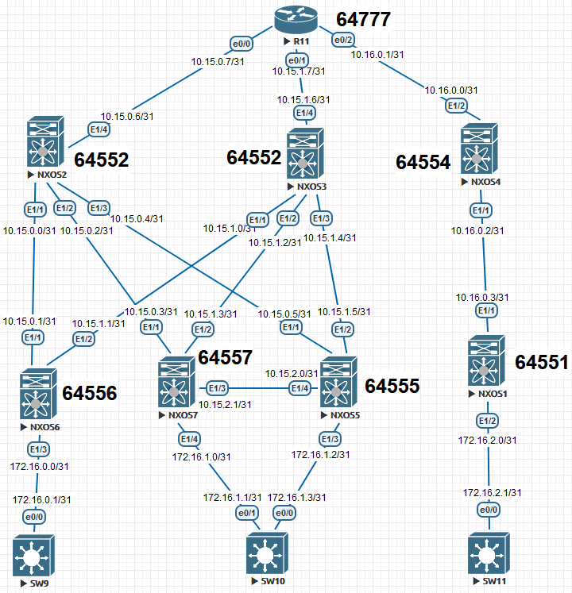

## Домашнее задание

Underlay. IS-IS

Цель: Настроить BGP для Underlay сети

В этой самостоятельной работе мы ожидаем, что вы самостоятельно:

1. настроить BGP в Underlay сети, для IP связанности между всеми устройствами NXOS
2. План работы, адресное пространство, схема сети, настройки - зафиксированы в документации



Немного вводной информации:


Настройка NEXUS:

NXOS1

```

```

NXOS2

```

```

NXOS3

```

```

NXOS4

```

```

NXOS5

```

```

NXOS6

```

```

NXOS7

```

```

Роутер R11

```

```

Далее пойдут настройки клиентских устройств:

SW11

```

```

SW10

```

```

SW9

```

```

Вывод нескольких устройств:

```

```

Далее укажу вывод соседства по BGP:

NXOS4

```

```

NXOS3

```

```

NXOS2

```

```

Проверим связь между ДЦ:

SW9

```

```

SW11

```

```

Вывод:

Условная сеть для двух ДЦ была построена , протокол BGP работает , связь между конечными точками сети присутствует.