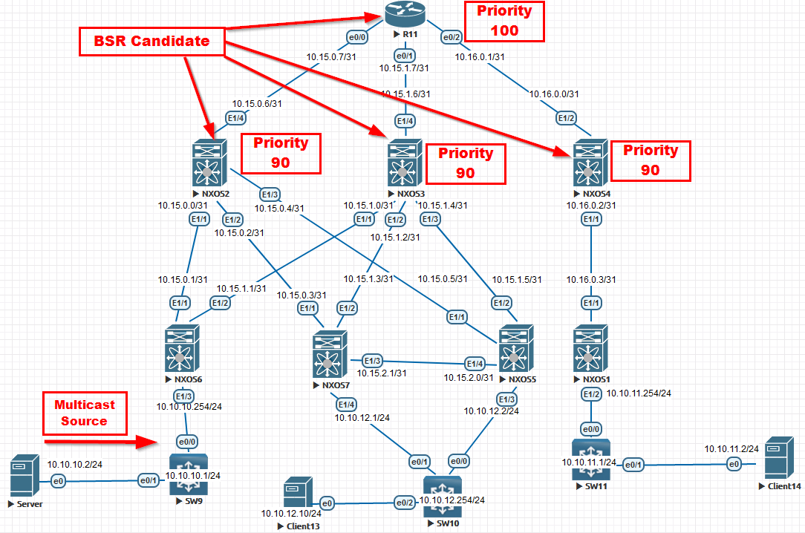
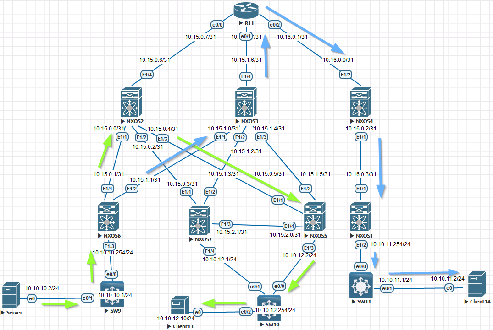

# Multicast. PIM

Цель:

Настроить PIM в сети.

В этой работе мы ожидаем, что вы самостоятельно:

1. Настроите PIM на всех устройствах (кроме коммутаторов доступа);

  *Для IP связанности между устройствами можно использовать любой протокол динамической маршрутизации; 2. План работы, адресное пространство, схема сети, настройки - зафиксируете в документации;

Дополнительно предлагается реализовать Multicast совместно с VxLAN(к этой части самостоятельной работы возможно вернуться позже)

За основу взял схему из раздела [OSPF](https://github.com/NickelFace/OTUS-Network-Architect/blob/main/2.Overlay_OSPF/Home_Work.md), где указал логику построения сети ЦОД, а  теперь требуется организовать  мультикаст в данной топологии.

Так как в интернете довольно мало информации на данную тематику,а [некоторые статьи](https://linkmeup.ru/blog/1204/)  не подойдут для EVE-NG, то придется организовать свою статью. Первая проблема с которой столкнулся, это как организовать источник мультикаста, а заодно и клиента. За решение данного вопроса я воспользовалься [инструкцией](https://www.eve-ng.net/index.php/documentation/howtos/howto-save-your-settings-to-be-as-default-on-qemu-node/) по созданию своего [образа](https://disk.yandex.ru/d/_UKl3leYfNVqGA). Для организации сервера мне потребовался пакет [tstools](https://onstartup.ru/utility/tstools/), а для организации клиента [smcroute](https://onstartup.ru/set/smcroute/). 

**Настройка NEXUS:**

 

NXOS1

<pre><code>
conf t
! 
hostname NX1
feature ospf
feature pim
!
ip pim log-neighbor-changes
ip pim bsr listen
!
router ospf 1
  router-id 1.1.1.1
  passive-interface default
!
interface Ethernet1/1
  no switchport
  medium p2p
  ip unnumbered loopback0
  ip ospf authentication-key OTUS
  ip ospf network point-to-point
  no ip ospf passive-interface
  ip router ospf 1 area 0.0.0.1
  ip pim sparse-mode
  no shutdown
!
interface Ethernet1/2
  no switchport
  ip address 10.10.11.254/24
  ip ospf passive-interface
  ip router ospf 1 area 0.0.0.1
  ip pim sparse-mode
  no shutdown
!
interface loopback0
  ip address 1.1.1.1/24
  ip router ospf 1 area 0.0.0.1
!
line console
  exec-timeout 0
line vty
  exec-timeout 0
!
end
copy run star 
</code></pre>

NXOS2

<pre><code>
conf t
!
hostname NX2
feature ospf
feature pim
!
ip pim bsr bsr-candidate loopback0 priority 90
ip pim bsr rp-candidate loopback0 group-list 224.0.0.0/4
ip pim log-neighbor-changes
ip pim bsr forward listen
!
router ospf 1
  router-id 1.1.1.2
  passive-interface default
!
interface Ethernet1/1
  no switchport
  medium p2p
  ip unnumbered loopback0
  ip ospf authentication-key OTUS
  ip ospf network point-to-point
  no ip ospf passive-interface
  ip router ospf 1 area 0.0.0.0
  ip pim sparse-mode
  no shutdown
!
interface Ethernet1/2
  no switchport
  medium p2p
  ip unnumbered loopback0
  ip ospf authentication-key OTUS
  ip ospf network point-to-point
  no ip ospf passive-interface
  ip router ospf 1 area 0.0.0.0
  ip pim sparse-mode
  no shutdown
!
interface Ethernet1/3
  no switchport
  medium p2p
  ip unnumbered loopback0
  ip ospf authentication-key OTUS
  ip ospf network point-to-point
  no ip ospf passive-interface
  ip router ospf 1 area 0.0.0.0
  ip pim sparse-mode
  no shutdown
!
interface Ethernet1/4
  no switchport
  ip address 10.15.0.6/31
  ip ospf authentication-key OTUS
  ip ospf network point-to-point
  no ip ospf passive-interface
  ip router ospf 1 area 0.0.0.0
  ip pim sparse-mode
  no shutdown
!
interface loopback0
  ip address 1.1.1.2/24
  ip router ospf 1 area 0.0.0.0
  ip pim sparse-mode
!
line console
  exec-timeout 0
line vty
  exec-timeout 0
!
end
copy run star
</code></pre>

  
NXOS3

<pre><code>
conf t
!
hostname NX3
feature ospf
feature pim
!
ip pim bsr bsr-candidate loopback0 priority 90
ip pim bsr rp-candidate loopback0 group-list 224.0.0.0/4
ip pim log-neighbor-changes
ip pim bsr forward listen
!
router ospf 1
  router-id 1.1.1.3
  passive-interface default
!
interface Ethernet1/1
  no switchport
  medium p2p
  ip unnumbered loopback0
  ip ospf authentication-key OTUS
  ip ospf network point-to-point
  no ip ospf passive-interface
  ip router ospf 1 area 0.0.0.0
  ip pim sparse-mode
  no shutdown
!
interface Ethernet1/2
  no switchport
  medium p2p
  ip unnumbered loopback0
  ip ospf authentication-key OTUS
  ip ospf network point-to-point
  no ip ospf passive-interface
  ip router ospf 1 area 0.0.0.0
  ip pim sparse-mode
  no shutdown
!
interface Ethernet1/3
  no switchport
  medium p2p
  ip unnumbered loopback0
  ip ospf authentication-key OTUS
  ip ospf network point-to-point
  no ip ospf passive-interface
  ip router ospf 1 area 0.0.0.0
  ip pim sparse-mode
  no shutdown
!
interface Ethernet1/4
  no switchport
  ip address 10.15.1.6/31
  ip ospf authentication-key OTUS
  ip ospf network point-to-point
  no ip ospf passive-interface
  ip router ospf 1 area 0.0.0.0
  ip pim sparse-mode
  no shutdown
!
interface loopback0
  ip address 1.1.1.3/24
  ip router ospf 1 area 0.0.0.0
  ip pim sparse-mode
!
line console
  exec-timeout 0
line vty
  exec-timeout 0
!
end
copy run star
</code></pre>

  
NXOS4

<pre><code>
conf t
!
hostname NX4
feature ospf
feature pim
!
ip pim bsr bsr-candidate loopback0 priority 90
ip pim bsr rp-candidate loopback0 group-list 224.0.0.0/4
ip pim log-neighbor-changes
ip pim bsr forward listen
!
router ospf 1
  router-id 1.1.1.4
  passive-interface default
!
interface Ethernet1/1
  no switchport
  medium p2p
  ip unnumbered loopback0
  ip ospf authentication-key OTUS
  ip ospf network point-to-point
  no ip ospf passive-interface
  ip router ospf 1 area 0.0.0.1
  ip pim sparse-mode
  no shutdown
!
interface Ethernet1/2
  no switchport
  ip address 10.16.0.0/31
  ip ospf authentication-key OTUS
  ip ospf network point-to-point
  no ip ospf passive-interface
  ip router ospf 1 area 0.0.0.1
  ip pim sparse-mode
  no shutdown
!
interface loopback0
  ip address 1.1.1.4/24
  ip router ospf 1 area 0.0.0.1
  ip pim sparse-mode
!
line console
  exec-timeout 0
line vty
  exec-timeout 0
!
end
copy run star
</code></pre>

NXOS5

<pre><code>
conf t
!
feature ospf
feature pim
!
ip pim log-neighbor-changes
ip pim bsr listen
!
hostname NX5
!
router ospf 1
  router-id 1.1.1.5
  passive-interface default
!
interface Ethernet1/1
  no switchport
  medium p2p
  ip unnumbered loopback0
  ip ospf authentication-key OTUS
  ip ospf network point-to-point
  no ip ospf passive-interface
  ip router ospf 1 area 0.0.0.0
  ip pim sparse-mode
  no shutdown
!
interface Ethernet1/2
  no switchport
  medium p2p
  ip unnumbered loopback0
  ip ospf authentication-key OTUS
  ip ospf network point-to-point
  no ip ospf passive-interface
  ip router ospf 1 area 0.0.0.0
  ip pim sparse-mode
  no shutdown
!
interface Ethernet1/3
  no switchport
  ip address 10.10.12.2/24
  ip router ospf 1 area 0.0.0.0
  ip pim sparse-mode
  ip pim dr-priority 1000
  no shutdown
!
interface Ethernet1/4
  no switchport
  medium p2p
  ip unnumbered loopback0
  ip ospf authentication-key OTUS
  ip ospf network point-to-point
  no ip ospf passive-interface
  ip router ospf 1 area 0.0.0.0
  ip pim sparse-mode
  no shutdown
!
interface loopback0
  ip address 1.1.1.5/24
  ip router ospf 1 area 0.0.0.0
!
line console
  exec-timeout 0
line vty
  exec-timeout 0
!
end
copy run star
 </code></pre>

NXOS6

<pre><code>
conf t
!
feature ospf
feature pim
!
ip pim log-neighbor-changes
ip pim bsr listen
!
hostname NX6
!
router ospf 1
  router-id 1.1.1.6
  passive-interface default
!
interface Ethernet1/1
  no switchport
  medium p2p
  ip unnumbered loopback0
  ip ospf authentication-key OTUS
  ip ospf network point-to-point
  no ip ospf passive-interface
  ip router ospf 1 area 0.0.0.0
  ip pim sparse-mode
  no shutdown
!
interface Ethernet1/2
  no switchport
  medium p2p
  ip unnumbered loopback0
  ip ospf authentication-key OTUS
  ip ospf network point-to-point
  no ip ospf passive-interface
  ip router ospf 1 area 0.0.0.0
  ip pim sparse-mode
  no shutdown
!
interface Ethernet1/3
  no switchport
  ip address 10.10.10.254/24
  ip router ospf 1 area 0.0.0.0
  ip pim sparse-mode
  no shutdown
!
interface loopback0
  ip address 1.1.1.6/24
  ip router ospf 1 area 0.0.0.0
!
line console
  exec-timeout 0
line vty
  exec-timeout 0
!
end
copy run star
 </code></pre>

NXOS7

<pre><code>
conf t
!
hostname NX7
!
feature ospf
feature pim
!
ip pim log-neighbor-changes
ip pim bsr listen
!
router ospf 1
  router-id 1.1.1.7
  passive-interface default
!
interface Ethernet1/1
  no switchport
  medium p2p
  ip unnumbered loopback0
  ip ospf authentication-key OTUS
  ip ospf network point-to-point
  no ip ospf passive-interface
  ip router ospf 1 area 0.0.0.0
  ip pim sparse-mode
  no shutdown
!
interface Ethernet1/2
  no switchport
  medium p2p
  ip unnumbered loopback0
  ip ospf authentication-key OTUS
  ip ospf network point-to-point
  no ip ospf passive-interface
  ip router ospf 1 area 0.0.0.0
  ip pim sparse-mode
  no shutdown
!
interface Ethernet1/3
  no switchport
  medium p2p
  ip unnumbered loopback0
  ip ospf authentication-key OTUS
  ip ospf network point-to-point
  no ip ospf passive-interface
  ip router ospf 1 area 0.0.0.0
  ip pim sparse-mode
  no shutdown
!
interface Ethernet1/4
  no switchport
  ip address 10.10.12.1/24
  ip router ospf 1 area 0.0.0.0
  ip pim sparse-mode
  no shutdown
!
interface loopback0
  ip address 1.1.1.7/24
  ip router ospf 1 area 0.0.0.0
!
line console
  exec-timeout 0
line vty
  exec-timeout 0
!
end
copy run star
</code></pre>

R11

<pre><code>
enable
configure terminal
!
hostname R11
line con 0
exec-t 0 0
exit
no ip domain loo
!
router ospf 1
router-id 1.1.1.11
!
interface Ethernet0/0
 ip address 10.15.0.7 255.255.255.254
 ip pim sparse-mode
 ip ospf authentication-key OTUS
 ip ospf network point-to-point
 ip ospf 1 area 0
 duplex full
 no shutdown
!
interface Ethernet0/1
 ip address 10.15.1.7 255.255.255.254
 ip pim sparse-mode
 ip ospf authentication-key OTUS
 ip ospf network point-to-point
 ip ospf 1 area 0
 duplex full
 no shutdown
!
interface Ethernet0/2
 ip address 10.16.0.1 255.255.255.254
 ip pim sparse-mode
 ip ospf authentication-key OTUS
 ip ospf network point-to-point
 ip ospf 1 area 1
 duplex full
 no shutdown
!
interface Loopback0
 ip address 1.1.1.11 255.255.255.0
 ip pim sparse-mode
 ip ospf 1 area 0
!
ip multicast-routing 
ip pim bsr-candidate Loopback0 32 100
ip pim rp-candidate Loopback0 priority 100
! 
end
wr
</code></pre>

Настройка Source Multicast

Server

cat /etc/network/interfaces/
<pre><code>
auto ens3
iface ens3  inet static
        address 10.10.10.2
        netmask 255.255.255.0
        gateway 10.10.10.1
</code></pre>
Запуск источника выполняется командой:
<pre><code> 
tsplay ./video.ts 239.0.0.100:1234 -loop -i 10.10.10.2 &
</code></pre>

Настройка клиентов:

Client13

cat /etc/network/interfaces/
<pre><code>
auto ens3
iface ens3 inet static
        address 10.10.12.10
        netmask 255.255.255.0
        gateway 10.10.12.254
</code></pre>
Запуск подписки на мультикаст рассылку выполняется командой:
<pre><code> 
smcroute -j ens3 239.0.0.100
</code></pre>

Client14

cat /etc/network/interfaces/
<pre><code>
auto ens3
iface ens3 inet static
        address 10.10.11.1
        netmask 255.255.255.0
        gateway 10.10.11.254
</code></pre>
Запуск подписки на мультикаст рассылку выполняется командой:
<pre><code> 
smcroute -j ens3 239.0.0.100
</code></pre>

А устройства SW9, SW10, SW11 выполняют просто функцию коммутатора.

SW9

<pre><code>
enable
configure terminal
!
ip multicast-routing 
!
no ip igmp snooping vlan 100
!
hostname SW9
line con 0
exec-t 0 0
exit
no ip domain loo
!
interface Ethernet0/0
 switchport access vlan 100
 switchport mode access
 spanning-tree bpdufilter enable
!
interface Ethernet0/1
 switchport access vlan 100
 switchport mode access
 spanning-tree bpdufilter enable
!
interface Vlan100
 ip address 10.10.10.1 255.255.255.0
!
ip route 0.0.0.0 0.0.0.0 10.10.10.254
end
wr
</code></pre>

 

SW10

<pre><code>
enable
configure terminal
!
hostname SW10
line con 0
exec-t 0 0
exit
no ip domain loo
interface Ethernet0/0
 switchport access vlan 100
 switchport mode access
 duplex full
!
interface Ethernet0/1
 switchport access vlan 100
 switchport mode access
 duplex full
!
interface Ethernet0/2
 switchport access vlan 100
 switchport mode access
 duplex full
!
interface Vlan100
 ip address 10.10.12.254 255.255.255.0
!
ip sla 1
 icmp-echo 10.10.12.2 source-interface Vlan100
 frequency 10
ip sla schedule 1 life forever start-time now
!
ip route 0.0.0.0 0.0.0.0 10.10.12.2 track 1
ip route 0.0.0.0 0.0.0.0 10.10.12.1
!
end
wr
</code></pre>

 

SW11

<pre><code>
enable
configure terminal
!
ip multicast-routing
!
hostname SW11
line con 0
exec-t 0 0
exit
no ip domain loo
!
interface Ethernet0/0
 switchport access vlan 100
 switchport mode access
 duplex full
 spanning-tree bpdufilter enable
!
interface Ethernet0/1
 switchport access vlan 100
 switchport mode access
 duplex full
 spanning-tree bpdufilter enable
!         
interface Vlan100
 ip address 10.10.11.1 255.255.255.0
!
ip route 0.0.0.0 0.0.0.0 10.10.11.254
!
end
wr
</code></pre>

 

Теперь проверим IGMP:

 
 
NXOS7
 <pre><code>
NX7# show ip igmp groups 
IGMP Connected Group Membership for VRF "default" - 1 total entries
Type: S - Static, D - Dynamic, L - Local, T - SSM Translated, H - Host Proxy
      * - Cache Only
Group Address      Type Interface              Uptime    Expires   Last Reporter
239.0.0.100        D   Ethernet1/4            18:01:49  00:04:15  10.10.12.10
</code></pre> 

 
 
NXOS5
 <pre><code>
NX5# show ip igmp groups 
IGMP Connected Group Membership for VRF "default" - 1 total entries
Type: S - Static, D - Dynamic, L - Local, T - SSM Translated, H - Host Proxy
      * - Cache Only
Group Address      Type Interface              Uptime    Expires   Last Reporter
239.0.0.100        D   Ethernet1/3            18:01:38  00:02:40  10.10.12.10
</code></pre> 

 
 
NXOS1
 <pre><code>
NX1# show ip igmp groups 
IGMP Connected Group Membership for VRF "default" - 1 total entries
Type: S - Static, D - Dynamic, L - Local, T - SSM Translated, H - Host Proxy
      * - Cache Only
Group Address      Type Interface              Uptime    Expires   Last Reporter
239.0.0.100        D   Ethernet1/2            01:54:09  00:03:28  10.10.11.2
</code></pre> 

 
 
SW11
 <pre><code>
SW11# show ip igmp groups 
IGMP Connected Group Membership
Group Address    Interface                Uptime    Expires   Last Reporter   Group Accounted
239.0.0.100      Vlan100                  01:53:00  00:02:17  10.10.11.2      
224.0.1.40       Vlan100                  20:38:51  00:02:19  10.10.11.1    
</code></pre> 

 
 
SW9
 <pre><code>
SW10#show ip igmp groups 
IGMP Connected Group Membership
Group Address    Interface                Uptime    Expires   Last Reporter   Group Accounted
239.0.0.100      Vlan100                  00:01:32  00:01:37  10.10.12.10     
224.0.1.40       Vlan100                  15:17:26  00:00:28  10.10.12.254  
</code></pre> 

А теперь PIM, начнём сначала с указанием соседств:

 
 
NXOS2
 <pre><code>
NX2# show ip pim neighbor 
PIM Neighbor Status for VRF "default"
Neighbor        Interface            Uptime    Expires   DR       Bidir-  BFD   
 ECMP Redirect
                                                         Priority Capable State 
    Capable
1.1.1.6         Ethernet1/1          20:52:24  00:01:44  1        yes     n/a   
  no
1.1.1.7         Ethernet1/2          20:52:24  00:01:37  1        yes     n/a   
  no
1.1.1.5         Ethernet1/3          20:52:24  00:01:30  1        yes     n/a   
  no
10.15.0.7       Ethernet1/4          20:14:32  00:01:28  1        no     n/a    
 no
</code></pre> 

 
 
NXOS3
 <pre><code>
NX3# show ip pim neighbor 
PIM Neighbor Status for VRF "default"
Neighbor        Interface            Uptime    Expires   DR       Bidir-  BFD   
 ECMP Redirect
                                                         Priority Capable State 
    Capable
1.1.1.6         Ethernet1/1          21:18:38  00:01:37  1        yes     n/a   
  no
1.1.1.7         Ethernet1/2          3d05h     00:01:32  1        yes     n/a   
  no
1.1.1.5         Ethernet1/3          3d05h     00:01:37  1        yes     n/a   
  no
10.15.1.7       Ethernet1/4          20:15:41  00:01:40  1        no     n/a    
 no
</code></pre> 

 
 
NXOS4
 <pre><code>
NX4# show ip pim neighbor 
PIM Neighbor Status for VRF "default"
Neighbor        Interface            Uptime    Expires   DR       Bidir-  BFD   
 ECMP Redirect
                                                         Priority Capable State 
    Capable
1.1.1.1         Ethernet1/1          3d05h     00:01:42  1        yes     n/a   
  no
10.16.0.1       Ethernet1/2          20:16:35  00:01:20  1        no     n/a    
 no
</code></pre> 

А теперь как распределяется мультикаст подписка за 239.0.0.100:

 

NXOS1

<pre><code>
NX1# show ip mroute 
IP Multicast Routing Table for VRF "default"
!
(*, 232.0.0.0/8), uptime: 3d13h, pim ip 
  Incoming interface: Null, RPF nbr: 0.0.0.0
  Outgoing interface list: (count: 0)
!
(*, 239.0.0.100/32), uptime: 02:21:04, igmp ip pim 
  Incoming interface: Ethernet1/1, RPF nbr: 1.1.1.4
  Outgoing interface list: (count: 1)
    Ethernet1/2, uptime: 02:21:04, igmp
!
(10.10.10.2/32, 239.0.0.100/32), uptime: 02:21:04, ip mrib pim 
  Incoming interface: Ethernet1/1, RPF nbr: 1.1.1.4
  Outgoing interface list: (count: 1)
    Ethernet1/2, uptime: 02:21:04, mrib
</code></pre> 

 
 
NXOS2
 <pre><code>
NX2# show ip mroute 
IP Multicast Routing Table for VRF "default"
!
(*, 232.0.0.0/8), uptime: 20:58:46, pim ip 
  Incoming interface: Null, RPF nbr: 0.0.0.0
  Outgoing interface list: (count: 0)
!
(*, 239.0.0.100/32), uptime: 15:42:29, pim ip 
  Incoming interface: Ethernet1/4, RPF nbr: 10.15.0.7
  Outgoing interface list: (count: 1)
    Ethernet1/3, uptime: 15:42:29, pim
!
(10.10.10.2/32, 239.0.0.100/32), uptime: 02:08:48, pim mrib ip 
  Incoming interface: Ethernet1/1, RPF nbr: 1.1.1.6
  Outgoing interface list: (count: 1)
    Ethernet1/3, uptime: 02:08:48, pim
</code></pre> 

 
 
NXOS3
 <pre><code>
NX3# show ip mroute 
IP Multicast Routing Table for VRF "default"
!
(*, 232.0.0.0/8), uptime: 3d13h, pim ip 
  Incoming interface: Null, RPF nbr: 0.0.0.0
  Outgoing interface list: (count: 0)
!
(10.10.10.2/32, 239.0.0.100/32), uptime: 02:09:29, pim ip 
  Incoming interface: Ethernet1/1, RPF nbr: 1.1.1.6
  Outgoing interface list: (count: 1)
    Ethernet1/4, uptime: 02:06:43, pim
</code></pre> 

 

NXOS4

<pre><code>
NX4# show ip mroute 
IP Multicast Routing Table for VRF "default"
!
(*, 232.0.0.0/8), uptime: 3d13h, pim ip 
  Incoming interface: Null, RPF nbr: 0.0.0.0
  Outgoing interface list: (count: 0)
!
(*, 239.0.0.100/32), uptime: 02:20:05, pim ip 
  Incoming interface: Ethernet1/2, RPF nbr: 10.16.0.1
  Outgoing interface list: (count: 1)
    Ethernet1/1, uptime: 02:20:05, pim
!
(10.10.10.2/32, 239.0.0.100/32), uptime: 02:20:04, pim mrib ip 
  Incoming interface: Ethernet1/2, RPF nbr: 10.16.0.1
  Outgoing interface list: (count: 1)
    Ethernet1/1, uptime: 02:20:04, pim
</code></pre> 

 

NXOS5

<pre><code>
NX5# show ip mroute 
IP Multicast Routing Table for VRF "default"
!
(*, 232.0.0.0/8), uptime: 3d13h, pim ip 
  Incoming interface: Null, RPF nbr: 0.0.0.0
  Outgoing interface list: (count: 0)
!
(*, 239.0.0.100/32), uptime: 15:58:55, pim ip igmp 
  Incoming interface: Ethernet1/1, RPF nbr: 1.1.1.2
  Outgoing interface list: (count: 1)
    Ethernet1/3, uptime: 15:58:55, igmp
!
(10.10.10.2/32, 239.0.0.100/32), uptime: 02:25:14, ip mrib pim 
  Incoming interface: Ethernet1/1, RPF nbr: 1.1.1.2
  Outgoing interface list: (count: 1)
    Ethernet1/3, uptime: 02:25:14, mrib
</code></pre> 

NXOS6

    <pre><code>
NX6# show ip mroute 
IP Multicast Routing Table for VRF "default"
!
(*, 232.0.0.0/8), uptime: 21:11:39, pim ip 
  Incoming interface: Null, RPF nbr: 0.0.0.0
  Outgoing interface list: (count: 0)
!
(10.10.10.2/32, 239.0.0.100/32), uptime: 01:57:55, ip pim 
  Incoming interface: Ethernet1/3, RPF nbr: 10.10.10.2
  Outgoing interface list: (count: 2)
    Ethernet1/2, uptime: 01:55:09, pim
    Ethernet1/1, uptime: 01:57:55, pim
</code></pre> 

 

NXOS7

<pre><code>
NX7# show ip mroute 
IP Multicast Routing Table for VRF "default"
!
(*, 232.0.0.0/8), uptime: 3d13h, pim ip 
  Incoming interface: Null, RPF nbr: 0.0.0.0
  Outgoing interface list: (count: 0)
</code></pre> 

 

R11

<pre><code>
R11# show ip mroute 
IP Multicast Routing Table
Flags: D - Dense, S - Sparse, B - Bidir Group, s - SSM Group, C - Connected,
       L - Local, P - Pruned, R - RP-bit set, F - Register flag,
       T - SPT-bit set, J - Join SPT, M - MSDP created entry, E - Extranet,
       X - Proxy Join Timer Running, A - Candidate for MSDP Advertisement,
       U - URD, I - Received Source Specific Host Report, 
       Z - Multicast Tunnel, z - MDT-data group sender, 
       Y - Joined MDT-data group, y - Sending to MDT-data group, 
       V - RD & Vector, v - Vector
Outgoing interface flags: H - Hardware switched, A - Assert winner
 Timers: Uptime/Expires
 Interface state: Interface, Next-Hop or VCD, State/Mode
!
(*, 239.0.0.100), 20:20:36/00:03:06, RP 1.1.1.11, flags: S
  Incoming interface: Null, RPF nbr 0.0.0.0
  Outgoing interface list:
    Ethernet0/2, Forward/Sparse, 02:07:17/00:03:04
    Ethernet0/0, Forward/Sparse, 15:43:43/00:03:06
!
(10.10.10.2, 239.0.0.100), 02:10:03/00:02:40, flags: T
  Incoming interface: Ethernet0/1, RPF nbr 10.15.1.6
  Outgoing interface list:
    Ethernet0/2, Forward/Sparse, 02:07:17/00:03:04
!          
(*, 224.0.1.40), 20:20:48/00:02:16, RP 1.1.1.11, flags: SJCL
  Incoming interface: Null, RPF nbr 0.0.0.0
  Outgoing interface list:
    Loopback0, Forward/Sparse, 20:20:47/00:02:16
</code></pre> 

Исходя из данных мы можем нарисовать поток трафика:

Вывод:

Условная сеть ДЦ была постоена, а также организован мультикаст, который доставляет трафик от источника до клиента. 