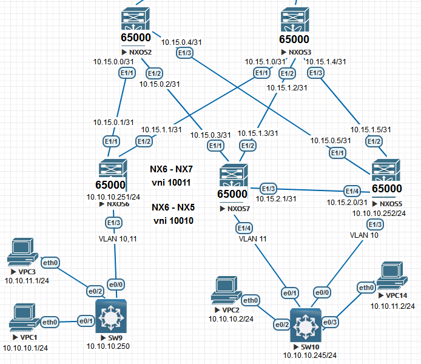

VxLAN. type 2

Goal: Configure Overlay based on VxLAN EVPN for L2 connectivity between clients

In this independent work, we expect you to be on your own:

1. Set up BGP peering between Leaf and Spine in AF l2vpn evpn
2. Spine works as a route-reflector
3. Connectivity is set up between clients in the first zone
4. The work plan, address space, network diagram, settings are fixed in the documentation

**Configuring NEXUS:**

 

NXOS2

<pre><code>
conf t
!
hostname NX2
!
nv overlay evpn
feature ospf
feature bgp
feature nv overlay
!
interface Ethernet1/1
  no switchport
  medium p2p
  ip unnumbered loopback0
  ip ospf authentication-key 3 e7cddfe7d0564e2c
  ip ospf network point-to-point
  no ip ospf passive-interface
  ip router ospf 1 area 0.0.0.0
  no shutdown
!
interface Ethernet1/2
  no switchport
  medium p2p
  ip unnumbered loopback0
  ip ospf authentication-key 3 e7cddfe7d0564e2c
  ip ospf network point-to-point
  no ip ospf passive-interface
  ip router ospf 1 area 0.0.0.0
  no shutdown
!
interface Ethernet1/3
  no switchport
  medium p2p
  ip unnumbered loopback0
  ip ospf authentication-key 3 e7cddfe7d0564e2c
  ip ospf network point-to-point
  no ip ospf passive-interface
  ip router ospf 1 area 0.0.0.0
  no shutdown
!
interface loopback0
  ip address 1.1.1.2/24
  ip router ospf 1 area 0.0.0.0
!
line console
  exec-timeout 0
line vty
  exec-timeout 0
!
router ospf 1
  router-id 1.1.1.2
  passive-interface default
 !
router bgp 65000
  template peer LEAF
    remote-as 65000
    update-source loopback0
    address-family l2vpn evpn
      send-community
      send-community extended
      route-reflector-client
  neighbor 1.1.1.5
    inherit peer LEAF
  neighbor 1.1.1.6
    inherit peer LEAF
  neighbor 1.1.1.7
    inherit peer LEAF
 !
end
copy run star
</code></pre>

  
NXOS3

<pre><code>
conf t
!
hostname NX3
!
nv overlay evpn
feature ospf
feature bgp
feature nv overlay
!
interface Ethernet1/1
  no switchport
  medium p2p
  ip unnumbered loopback0
  ip ospf authentication-key 3 e7cddfe7d0564e2c
  ip ospf network point-to-point
  no ip ospf passive-interface
  ip router ospf 1 area 0.0.0.0
  no shutdown
!
interface Ethernet1/2
  no switchport
  medium p2p
  ip unnumbered loopback0
  ip ospf authentication-key 3 e7cddfe7d0564e2c
  ip ospf network point-to-point
  no ip ospf passive-interface
  ip router ospf 1 area 0.0.0.0
  no shutdown
!
interface Ethernet1/3
  no switchport
  medium p2p
  ip unnumbered loopback0
  ip ospf authentication-key 3 e7cddfe7d0564e2c
  ip ospf network point-to-point
  no ip ospf passive-interface
  ip router ospf 1 area 0.0.0.0
  no shutdown
!
interface loopback0
  ip address 1.1.1.3/24
  ip router ospf 1 area 0.0.0.0
!
line console
  exec-timeout 0
line vty
  exec-timeout 0
!
router ospf 1
  router-id 1.1.1.3
  passive-interface default
!
router bgp 65000
  template peer LEAF
    remote-as 65000
    update-source loopback0
    address-family l2vpn evpn
      send-community
      send-community extended
      route-reflector-client
  neighbor 1.1.1.5
    inherit peer LEAF
  neighbor 1.1.1.6
    inherit peer LEAF
  neighbor 1.1.1.7
    inherit peer LEAF
!
end
copy run star
</code></pre>

NXOS5

<pre><code>
conf t
!
hostname NX5
!
nv overlay evpn
feature ospf
feature bgp
feature interface-vlan
feature vn-segment-vlan-based
feature nv overlay
!
fabric forwarding anycast-gateway-mac 0001.0001.0001
vlan 1,10
vlan 10
  vn-segment 10010
!
interface Vlan10
  no shutdown
  ip address 10.10.10.254/24
  fabric forwarding mode anycast-gateway
!
interface nve1
  no shutdown
  host-reachability protocol bgp
  source-interface loopback0
  member vni 10010
    ingress-replication protocol bgp
!
interface Ethernet1/1
  no switchport
  medium p2p
  ip unnumbered loopback0
  ip ospf authentication-key 3 e7cddfe7d0564e2c
  ip ospf network point-to-point
  no ip ospf passive-interface
  ip router ospf 1 area 0.0.0.0
  no shutdown
!
interface Ethernet1/2
  no switchport
  medium p2p
  ip unnumbered loopback0
  ip ospf authentication-key 3 e7cddfe7d0564e2c
  ip ospf network point-to-point
  no ip ospf passive-interface
  ip router ospf 1 area 0.0.0.0
  no shutdown
!
interface Ethernet1/3
  switchport mode trunk
  switchport trunk allowed vlan 10
!
interface Ethernet1/4
  no switchport
  medium p2p
  ip unnumbered loopback0
  ip ospf authentication-key 3 e7cddfe7d0564e2c
  ip ospf network point-to-point
  no ip ospf passive-interface
  ip router ospf 1 area 0.0.0.0
  no shutdown
!
interface loopback0
  ip address 1.1.1.5/24
  ip router ospf 1 area 0.0.0.0
!
line console
  exec-timeout 0
line vty
  exec-timeout 0
!
router ospf 1
  router-id 1.1.1.5
  passive-interface default
!
router bgp 65000
  template peer SPINE
    remote-as 65000
    update-source loopback0
    address-family l2vpn evpn
      send-community
      send-community extended
  neighbor 1.1.1.2
    inherit peer SPINE
  neighbor 1.1.1.3
    inherit peer SPINE
!
end
copy run star
</code></pre>

NXOS6

<pre><code>
configure terminal
!
hostname NX6
!
nv overlay evpn
feature ospf
feature bgp
feature interface-vlan
feature vn-segment-vlan-based
feature nv overlay
!
fabric forwarding anycast-gateway-mac 0001.0001.0001
vlan 1,10-11
vlan 10
  vn-segment 10010
vlan 11
  vn-segment 10011
!
interface Vlan10
  no shutdown
  ip address 10.10.10.254/24
  fabric forwarding mode anycast-gateway
!
interface Vlan11
  no shutdown
  ip address 10.10.11.254/24
  fabric forwarding mode anycast-gateway
!
interface nve1
  no shutdown
  host-reachability protocol bgp
  source-interface loopback0
  member vni 10010
    ingress-replication protocol bgp
  member vni 10011
    ingress-replication protocol bgp
!
interface Ethernet1/1
  no switchport
  medium p2p
  ip unnumbered loopback0
  ip ospf authentication-key 3 e7cddfe7d0564e2c
  ip ospf network point-to-point
  no ip ospf passive-interface
  ip router ospf 1 area 0.0.0.0
  no shutdown
!
interface Ethernet1/2
  no switchport
  medium p2p
  ip unnumbered loopback0
  ip ospf authentication-key 3 e7cddfe7d0564e2c
  ip ospf network point-to-point
  no ip ospf passive-interface
  ip router ospf 1 area 0.0.0.0
  no shutdown
!
interface Ethernet1/3
  switchport mode trunk
  spanning-tree bpdufilter enable
!
interface loopback0
  ip address 1.1.1.6/24
  ip router ospf 1 area 0.0.0.0
!
line console
  exec-timeout 0
line vty
  exec-timeout 0
!
router ospf 1
  router-id 1.1.1.6
  passive-interface default
!
router bgp 65000
  template peer SPINE
    remote-as 65000
    update-source loopback0
    address-family l2vpn evpn
      send-community
      send-community extended
  neighbor 1.1.1.2
    inherit peer SPINE
  neighbor 1.1.1.3
    inherit peer SPINE
!
end
copy run star
</code></pre>

NXOS7

<pre><code>
configure terminal
!
hostname NX7
!
nv overlay evpn
feature ospf
feature bgp
feature interface-vlan
feature vn-segment-vlan-based
feature nv overlay
!
fabric forwarding anycast-gateway-mac 0001.0001.0001
vlan 1,11
vlan 11
  vn-segment 10011
!
interface Vlan11
  no shutdown
  ip address 10.10.11.254/24
  fabric forwarding mode anycast-gateway
!
interface nve1
  no shutdown
  host-reachability protocol bgp
  source-interface loopback0
  member vni 10011
    ingress-replication protocol bgp
!
interface Ethernet1/1
  no switchport
  medium p2p
  ip unnumbered loopback0
  ip ospf authentication-key 3 e7cddfe7d0564e2c
  ip ospf network point-to-point
  no ip ospf passive-interface
  ip router ospf 1 area 0.0.0.0
  no shutdown
!
interface Ethernet1/2
  no switchport
  medium p2p
  ip unnumbered loopback0
  ip ospf authentication-key 3 e7cddfe7d0564e2c
  ip ospf network point-to-point
  no ip ospf passive-interface
  ip router ospf 1 area 0.0.0.0
  no shutdown
!
interface Ethernet1/3
  no switchport
  medium p2p
  ip unnumbered loopback0
  ip ospf authentication-key 3 e7cddfe7d0564e2c
  ip ospf network point-to-point
  no ip ospf passive-interface
  ip router ospf 1 area 0.0.0.0
  no shutdown
!
interface Ethernet1/4
  switchport mode trunk
  spanning-tree bpdufilter enable
!
interface loopback0
  ip address 1.1.1.7/24
  ip router ospf 1 area 0.0.0.0
!
line console
  exec-timeout 0
line vty
  exec-timeout 0
!
router ospf 1
  router-id 1.1.1.7
  passive-interface default
!
router bgp 65000
  template peer SPINE
    remote-as 65000
    update-source loopback0
    address-family l2vpn evpn
      send-community
      send-community extended
  neighbor 1.1.1.2
    inherit peer SPINE
  neighbor 1.1.1.3
    inherit peer SPINE
!
end
copy run star
</code></pre>

Let's check the peering with everyone:

NXOS2

<pre><code>
NX2# sh bgp l2vpn evpn summary
BGP summary information for VRF default, address family L2VPN EVPN
BGP router identifier 1.1.1.2, local AS number 65000
BGP table version is 5922, L2VPN EVPN config peers 3, capable peers 3
6 network entries and 6 paths using 1320 bytes of memory
BGP attribute entries [5/820], BGP AS path entries [0/0]
BGP community entries [0/0], BGP clusterlist entries [0/0]
!
Neighbor        V    AS MsgRcvd MsgSent   TblVer  InQ OutQ Up/Down  State/PfxRcd
1.1.1.5         4 65000    8350    7161     5922    0    0    4d07h 1         
1.1.1.6         4 65000    8457    7226     5922    0    0    4d07h 2         
1.1.1.7         4 65000    6563    8099     5922    0    0    2d22h 3  
</code></pre>

NXOS3

<pre><code>
 NX3#  sh bgp l2vpn evpn summary
BGP summary information for VRF default, address family L2VPN EVPN
BGP router identifier 1.1.1.3, local AS number 65000
BGP table version is 5925, L2VPN EVPN config peers 3, capable peers 3
8 network entries and 8 paths using 1760 bytes of memory
BGP attribute entries [6/984], BGP AS path entries [0/0]
BGP community entries [0/0], BGP clusterlist entries [0/0]
!
Neighbor        V    AS MsgRcvd MsgSent   TblVer  InQ OutQ Up/Down  State/PfxRcd
1.1.1.5         4 65000    8353    7160     5925    0    0    4d07h 1         
1.1.1.6         4 65000    8456    7223     5925    0    0    4d07h 4         
1.1.1.7         4 65000    6565    8097     5925    0    0    2d22h 3 
</code></pre>

NXOS5

<pre><code>
 NX3#  sh bgp l2vpn evpn summary
BGP summary information for VRF default, address family L2VPN EVPN
BGP router identifier 1.1.1.3, local AS number 65000
BGP table version is 5925, L2VPN EVPN config peers 3, capable peers 3
8 network entries and 8 paths using 1760 bytes of memory
BGP attribute entries [6/984], BGP AS path entries [0/0]
BGP community entries [0/0], BGP clusterlist entries [0/0]
!
Neighbor        V    AS MsgRcvd MsgSent   TblVer  InQ OutQ Up/Down  State/PfxRcd
1.1.1.2         4 65000    8769    7031    12020    0    0    4d07h 1         
1.1.1.3         4 65000    8771    7032    12020    0    0    4d07h 1  
</code></pre>

NXOS6

<pre><code>
 NX3#  sh bgp l2vpn evpn summary
BGP summary information for VRF default, address family L2VPN EVPN
BGP router identifier 1.1.1.3, local AS number 65000
BGP table version is 5925, L2VPN EVPN config peers 3, capable peers 3
8 network entries and 8 paths using 1760 bytes of memory
BGP attribute entries [6/984], BGP AS path entries [0/0]
BGP community entries [0/0], BGP clusterlist entries [0/0]
!
Neighbor        V    AS MsgRcvd MsgSent   TblVer  InQ OutQ Up/Down  State/PfxRcd
1.1.1.2         4 65000    8752    7047    13033    0    0    4d07h 4         
1.1.1.3         4 65000    8748    7043    13033    0    0    4d07h 4  
</code></pre>

NXOS7

<pre><code>
 NX3#  sh bgp l2vpn evpn summary
BGP summary information for VRF default, address family L2VPN EVPN
BGP router identifier 1.1.1.3, local AS number 65000
BGP table version is 5925, L2VPN EVPN config peers 3, capable peers 3
8 network entries and 8 paths using 1760 bytes of memory
BGP attribute entries [6/984], BGP AS path entries [0/0]
BGP community entries [0/0], BGP clusterlist entries [0/0]
!
Neighbor        V    AS MsgRcvd MsgSent   TblVer  InQ OutQ Up/Down  State/PfxRcd
1.1.1.2         4 65000    8207    4423     1870    0    0    2d22h 2         
1.1.1.3         4 65000    8206    4423     1870    0    0    2d22h 2  
</code></pre>

Let's check that there is IP connectivity between all devices:

NXOS2

<pre><code>
NX2# show ip route 
IP Route Table for VRF "default"
'*' denotes best ucast next-hop
'**' denotes best mcast next-hop
'[x/y]' denotes [preference/metric]
!
1.1.1.0/24, ubest/mbest: 1/0, attached
    *via 1.1.1.2, Lo0, [0/0], 4d09h, direct
1.1.1.1/32, ubest/mbest: 1/0
    *via 172.25.20.3, Eth1/4, [110/81], 4d08h, ospf-1, inter
1.1.1.2/32, ubest/mbest: 1/0, attached
    *via 1.1.1.2, Lo0, [0/0], 4d09h, local
1.1.1.3/32, ubest/mbest: 1/0
    *via 172.25.20.2, Eth1/4, [110/41], 4d08h, ospf-1, intra
1.1.1.4/32, ubest/mbest: 1/0
    *via 172.25.20.3, Eth1/4, [110/41], 4d08h, ospf-1, inter
1.1.1.5/32, ubest/mbest: 1/0
    *via 1.1.1.5, Eth1/3, [110/41], 4d09h, ospf-1, intra
1.1.1.6/32, ubest/mbest: 1/0
    *via 1.1.1.6, Eth1/1, [110/41], 4d09h, ospf-1, intra
1.1.1.7/32, ubest/mbest: 1/0
    *via 1.1.1.7, Eth1/2, [110/41], 2d22h, ospf-1, intra
172.25.20.0/24, ubest/mbest: 1/0, attached
    *via 172.25.20.1, Eth1/4, [0/0], 4d08h, direct
172.25.20.1/32, ubest/mbest: 1/0, attached
    *via 172.25.20.1, Eth1/4, [0/0], 4d08h, local
</code></pre>

NXOS3

<pre><code>
NX3# show ip route 
IP Route Table for VRF "default"
'*' denotes best ucast next-hop
'**' denotes best mcast next-hop
'[x/y]' denotes [preference/metric]
!
1.1.1.0/24, ubest/mbest: 1/0, attached
    *via 1.1.1.3, Lo0, [0/0], 4d09h, direct
1.1.1.1/32, ubest/mbest: 1/0
    *via 172.25.20.3, Eth1/4, [110/81], 4d08h, ospf-1, inter
1.1.1.2/32, ubest/mbest: 1/0
    *via 172.25.20.1, Eth1/4, [110/41], 4d08h, ospf-1, intra
1.1.1.3/32, ubest/mbest: 1/0, attached
    *via 1.1.1.3, Lo0, [0/0], 4d09h, local
1.1.1.4/32, ubest/mbest: 1/0
    *via 172.25.20.3, Eth1/4, [110/41], 4d08h, ospf-1, inter
1.1.1.5/32, ubest/mbest: 1/0
    *via 1.1.1.5, Eth1/3, [110/41], 4d09h, ospf-1, intra
1.1.1.6/32, ubest/mbest: 1/0
    *via 1.1.1.6, Eth1/1, [110/41], 4d09h, ospf-1, intra
1.1.1.7/32, ubest/mbest: 1/0
    *via 1.1.1.7, Eth1/2, [110/41], 2d22h, ospf-1, intra
172.25.20.0/24, ubest/mbest: 1/0, attached
    *via 172.25.20.2, Eth1/4, [0/0], 4d08h, direct
172.25.20.2/32, ubest/mbest: 1/0, attached
    *via 172.25.20.2, Eth1/4, [0/0], 4d08h, local
</code></pre>

NXOS5

<pre><code>
NX5(config)#  sh ip route
IP Route Table for VRF "default"
'*' denotes best ucast next-hop
'**' denotes best mcast next-hop
'[x/y]' denotes [preference/metric]
!
1.1.1.0/24, ubest/mbest: 1/0, attached
    *via 1.1.1.5, Lo0, [0/0], 4d09h, direct
1.1.1.1/32, ubest/mbest: 2/0
    *via 1.1.1.2, Eth1/1, [110/121], 4d08h, ospf-1, inter
    *via 1.1.1.3, Eth1/2, [110/121], 4d08h, ospf-1, inter
1.1.1.2/32, ubest/mbest: 1/0
    *via 1.1.1.2, Eth1/1, [110/41], 4d09h, ospf-1, intra
1.1.1.3/32, ubest/mbest: 1/0
    *via 1.1.1.3, Eth1/2, [110/41], 4d09h, ospf-1, intra
1.1.1.4/32, ubest/mbest: 2/0
    *via 1.1.1.2, Eth1/1, [110/81], 4d08h, ospf-1, inter
    *via 1.1.1.3, Eth1/2, [110/81], 4d08h, ospf-1, inter
1.1.1.5/32, ubest/mbest: 1/0, attached
    *via 1.1.1.5, Lo0, [0/0], 4d09h, local
1.1.1.6/32, ubest/mbest: 2/0
    *via 1.1.1.2, Eth1/1, [110/81], 4d09h, ospf-1, intra
    *via 1.1.1.3, Eth1/2, [110/81], 4d09h, ospf-1, intra
1.1.1.7/32, ubest/mbest: 1/0
    *via 1.1.1.7, Eth1/4, [110/41], 1d17h, ospf-1, intra
10.10.10.0/24, ubest/mbest: 1/0, attached
    *via 10.10.10.254, Vlan10, [0/0], 09:39:02, direct
10.10.10.254/32, ubest/mbest: 1/0, attached
    *via 10.10.10.254, Vlan10, [0/0], 09:39:02, local
172.25.20.0/24, ubest/mbest: 2/0
    *via 1.1.1.2, Eth1/1, [110/80], 4d08h, ospf-1, intra
    *via 1.1.1.3, Eth1/2, [110/80], 4d08h, ospf-1, intra
</code></pre>

NXOS6

<pre><code>
NX6(config)# show ip route 
IP Route Table for VRF "default"
'*' denotes best ucast next-hop
'**' denotes best mcast next-hop
'[x/y]' denotes [preference/metric]
!
1.1.1.0/24, ubest/mbest: 1/0, attached
    *via 1.1.1.6, Lo0, [0/0], 4d09h, direct
1.1.1.1/32, ubest/mbest: 2/0
    *via 1.1.1.2, Eth1/1, [110/121], 4d08h, ospf-1, inter
    *via 1.1.1.3, Eth1/2, [110/121], 4d08h, ospf-1, inter
1.1.1.2/32, ubest/mbest: 1/0
    *via 1.1.1.2, Eth1/1, [110/41], 4d09h, ospf-1, intra
1.1.1.3/32, ubest/mbest: 1/0
    *via 1.1.1.3, Eth1/2, [110/41], 4d09h, ospf-1, intra
1.1.1.4/32, ubest/mbest: 2/0
    *via 1.1.1.2, Eth1/1, [110/81], 4d08h, ospf-1, inter
    *via 1.1.1.3, Eth1/2, [110/81], 4d08h, ospf-1, inter
1.1.1.5/32, ubest/mbest: 2/0
    *via 1.1.1.2, Eth1/1, [110/81], 4d09h, ospf-1, intra
    *via 1.1.1.3, Eth1/2, [110/81], 4d09h, ospf-1, intra
1.1.1.6/32, ubest/mbest: 1/0, attached
    *via 1.1.1.6, Lo0, [0/0], 4d09h, local
1.1.1.7/32, ubest/mbest: 2/0
    *via 1.1.1.2, Eth1/1, [110/81], 2d22h, ospf-1, intra
    *via 1.1.1.3, Eth1/2, [110/81], 2d22h, ospf-1, intra
10.10.10.0/24, ubest/mbest: 1/0, attached
    *via 10.10.10.254, Vlan10, [0/0], 10:06:46, direct
10.10.10.254/32, ubest/mbest: 1/0, attached
    *via 10.10.10.254, Vlan10, [0/0], 10:06:46, local
10.10.11.0/24, ubest/mbest: 1/0, attached
    *via 10.10.11.254, Vlan11, [0/0], 10:06:36, direct
10.10.11.254/32, ubest/mbest: 1/0, attached
    *via 10.10.11.254, Vlan11, [0/0], 10:06:36, local
172.25.20.0/24, ubest/mbest: 2/0
    *via 1.1.1.2, Eth1/1, [110/80], 4d08h, ospf-1, intra
    *via 1.1.1.3, Eth1/2, [110/80], 4d08h, ospf-1, intra
</code></pre>

NXOS7

<pre><code>
NX7# show ip route 
IP Route Table for VRF "default"
'*' denotes best ucast next-hop
'**' denotes best mcast next-hop
'[x/y]' denotes [preference/metric]
!
1.1.1.0/24, ubest/mbest: 1/0, attached
    *via 1.1.1.7, Lo0, [0/0], 2d22h, direct
1.1.1.1/32, ubest/mbest: 2/0
    *via 1.1.1.2, Eth1/1, [110/121], 2d22h, ospf-1, inter
    *via 1.1.1.3, Eth1/2, [110/121], 2d22h, ospf-1, inter
1.1.1.2/32, ubest/mbest: 1/0
    *via 1.1.1.2, Eth1/1, [110/41], 2d22h, ospf-1, intra
1.1.1.3/32, ubest/mbest: 1/0
    *via 1.1.1.3, Eth1/2, [110/41], 2d22h, ospf-1, intra
1.1.1.4/32, ubest/mbest: 2/0
    *via 1.1.1.2, Eth1/1, [110/81], 2d22h, ospf-1, inter
    *via 1.1.1.3, Eth1/2, [110/81], 2d22h, ospf-1, inter
1.1.1.5/32, ubest/mbest: 1/0
    *via 1.1.1.5, Eth1/3, [110/41], 1d17h, ospf-1, intra
1.1.1.6/32, ubest/mbest: 2/0
    *via 1.1.1.2, Eth1/1, [110/81], 2d22h, ospf-1, intra
    *via 1.1.1.3, Eth1/2, [110/81], 2d22h, ospf-1, intra
1.1.1.7/32, ubest/mbest: 1/0, attached
    *via 1.1.1.7, Lo0, [0/0], 2d22h, local
10.10.11.0/24, ubest/mbest: 1/0, attached
    *via 10.10.11.254, Vlan11, [0/0], 10:05:40, direct
10.10.11.2/32, ubest/mbest: 1/0, attached
    *via 10.10.11.2, Vlan11, [190/0], 10:02:52, hmm
10.10.11.254/32, ubest/mbest: 1/0, attached
    *via 10.10.11.254, Vlan11, [0/0], 10:05:40, local
172.25.20.0/24, ubest/mbest: 2/0
    *via 1.1.1.2, Eth1/1, [110/80], 2d22h, ospf-1, intra
    *via 1.1.1.3, Eth1/2, [110/80], 2d22h, ospf-1, intra
</code></pre>

Now let's check nve peers and the table for BGP EVPN:

NXOS5

<pre><code>
NX5#  sh nve peers
Interface Peer-IP          State LearnType Uptime   Router-Mac       
--------- ---------------  ----- --------- -------- -----------------
nve1      1.1.1.6          Up    CP        3d22h    n/a  
!
NX5#  sh bgp l2vpn evpn
BGP routing table information for VRF default, address family L2VPN EVPN
BGP table version is 12037, Local Router ID is 1.1.1.5
Status: s-suppressed, x-deleted, S-stale, d-dampened, h-history, *-valid, >-best
Path type: i-internal, e-external, c-confed, l-local, a-aggregate, r-redist, I-i
njected
Origin codes: i - IGP, e - EGP, ? - incomplete, | - multipath, & - backup, 2 - b
est2
!
   Network            Next Hop            Metric     LocPrf     Weight Path
Route Distinguisher: 1.1.1.5:32777    (L2VNI 10010)
*>l[3]:[0]:[32]:[1.1.1.5]/88
                      1.1.1.5                           100      32768 i
*>i[3]:[0]:[32]:[1.1.1.6]/88
                      1.1.1.6                           100          0 i
!
Route Distinguisher: 1.1.1.6:32777
* i[3]:[0]:[32]:[1.1.1.6]/88
                      1.1.1.6                           100          0 i
*>i                   1.1.1.6                           100          0 i
</code></pre>

NXOS6

<pre><code>
NX6# sh nve peers
Interface Peer-IP          State LearnType Uptime   Router-Mac       
--------- ---------------  ----- --------- -------- -----------------
nve1      1.1.1.5          Up    CP        3d22h    n/a              
nve1      1.1.1.7          Up    CP        10:50:21 n/a     
!
NX6# sh bgp l2vpn evpn
BGP routing table information for VRF default, address family L2VPN EVPN
BGP table version is 13061, Local Router ID is 1.1.1.6
Status: s-suppressed, x-deleted, S-stale, d-dampened, h-history, *-valid, >-best
Path type: i-internal, e-external, c-confed, l-local, a-aggregate, r-redist, I-i
njected
Origin codes: i - IGP, e - EGP, ? - incomplete, | - multipath, & - backup, 2 - b
est2
!
   Network            Next Hop            Metric     LocPrf     Weight Path
Route Distinguisher: 1.1.1.5:32777
* i[3]:[0]:[32]:[1.1.1.5]/88
                      1.1.1.5                           100          0 i
*>i                   1.1.1.5                           100          0 i
!
Route Distinguisher: 1.1.1.6:32777    (L2VNI 10010)
*>i[3]:[0]:[32]:[1.1.1.5]/88
                      1.1.1.5                           100          0 i
*>l[3]:[0]:[32]:[1.1.1.6]/88
                      1.1.1.6                           100      32768 i
!
Route Distinguisher: 1.1.1.6:32778    (L2VNI 10011)
*>i[2]:[0]:[0]:[48]:[0050.7966.680e]:[0]:[0.0.0.0]/216
                      1.1.1.7                           100          0 i
*>i[2]:[0]:[0]:[48]:[0050.7966.680e]:[32]:[10.10.11.2]/248
                      1.1.1.7                           100          0 i
*>l[3]:[0]:[32]:[1.1.1.6]/88
                      1.1.1.6                           100      32768 i
*>i[3]:[0]:[32]:[1.1.1.7]/88
                      1.1.1.7                           100          0 i
!
Route Distinguisher: 1.1.1.7:32778
*>i[2]:[0]:[0]:[48]:[0050.7966.680e]:[0]:[0.0.0.0]/216
                      1.1.1.7                           100          0 i
* i                   1.1.1.7                           100          0 i
  *>i[2]:[0]:[0]:[48]:[0050.7966.680e]:[32]:[10.10.11.2]/248
                      1.1.1.7                           100          0 i
* i                   1.1.1.7                           100          0 i
* i[3]:[0]:[32]:[1.1.1.7]/88
                      1.1.1.7                           100          0 i
                  *>i                   1.1.1.7                           100          0 i
                  </code></pre>
                  

NXOS7

<pre><code>
NX7# sh nve peers
Interface Peer-IP          State LearnType Uptime   Router-Mac       
--------- ---------------  ----- --------- -------- -----------------
nve1      1.1.1.6          Up    CP        10:50:09 n/a  
!
NX7#  sh bgp l2vpn evpn
BGP routing table information for VRF default, address family L2VPN EVPN
BGP table version is 1890, Local Router ID is 1.1.1.7
Status: s-suppressed, x-deleted, S-stale, d-dampened, h-history, *-valid, >-best
Path type: i-internal, e-external, c-confed, l-local, a-aggregate, r-redist, I-i
njected
Origin codes: i - IGP, e - EGP, ? - incomplete, | - multipath, & - backup, 2 - b
est2
!
   Network            Next Hop            Metric     LocPrf     Weight Path
Route Distinguisher: 1.1.1.6:32778
* i[3]:[0]:[32]:[1.1.1.6]/88
                      1.1.1.6                           100          0 i
*>i                   1.1.1.6                           100          0 i
Route Distinguisher: 1.1.1.7:32778    (L2VNI 10011)
*>l[2]:[0]:[0]:[48]:[0050.7966.680e]:[0]:[0.0.0.0]/216
                      1.1.1.7                           100      32768 i
*>l[2]:[0]:[0]:[48]:[0050.7966.680e]:[32]:[10.10.11.2]/248
                      1.1.1.7                           100      32768 i
*>i[3]:[0]:[32]:[1.1.1.6]/88
                      1.1.1.6                           100          0 i
*>l[3]:[0]:[32]:[1.1.1.7]/88
                      1.1.1.7                           100      32768 i
</code></pre>

Conclusion:

1. Configured BGP peering between Leaf and Spine in AF l2vpn evpn
2. Spine works as a route-reflector
3. The work plan, address space, network diagram, settings are fixed in the documentation