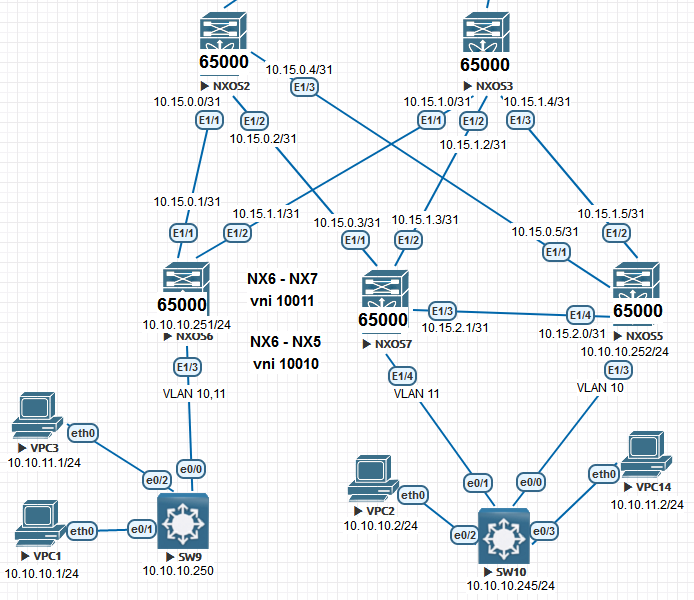

Проектирование адресного пространства

Цель: Собрать схему CLOS;
Распределить адресное пространство;

В этой самостоятельной работе мы ожидаем, что вы самостоятельно:

1. Соберете топологию CLOS с 3 Spine и 4 Leaf. 3 Leaf подключены к 2 Spine. 1 Leaf подключен к оставшемуся Spine. Все Spine связаны между собой через дополнительный маршрутизатор(рекомендуется использовать IOL)
2. Leaf необходимо связать между собой для дальнейшей настройки VPC пары
3. Добавите 3 клиента будущей фабрики. Один клиент подключен к VPC паре. Остальные клиенты подключены к оставшимся Leaf(в качестве клиентов рекомендуется использовать IOL образы)
4. Распределите адресное пространство для Underlay сети
5. План работы, адресное пространство, схема сети, настройки - зафиксированы в документации

**Настройка NEXUS:**

 

NXOS2

<pre><code>
conf t
!
hostname NX2
!
nv overlay evpn
feature ospf
feature bgp
feature nv overlay
!
interface Ethernet1/1
  no switchport
  medium p2p
  ip unnumbered loopback0
  ip ospf authentication-key 3 e7cddfe7d0564e2c
  ip ospf network point-to-point
  no ip ospf passive-interface
  ip router ospf 1 area 0.0.0.0
  no shutdown
!
interface Ethernet1/2
  no switchport
  medium p2p
  ip unnumbered loopback0
  ip ospf authentication-key 3 e7cddfe7d0564e2c
  ip ospf network point-to-point
  no ip ospf passive-interface
  ip router ospf 1 area 0.0.0.0
  no shutdown
!
interface Ethernet1/3
  no switchport
  medium p2p
  ip unnumbered loopback0
  ip ospf authentication-key 3 e7cddfe7d0564e2c
  ip ospf network point-to-point
  no ip ospf passive-interface
  ip router ospf 1 area 0.0.0.0
  no shutdown
!
interface loopback0
  ip address 1.1.1.2/24
  ip router ospf 1 area 0.0.0.0
!
line console
  exec-timeout 0
line vty
  exec-timeout 0
!
router ospf 1
  router-id 1.1.1.2
  passive-interface default
 !
router bgp 65000
  template peer LEAF
    remote-as 65000
    update-source loopback0
    address-family l2vpn evpn
      send-community
      send-community extended
      route-reflector-client
  neighbor 1.1.1.5
    inherit peer LEAF
  neighbor 1.1.1.6
    inherit peer LEAF
  neighbor 1.1.1.7
    inherit peer LEAF
 !
end
copy run star
</code></pre>

  
NXOS3

<pre><code>
conf t
!
hostname NX3
!
nv overlay evpn
feature ospf
feature bgp
feature nv overlay
!
interface Ethernet1/1
  no switchport
  medium p2p
  ip unnumbered loopback0
  ip ospf authentication-key 3 e7cddfe7d0564e2c
  ip ospf network point-to-point
  no ip ospf passive-interface
  ip router ospf 1 area 0.0.0.0
  no shutdown
!
interface Ethernet1/2
  no switchport
  medium p2p
  ip unnumbered loopback0
  ip ospf authentication-key 3 e7cddfe7d0564e2c
  ip ospf network point-to-point
  no ip ospf passive-interface
  ip router ospf 1 area 0.0.0.0
  no shutdown
!
interface Ethernet1/3
  no switchport
  medium p2p
  ip unnumbered loopback0
  ip ospf authentication-key 3 e7cddfe7d0564e2c
  ip ospf network point-to-point
  no ip ospf passive-interface
  ip router ospf 1 area 0.0.0.0
  no shutdown
!
interface loopback0
  ip address 1.1.1.3/24
  ip router ospf 1 area 0.0.0.0
!
line console
  exec-timeout 0
line vty
  exec-timeout 0
!
router ospf 1
  router-id 1.1.1.3
  passive-interface default
!
router bgp 65000
  template peer LEAF
    remote-as 65000
    update-source loopback0
    address-family l2vpn evpn
      send-community
      send-community extended
      route-reflector-client
  neighbor 1.1.1.5
    inherit peer LEAF
  neighbor 1.1.1.6
    inherit peer LEAF
  neighbor 1.1.1.7
    inherit peer LEAF
!
end
copy run star
</code></pre>

NXOS5

<pre><code>
conf t
!
hostname NX5
!
nv overlay evpn
feature ospf
feature bgp
feature interface-vlan
feature vn-segment-vlan-based
feature nv overlay
!
fabric forwarding anycast-gateway-mac 0001.0001.0001
vlan 1,10
vlan 10
  vn-segment 10010
!
interface Vlan10
  no shutdown
  ip address 10.10.10.254/24
  fabric forwarding mode anycast-gateway
!
interface nve1
  no shutdown
  host-reachability protocol bgp
  source-interface loopback0
  member vni 10010
    ingress-replication protocol bgp
!
interface Ethernet1/1
  no switchport
  medium p2p
  ip unnumbered loopback0
  ip ospf authentication-key 3 e7cddfe7d0564e2c
  ip ospf network point-to-point
  no ip ospf passive-interface
  ip router ospf 1 area 0.0.0.0
  no shutdown
!
interface Ethernet1/2
  no switchport
  medium p2p
  ip unnumbered loopback0
  ip ospf authentication-key 3 e7cddfe7d0564e2c
  ip ospf network point-to-point
  no ip ospf passive-interface
  ip router ospf 1 area 0.0.0.0
  no shutdown
!
interface Ethernet1/3
  switchport mode trunk
  switchport trunk allowed vlan 10
!
interface Ethernet1/4
  no switchport
  medium p2p
  ip unnumbered loopback0
  ip ospf authentication-key 3 e7cddfe7d0564e2c
  ip ospf network point-to-point
  no ip ospf passive-interface
  ip router ospf 1 area 0.0.0.0
  no shutdown
!
interface loopback0
  ip address 1.1.1.5/24
  ip router ospf 1 area 0.0.0.0
!
line console
  exec-timeout 0
line vty
  exec-timeout 0
!
router ospf 1
  router-id 1.1.1.5
  passive-interface default
!
router bgp 65000
  template peer SPINE
    remote-as 65000
    update-source loopback0
    address-family l2vpn evpn
      send-community
      send-community extended
  neighbor 1.1.1.2
    inherit peer SPINE
  neighbor 1.1.1.3
    inherit peer SPINE
!
end
copy run star
</code></pre>

NXOS6

<pre><code>
configure terminal
!
hostname NX6
!
nv overlay evpn
feature ospf
feature bgp
feature interface-vlan
feature vn-segment-vlan-based
feature nv overlay
!
fabric forwarding anycast-gateway-mac 0001.0001.0001
vlan 1,10-11
vlan 10
  vn-segment 10010
vlan 11
  vn-segment 10011
!
interface Vlan10
  no shutdown
  ip address 10.10.10.254/24
  fabric forwarding mode anycast-gateway
!
interface Vlan11
  no shutdown
  ip address 10.10.11.254/24
  fabric forwarding mode anycast-gateway
!
interface nve1
  no shutdown
  host-reachability protocol bgp
  source-interface loopback0
  member vni 10010
    ingress-replication protocol bgp
  member vni 10011
    ingress-replication protocol bgp
!
interface Ethernet1/1
  no switchport
  medium p2p
  ip unnumbered loopback0
  ip ospf authentication-key 3 e7cddfe7d0564e2c
  ip ospf network point-to-point
  no ip ospf passive-interface
  ip router ospf 1 area 0.0.0.0
  no shutdown
!
interface Ethernet1/2
  no switchport
  medium p2p
  ip unnumbered loopback0
  ip ospf authentication-key 3 e7cddfe7d0564e2c
  ip ospf network point-to-point
  no ip ospf passive-interface
  ip router ospf 1 area 0.0.0.0
  no shutdown
!
interface Ethernet1/3
  switchport mode trunk
  switchport trunk allowed vlan 10-11
  spanning-tree bpdufilter enable
!
interface loopback0
  ip address 1.1.1.6/24
  ip router ospf 1 area 0.0.0.0
!
line console
  exec-timeout 0
line vty
  exec-timeout 0
!
router ospf 1
  router-id 1.1.1.6
  passive-interface default
!
router bgp 65000
  template peer SPINE
    remote-as 65000
    update-source loopback0
    address-family l2vpn evpn
      send-community
      send-community extended
  neighbor 1.1.1.2
    inherit peer SPINE
  neighbor 1.1.1.3
    inherit peer SPINE
!
end
copy run star
</code></pre>

NXOS7

<pre><code>
configure terminal
!
hostname NX7
!
nv overlay evpn
feature ospf
feature bgp
feature interface-vlan
feature vn-segment-vlan-based
feature nv overlay
!
fabric forwarding anycast-gateway-mac 0001.0001.0001
vlan 1,11
vlan 11
  vn-segment 10011
!
interface Vlan11
  no shutdown
  ip address 10.10.11.254/24
  fabric forwarding mode anycast-gateway
!
interface nve1
  no shutdown
  host-reachability protocol bgp
  source-interface loopback0
  member vni 10011
    ingress-replication protocol bgp
!
interface Ethernet1/1
  no switchport
  medium p2p
  ip unnumbered loopback0
  ip ospf authentication-key 3 e7cddfe7d0564e2c
  ip ospf network point-to-point
  no ip ospf passive-interface
  ip router ospf 1 area 0.0.0.0
  no shutdown
!
interface Ethernet1/2
  no switchport
  medium p2p
  ip unnumbered loopback0
  ip ospf authentication-key 3 e7cddfe7d0564e2c
  ip ospf network point-to-point
  no ip ospf passive-interface
  ip router ospf 1 area 0.0.0.0
  no shutdown
!
interface Ethernet1/4
  switchport mode trunk
  spanning-tree bpdufilter enable
!
interface loopback0
  ip address 1.1.1.7/24
  ip router ospf 1 area 0.0.0.0
!
line console
  exec-timeout 0
line vty
  exec-timeout 0
!
router ospf 1
  router-id 1.1.1.7
  passive-interface default
!
router bgp 65000
  template peer SPINE
    remote-as 65000
    update-source loopback0
    address-family l2vpn evpn
      send-community
      send-community extended
  neighbor 1.1.1.2
    inherit peer SPINE
  neighbor 1.1.1.3
    inherit peer SPINE
!
end
copy run star
</code></pre>

