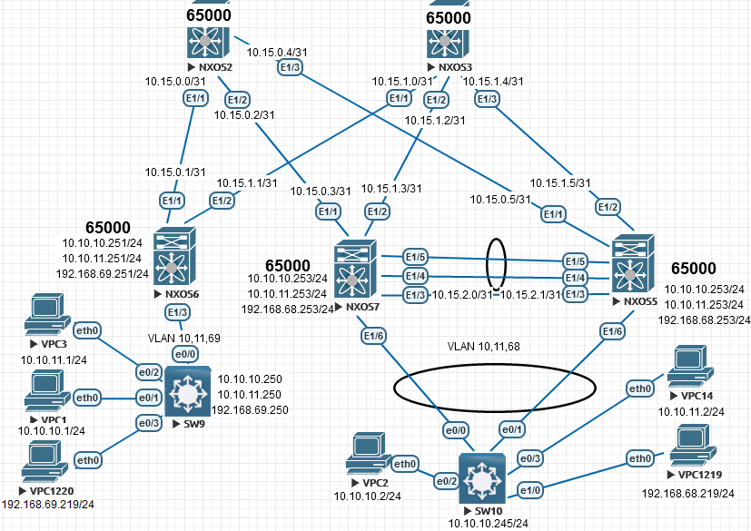

# VxLAN. Route

Цель:

Настроить Overlay на основе с использованием VPC; Маршрутизация в Overlay.

В этой  самостоятельной работе мы ожидаем, что вы самостоятельно:

1. Настроите каждого клиента в своем VNI

2. Настроите маршрутизацию между клиентами

   

**Настройка NEXUS:**

 

NXOS2

<pre><code>
conf t
!
hostname NX2
!
nv overlay evpn
feature ospf
feature bgp
feature nv overlay
!
interface Ethernet1/1
  no switchport
  medium p2p
  ip unnumbered loopback0
  ip ospf authentication-key 3 e7cddfe7d0564e2c
  ip ospf network point-to-point
  no ip ospf passive-interface
  ip router ospf 1 area 0.0.0.0
  no shutdown
!
interface Ethernet1/2
  no switchport
  medium p2p
  ip unnumbered loopback0
  ip ospf authentication-key 3 e7cddfe7d0564e2c
  ip ospf network point-to-point
  no ip ospf passive-interface
  ip router ospf 1 area 0.0.0.0
  no shutdown
!
interface Ethernet1/3
  no switchport
  medium p2p
  ip unnumbered loopback0
  ip ospf authentication-key 3 e7cddfe7d0564e2c
  ip ospf network point-to-point
  no ip ospf passive-interface
  ip router ospf 1 area 0.0.0.0
  no shutdown
!
interface loopback0
  ip address 1.1.1.2/24
  ip router ospf 1 area 0.0.0.0
!
cli alias name wr copy running-config startup-config
line console
  exec-timeout 0
line vty
  exec-timeout 0
!
router ospf 1
  router-id 1.1.1.2
  passive-interface default
 !
router bgp 65000
  template peer LEAF
    remote-as 65000
    update-source loopback0
    address-family l2vpn evpn
      send-community
      send-community extended
      route-reflector-client
  neighbor 1.1.1.5
    inherit peer LEAF
  neighbor 1.1.1.6
    inherit peer LEAF
  neighbor 1.1.1.7
    inherit peer LEAF
 !
end
wr
</code></pre>

  
NXOS3

<pre><code>
conf t
!
hostname NX3
!
nv overlay evpn
feature ospf
feature bgp
feature nv overlay
!
interface Ethernet1/1
  no switchport
  medium p2p
  ip unnumbered loopback0
  ip ospf authentication-key 3 e7cddfe7d0564e2c
  ip ospf network point-to-point
  no ip ospf passive-interface
  ip router ospf 1 area 0.0.0.0
  no shutdown
!
interface Ethernet1/2
  no switchport
  medium p2p
  ip unnumbered loopback0
  ip ospf authentication-key 3 e7cddfe7d0564e2c
  ip ospf network point-to-point
  no ip ospf passive-interface
  ip router ospf 1 area 0.0.0.0
  no shutdown
!
interface Ethernet1/3
  no switchport
  medium p2p
  ip unnumbered loopback0
  ip ospf authentication-key 3 e7cddfe7d0564e2c
  ip ospf network point-to-point
  no ip ospf passive-interface
  ip router ospf 1 area 0.0.0.0
  no shutdown
!
interface loopback0
  ip address 1.1.1.3/24
  ip router ospf 1 area 0.0.0.0
!
line console
  exec-timeout 0
line vty
  exec-timeout 0
!
router ospf 1
  router-id 1.1.1.3
  passive-interface default
!
router bgp 65000
  template peer LEAF
    remote-as 65000
    update-source loopback0
    address-family l2vpn evpn
      send-community
      send-community extended
      route-reflector-client
  neighbor 1.1.1.5
    inherit peer LEAF
  neighbor 1.1.1.6
    inherit peer LEAF
  neighbor 1.1.1.7
    inherit peer LEAF
!
end
copy run star
</code></pre>

NXOS5

<pre><code>
configure terminal
!
hostname NX5
!
nv overlay evpn
feature ospf
feature bgp
feature interface-vlan
feature vn-segment-vlan-based
feature lacp
feature vpc
feature nv overlay
!
fabric forwarding anycast-gateway-mac 0001.0001.0001
vlan 1,10-11,68,88
vlan 10
  vn-segment 10010
vlan 11
  vn-segment 10011
vlan 68
  vn-segment 10068
vlan 88
  vn-segment 9999
!
vrf context VPC
vrf context VXLAN_RT
  vni 9999
  address-family ipv4 unicast
    route-target import 9999:9999
    route-target import 9999:9999 evpn
    route-target export 9999:9999
    route-target export 9999:9999 evpn
    route-target both auto
    route-target both auto evpn
!
vpc domain 1
  peer-keepalive destination 10.15.2.0 source 10.15.2.1 vrf VPC
!
interface Vlan10
  no shutdown
  ip address 10.10.10.253/24
  fabric forwarding mode anycast-gateway
!
interface Vlan11
  no shutdown
  ip address 10.10.11.253/24
  fabric forwarding mode anycast-gateway
!
interface Vlan68
  no shutdown
  vrf member VXLAN_RT
  ip address 192.168.68.253/24
  fabric forwarding mode anycast-gateway
!
interface Vlan88
  no shutdown
  vrf member VXLAN_RT
  ip forward
!
interface port-channel1
  switchport mode trunk
  spanning-tree port type network
  vpc peer-link
!
interface port-channel2
  switchport mode trunk
  vpc 1
!
interface nve1
  no shutdown
  host-reachability protocol bgp
  source-interface loopback0
  member vni 9999 associate-vrf
  member vni 10010
    ingress-replication protocol bgp
  member vni 10011
    ingress-replication protocol bgp
  member vni 10068
    ingress-replication protocol bgp
!
interface Ethernet1/1
  no switchport
  medium p2p
  ip unnumbered loopback0
  ip ospf authentication-key 3 e7cddfe7d0564e2c
  ip ospf network point-to-point
  no ip ospf passive-interface
  ip router ospf 1 area 0.0.0.0
  no shutdown
!
interface Ethernet1/2
  no switchport
  medium p2p
  ip unnumbered loopback0
  ip ospf authentication-key 3 e7cddfe7d0564e2c
  ip ospf network point-to-point
  no ip ospf passive-interface
  ip router ospf 1 area 0.0.0.0
  no shutdown
!
interface Ethernet1/3
  no switchport
  vrf member VPC
  ip address 10.15.2.1/31
  no shutdown
!
interface Ethernet1/4
  switchport mode trunk
  channel-group 1 mode active
!
interface Ethernet1/5
  switchport mode trunk
  channel-group 1 mode active
!
interface Ethernet1/6
  switchport mode trunk
  spanning-tree bpdufilter enable
  channel-group 2 mode active
!
interface loopback0
  ip address 1.1.1.5/24
  ip address 10.255.255.255/32 secondary
  ip router ospf 1 area 0.0.0.0
!
cli alias name wr copy running-config startup-config
line console
  exec-timeout 0
line vty
  exec-timeout 0
!
router ospf 1
  router-id 1.1.1.5
  passive-interface default
! 
router bgp 65000
  template peer SPINE
    remote-as 65000
    update-source loopback0
    address-family l2vpn evpn
      send-community
      send-community extended
  neighbor 1.1.1.2
    inherit peer SPINE
  neighbor 1.1.1.3
    inherit peer SPINE
end
wr
</code></pre>

NXOS6

<pre><code>
configure terminal
!
hostname NX6
!
nv overlay evpn
feature ospf
feature bgp
feature interface-vlan
feature vn-segment-vlan-based
feature nv overlay
!
fabric forwarding anycast-gateway-mac 0001.0001.0001
vlan 1,10-11,69,99
vlan 10
  vn-segment 10010
vlan 11
  vn-segment 10011
vlan 69
  vn-segment 10069
vlan 99
  vn-segment 9999
!
vrf context VXLAN_RT
  vni 9999
  address-family ipv4 unicast
    route-target import 9999:9999
    route-target import 9999:9999 evpn
    route-target export 9999:9999
    route-target export 9999:9999 evpn
    route-target both auto
    route-target both auto evpn
!
interface Vlan10
  no shutdown
  ip address 10.10.10.251/24
  fabric forwarding mode anycast-gateway
!
interface Vlan11
  no shutdown
  ip address 10.10.11.251/24
  fabric forwarding mode anycast-gateway
!
interface Vlan69
  no shutdown
  vrf member VXLAN_RT
  ip address 192.168.69.251/24
  fabric forwarding mode anycast-gateway
!
interface Vlan99
  no shutdown
  vrf member VXLAN_RT
  ip forward
!
interface nve1
  no shutdown
  host-reachability protocol bgp
  source-interface loopback0
  member vni 9999 associate-vrf
  member vni 10010
    ingress-replication protocol bgp
  member vni 10011
    ingress-replication protocol bgp
  member vni 10069
    ingress-replication protocol bgp
!
interface Ethernet1/1
  no switchport
  medium p2p
  ip unnumbered loopback0
  ip ospf authentication-key 3 e7cddfe7d0564e2c
  ip ospf network point-to-point
  no ip ospf passive-interface
  ip router ospf 1 area 0.0.0.0
  no shutdown
!
interface Ethernet1/2
  no switchport
  medium p2p
  ip unnumbered loopback0
  ip ospf authentication-key 3 e7cddfe7d0564e2c
  ip ospf network point-to-point
  no ip ospf passive-interface
  ip router ospf 1 area 0.0.0.0
  no shutdown
!
interface Ethernet1/3
  switchport mode trunk
  spanning-tree bpdufilter enable
!
interface loopback0
  ip address 1.1.1.6/24
  ip router ospf 1 area 0.0.0.0
!
cli alias name wr copy running-config startup-config
line console
  exec-timeout 0
line vty
  exec-timeout 0
!
router ospf 1
  router-id 1.1.1.6
  passive-interface default
!
router bgp 65000
  template peer SPINE
    remote-as 65000
    update-source loopback0
    address-family l2vpn evpn
      send-community
      send-community extended
  neighbor 1.1.1.2
    inherit peer SPINE
  neighbor 1.1.1.3
    inherit peer SPINE
!
end
wr
</code></pre>

NXOS7

<pre><code>
configure terminal
!
hostname NX7
!
nv overlay evpn
feature ospf
feature bgp
feature interface-vlan
feature vn-segment-vlan-based
feature lacp
feature vpc
feature nv overlay
!
fabric forwarding anycast-gateway-mac 0001.0001.0001
vlan 1,10-11,68,88
vlan 10
  vn-segment 10010
vlan 11
  vn-segment 10011
vlan 68
  vn-segment 10068
vlan 88
  vn-segment 9999
!
vrf context VPC
!
vrf context VXLAN_RT
  vni 9999
  address-family ipv4 unicast
    route-target import 9999:9999
    route-target import 9999:9999 evpn
    route-target export 9999:9999
    route-target export 9999:9999 evpn
    route-target both auto
    route-target both auto evpn
!
vpc domain 1
  peer-keepalive destination 10.15.2.1 source 10.15.2.0 vrf VPC
!
interface Vlan10
  no shutdown
  ip address 10.10.10.253/24
  fabric forwarding mode anycast-gateway
!
interface Vlan11
  no shutdown
  ip address 10.10.11.253/24
  fabric forwarding mode anycast-gateway
!
interface Vlan68
  no shutdown
  vrf member VXLAN_RT
  ip address 192.168.68.253/24
  fabric forwarding mode anycast-gateway
!
interface Vlan88
  no shutdown
  vrf member VXLAN_RT
  ip forward
!
interface port-channel1
  switchport mode trunk
  spanning-tree port type network
  vpc peer-link
!
interface port-channel2
  switchport mode trunk
  vpc 1
!
interface nve1
  no shutdown
  host-reachability protocol bgp
  source-interface loopback0
  member vni 9999 associate-vrf
  member vni 10010
    ingress-replication protocol bgp
  member vni 10011
    ingress-replication protocol bgp
  member vni 10068
    ingress-replication protocol bgp
!
interface Ethernet1/1
  no switchport
  medium p2p
  ip unnumbered loopback0
  ip ospf authentication-key 3 e7cddfe7d0564e2c
  ip ospf network point-to-point
  no ip ospf passive-interface
  ip router ospf 1 area 0.0.0.0
  no shutdown
!
interface Ethernet1/2
  no switchport
  medium p2p
  ip unnumbered loopback0
  ip ospf authentication-key 3 e7cddfe7d0564e2c
  ip ospf network point-to-point
  no ip ospf passive-interface
  ip router ospf 1 area 0.0.0.0
  no shutdown
!
interface Ethernet1/3
  no switchport
  vrf member VPC
  ip address 10.15.2.0/31
  no shutdown
!
interface Ethernet1/4
  switchport mode trunk
  channel-group 1 mode active
!
interface Ethernet1/5
  switchport mode trunk
  channel-group 1 mode active
!
interface Ethernet1/6
  switchport mode trunk
  spanning-tree bpdufilter enable
  channel-group 2 mode active
!
interface loopback0
  ip address 1.1.1.7/24
  ip address 10.255.255.255/32 secondary
  ip router ospf 1 area 0.0.0.0
!
cli alias name wr copy running-config startup-config
line console
  exec-timeout 0
line vty
  exec-timeout 0
!
router ospf 1
  router-id 1.1.1.7
  passive-interface default
!
router bgp 65000
  template peer SPINE
    remote-as 65000
    update-source loopback0
    address-family l2vpn evpn
      send-community
      send-community extended
  neighbor 1.1.1.2
    inherit peer SPINE
  neighbor 1.1.1.3
    inherit peer SPINE
!
end
wr
</code></pre>

**Настройка Switch:**

  
SW9

<pre><code>
enable
configure terminal
!
hostname SW9
!
interface Ethernet0/0
 switchport trunk encapsulation dot1q
 switchport mode trunk
 spanning-tree bpdufilter enable
!
interface Ethernet0/1
 switchport access vlan 10
 spanning-tree bpdufilter enable
!
interface Ethernet0/2
 switchport access vlan 11
 spanning-tree bpdufilter enable
!
interface Ethernet0/3
 switchport access vlan 69
 spanning-tree bpdufilter enable
!
interface Vlan10
 ip address 10.10.10.250 255.255.255.0
!
interface Vlan11
 ip address 10.10.11.250 255.255.255.0
!
interface Vlan69
 ip address 192.168.69.250 255.255.255.0
!
line con 0
 logging synchronous
line aux 0
line vty 0 4
 login
!
end
wr
</code></pre>

  
SW10

<pre><code>
enable
configure terminal
!
hostname SW10
!
interface Port-channel1
 switchport trunk encapsulation dot1q
 switchport mode trunk
 spanning-tree bpdufilter enable
!
interface Ethernet0/0
 switchport trunk encapsulation dot1q
 switchport mode trunk
 channel-group 1 mode active
 spanning-tree bpdufilter enable
!
interface Ethernet0/1
 switchport trunk encapsulation dot1q
 switchport mode trunk
 channel-group 1 mode active
 spanning-tree bpdufilter enable
!
interface Ethernet0/2
 switchport access vlan 10
!         
interface Ethernet0/3
 switchport access vlan 11
!
interface Ethernet1/0
 switchport access vlan 68
!
interface Vlan10
 ip address 10.10.10.245 255.255.255.0
!
interface Vlan11
 ip address 10.10.11.245 255.255.255.0
!
interface Vlan68
 ip address 192.168.68.245 255.255.255.0
!
end
wr
</code></pre>

**Настройка клиентов:**

  
VPC1

<pre><code>
ip 10.10.10.1/24 10.10.10.251
</code></pre>

  
VPC3

<pre><code>
ip 10.10.11.1/24 10.10.11.251
</code></pre>

  
VPC1120

<pre><code>
ip 192.168.69.219/24 192.168.69.251
</code></pre>

  
VPC2

<pre><code>
ip 10.10.10.2/24 10.10.10.253
</code></pre>

  
VPC14

<pre><code>
ip 10.10.11.2/24 10.10.11.253
</code></pre>

  
VPC1219

<pre><code>
ip 192.168.68.219/24 192.168.69.253
</code></pre>

Обращаем внимание на настройку **VPC** между **NXOS5 - NXOS7**:

NXOS5

<pre><code>
NX5# show vpc brief 
Legend:
                (*) - local vPC is down, forwarding via vPC peer-link
!
vPC domain id                     : 1   
Peer status                       : peer adjacency formed ok      
vPC keep-alive status             : peer is alive                 
Configuration consistency status  : success 
Per-vlan consistency status       : success                       
Type-2 consistency status         : success 
vPC role                          : primary                       
Number of vPCs configured         : 1   
Peer Gateway                      : Disabled
Dual-active excluded VLANs        : -
Graceful Consistency Check        : Enabled
Auto-recovery status              : Disabled
Delay-restore status              : Timer is off.(timeout = 30s)
Delay-restore SVI status          : Timer is off.(timeout = 10s)
Operational Layer3 Peer-router    : Disabled
!
vPC Peer-link status
---------------------------------------------------------------------
id    Port   Status Active vlans    
--    ----   ------ -------------------------------------------------
1     Po1    up     1,10-11,68,88                                               
!         
!
vPC status
----------------------------------------------------------------------------
Id    Port          Status Consistency Reason                Active vlans
--    ------------  ------ ----------- ------                ---------------
1     Po2           up     success     success               1,10-11,68,88  
!
!
NX5# show vpc consistency-parameters global 
!
    Legend:
        Type 1 : vPC will be suspended in case of mismatch
!
Name                        Type  Local Value            Peer Value             
-------------               ----  ---------------------- -----------------------
STP MST Simulate PVST       1     Enabled                Enabled               
STP Port Type, Edge         1     Normal, Disabled,      Normal, Disabled,     
BPDUFilter, Edge BPDUGuard        Disabled               Disabled              
STP MST Region Name         1     ""                     ""                    
STP Disabled                1     None                   None                  
STP Mode                    1     Rapid-PVST             Rapid-PVST            
STP Bridge Assurance        1     Enabled                Enabled               
STP Loopguard               1     Disabled               Disabled              
STP MST Region Instance to  1                                                  
 VLAN Mapping                                                                  
STP MST Region Revision     1     0                      0                     
Interface-vlan admin up     2     10-11,68,88            10-11,68,88           
Interface-vlan routing      2     1,10-11,68,88          1,10-11,68,88         
capability                                                                     
Nve1 Adm St, Src Adm St,    1     Up, Up,                Up, Up,               
Sec IP, Host Reach, VMAC          10.255.255.255, CP,    10.255.255.255, CP,   
Adv, SA,mcast l2, mcast           FALSE, Disabled,       FALSE, Disabled,      
l3, IR BGP,MS Adm St, Reo         0.0.0.0, 0.0.0.0,      0.0.0.0, 0.0.0.0,     
                                  Disabled, Down,        Disabled, Down,       
                                  0.0.0.0                0.0.0.0               
Xconnect Vlans              1                                                  
QoS (Cos)                   2     ([0-7], [], [], [],    ([0-7], [], [], [],   
                                  [], [])                [], [])               
Network QoS (MTU)           2     (1500, 1500, 1500,     (1500, 1500, 1500,    
                                  1500, 0, 0)            1500, 0, 0)           
Network Qos (Pause:         2     (F, F, F, F, F, F)     (F, F, F, F, F, F)    
T->Enabled, F->Disabled)                                                       
Input Queuing (Bandwidth)   2     (0, 0, 0, 0, 0, 0)     (0, 0, 0, 0, 0, 0)    
Input Queuing (Absolute     2     (F, F, F, F, F, F)     (F, F, F, F, F, F)    
Priority: T->Enabled,                                                          
F->Disabled)                                                                   
Output Queuing (Bandwidth   2     (100, 0, 0, 0, 0, 0)   (100, 0, 0, 0, 0, 0)  
Remaining)                                                                     
Output Queuing (Absolute    2     (F, F, F, T, F, F)     (F, F, F, T, F, F)    
Priority: T->Enabled,                                                          
F->Disabled)                                                                   
Allowed VLANs               -     1,10-11,68,88          1,10-11,68,88         
Local suspended VLANs       -     -                      -              
</code></pre>

NXOS7

<pre><code>
NX7(config-if)# show vpc brief 
Legend:
                (*) - local vPC is down, forwarding via vPC peer-link
!
vPC domain id                     : 1   
Peer status                       : peer adjacency formed ok      
vPC keep-alive status             : peer is alive                 
Configuration consistency status  : success 
Per-vlan consistency status       : success                       
Type-2 consistency status         : success 
vPC role                          : secondary                     
Number of vPCs configured         : 1   
Peer Gateway                      : Disabled
Dual-active excluded VLANs        : -
Graceful Consistency Check        : Enabled
Auto-recovery status              : Disabled
Delay-restore status              : Timer is off.(timeout = 30s)
Delay-restore SVI status          : Timer is off.(timeout = 10s)
Operational Layer3 Peer-router    : Disabled
!
vPC Peer-link status
---------------------------------------------------------------------
id    Port   Status Active vlans    
--    ----   ------ -------------------------------------------------
1     Po1    up     1,10-11,68,88                                               
!         
!
vPC status
----------------------------------------------------------------------------
Id    Port          Status Consistency Reason                Active vlans
--    ------------  ------ ----------- ------                ---------------
1     Po2           up     success     success               1,10-11,68,88  
!
!
NX7(config-if)# show vpc consistency-parameters global 
!
    Legend:
        Type 1 : vPC will be suspended in case of mismatch
!
Name                        Type  Local Value            Peer Value             
-------------               ----  ---------------------- -----------------------
STP MST Simulate PVST       1     Enabled                Enabled               
STP Port Type, Edge         1     Normal, Disabled,      Normal, Disabled,     
BPDUFilter, Edge BPDUGuard        Disabled               Disabled              
STP MST Region Name         1     ""                     ""                    
STP Disabled                1     None                   None                  
STP Mode                    1     Rapid-PVST             Rapid-PVST            
STP Bridge Assurance        1     Enabled                Enabled               
STP Loopguard               1     Disabled               Disabled              
STP MST Region Instance to  1                                                  
 VLAN Mapping                                                                  
STP MST Region Revision     1     0                      0                     
Interface-vlan admin up     2     10-11,68,88            10-11,68,88           
Interface-vlan routing      2     1,10-11,68,88          1,10-11,68,88         
capability                                                                     
Nve1 Adm St, Src Adm St,    1     Up, Up,                Up, Up,               
Sec IP, Host Reach, VMAC          10.255.255.255, CP,    10.255.255.255, CP,   
Adv, SA,mcast l2, mcast           FALSE, Disabled,       FALSE, Disabled,      
l3, IR BGP,MS Adm St, Reo         0.0.0.0, 0.0.0.0,      0.0.0.0, 0.0.0.0,     
                                  Disabled, Down,        Disabled, Down,       
                                  0.0.0.0                0.0.0.0               
Xconnect Vlans              1                                                  
QoS (Cos)                   2     ([0-7], [], [], [],    ([0-7], [], [], [],   
                                  [], [])                [], [])               
Network QoS (MTU)           2     (1500, 1500, 1500,     (1500, 1500, 1500,    
                                  1500, 0, 0)            1500, 0, 0)           
Network Qos (Pause:         2     (F, F, F, F, F, F)     (F, F, F, F, F, F)    
T->Enabled, F->Disabled)                                                       
Input Queuing (Bandwidth)   2     (0, 0, 0, 0, 0, 0)     (0, 0, 0, 0, 0, 0)    
Input Queuing (Absolute     2     (F, F, F, F, F, F)     (F, F, F, F, F, F)    
Priority: T->Enabled,                                                          
F->Disabled)                                                                   
Output Queuing (Bandwidth   2     (100, 0, 0, 0, 0, 0)   (100, 0, 0, 0, 0, 0)  
Remaining)                                                                     
Output Queuing (Absolute    2     (F, F, F, T, F, F)     (F, F, F, T, F, F)    
Priority: T->Enabled,                                                          
F->Disabled)                                                                   
Allowed VLANs               -     1,10-11,68,88          1,10-11,68,88         
Local suspended VLANs       -     -                      -                    
</code></pre>

Также был настроен MLAG на основе LACP:

SW10

<pre><code>
SW10#show etherchannel summary 
Flags:  D - down        P - bundled in port-channel
        I - stand-alone s - suspended
        H - Hot-standby (LACP only)
        R - Layer3      S - Layer2
        U - in use      N - not in use, no aggregation
        f - failed to allocate aggregator
        M - not in use, minimum links not met
        m - not in use, port not aggregated due to minimum links not met
        u - unsuitable for bundling
        w - waiting to be aggregated
        d - default port
        A - formed by Auto LAG
!
!
Number of channel-groups in use: 1
Number of aggregators:           1
!
Group  Port-channel  Protocol    Ports
------+-------------+-----------+-----------------------------------------------
1      Po1(SU)         LACP      Et0/0(P)    Et0/1(P)    
!
!
SW10#show lacp neighbor 
Flags:  S - Device is requesting Slow LACPDUs 
        F - Device is requesting Fast LACPDUs
        A - Device is in Active mode       P - Device is in Passive mode     
!
Channel group 1 neighbors
!
Partner's information:
!
                  LACP port                        Admin  Oper   Port    Port
Port      Flags   Priority  Dev ID          Age    key    Key    Number  State
Et0/0     SA      32768     0023.04ee.be01  24s    0x0    0x8001 0x4106  0x3D  
Et0/1     SA      32768     0023.04ee.be01  23s    0x0    0x8001 0x106   0x3D  
</code></pre>

NXOS2

<pre><code>
NX2# sh bgp l2vpn evpn summary
BGP summary information for VRF default, address family L2VPN EVPN
BGP router identifier 1.1.1.2, local AS number 65000
BGP table version is 1202, L2VPN EVPN config peers 3, capable peers 3
36 network entries and 36 paths using 7920 bytes of memory
BGP attribute entries [15/2460], BGP AS path entries [0/0]
BGP community entries [0/0], BGP clusterlist entries [0/0]
!
Neighbor        V    AS MsgRcvd MsgSent   TblVer  InQ OutQ Up/Down  State/PfxRcd
1.1.1.5         4 65000     610     752     1202    0    0 06:31:07 11        
1.1.1.6         4 65000    1006     619     1202    0    0 06:46:53 14        
1.1.1.7         4 65000     675     685     1202    0    0 06:28:46 11        
</code></pre>

NXOS3

<pre><code>
NX2# sh bgp l2vpn evpn summary
BGP summary information for VRF default, address family L2VPN EVPN
BGP router identifier 1.1.1.2, local AS number 65000
BGP table version is 1202, L2VPN EVPN config peers 3, capable peers 3
36 network entries and 36 paths using 7920 bytes of memory
BGP attribute entries [15/2460], BGP AS path entries [0/0]
BGP community entries [0/0], BGP clusterlist entries [0/0]
!
Neighbor        V    AS MsgRcvd MsgSent   TblVer  InQ OutQ Up/Down  State/PfxRcd
1.1.1.5         4 65000     610     752     1202    0    0 06:31:07 11        
1.1.1.6         4 65000    1006     619     1202    0    0 06:46:53 14        
1.1.1.7         4 65000     675     685     1202    0    0 06:28:46 11        
</code></pre>

NXOS5

<pre><code>
NX5# sh bgp l2vpn evpn summary
BGP summary information for VRF default, address family L2VPN EVPN
BGP router identifier 1.1.1.5, local AS number 65000
BGP table version is 2071, L2VPN EVPN config peers 2, capable peers 2
32 network entries and 43 paths using 7164 bytes of memory
BGP attribute entries [17/2788], BGP AS path entries [0/0]
BGP community entries [0/0], BGP clusterlist entries [2/8]
!
Neighbor        V    AS MsgRcvd MsgSent   TblVer  InQ OutQ Up/Down  State/PfxRcd
1.1.1.2         4 65000    1290     510     2071    0    0 06:33:15 11        
1.1.1.3         4 65000    1265     483     2071    0    0 06:27:31 11        
</code></pre>

NXOS6

<pre><code>
NX6(config)# show bgp l2vpn evpn summary 
BGP summary information for VRF default, address family L2VPN EVPN
BGP router identifier 1.1.1.6, local AS number 65000
BGP table version is 1627, L2VPN EVPN config peers 2, capable peers 2
35 network entries and 57 paths using 8940 bytes of memory
BGP attribute entries [23/3772], BGP AS path entries [0/0]
BGP community entries [0/0], BGP clusterlist entries [4/16]
!
Neighbor        V    AS MsgRcvd MsgSent   TblVer  InQ OutQ Up/Down  State/PfxRcd
1.1.1.2         4 65000     920     666     1627    0    0 06:49:42 16        
1.1.1.3         4 65000     895     644     1627    0    0 06:28:06 16        
</code></pre>

 

NXOS7

<pre><code>
NX7(config)# show bgp l2vpn evpn summary 
BGP summary information for VRF default, address family L2VPN EVPN
BGP router identifier 1.1.1.7, local AS number 65000
BGP table version is 2200, L2VPN EVPN config peers 2, capable peers 2
32 network entries and 43 paths using 7164 bytes of memory
BGP attribute entries [17/2788], BGP AS path entries [0/0]
BGP community entries [0/0], BGP clusterlist entries [2/8]
!
Neighbor        V    AS MsgRcvd MsgSent   TblVer  InQ OutQ Up/Down  State/PfxRcd
1.1.1.2         4 65000    1170     521     2200    0    0 06:32:14 11        
1.1.1.3         4 65000    1166     517     2200    0    0 06:28:45 11        
NX7(config)#      
</code></pre>

 
Проверим формирование таблиц маршрутизации:

  
NXOS2

<pre><code>
NX2# show ip route vrf all 
IP Route Table for VRF "default"
'*' denotes best ucast next-hop
'**' denotes best mcast next-hop
'[x/y]' denotes [preference/metric]
'%<string>' in via output denotes VRF <string>
!
1.1.1.0/24, ubest/mbest: 1/0, attached
    *via 1.1.1.2, Lo0, [0/0], 1d09h, direct
1.1.1.2/32, ubest/mbest: 1/0, attached
    *via 1.1.1.2, Lo0, [0/0], 1d09h, local
1.1.1.3/32, ubest/mbest: 3/0
    *via 1.1.1.5, Eth1/3, [110/81], 06:31:52, ospf-1, intra
    *via 1.1.1.6, Eth1/1, [110/81], 06:31:52, ospf-1, intra
    *via 1.1.1.7, Eth1/2, [110/81], 06:31:52, ospf-1, intra
1.1.1.5/32, ubest/mbest: 1/0
    *via 1.1.1.5, Eth1/3, [110/41], 06:37:49, ospf-1, intra
1.1.1.6/32, ubest/mbest: 1/0
    *via 1.1.1.6, Eth1/1, [110/41], 1d09h, ospf-1, intra
1.1.1.7/32, ubest/mbest: 1/0
    *via 1.1.1.7, Eth1/2, [110/41], 06:36:26, ospf-1, intra
10.255.255.255/32, ubest/mbest: 2/0
    *via 1.1.1.5, Eth1/3, [110/41], 06:36:26, ospf-1, intra
    *via 1.1.1.7, Eth1/2, [110/41], 06:36:26, ospf-1, intra
</code></pre>

  
NXOS3

<pre><code>
NX3(config)# show ip route vrf all 
IP Route Table for VRF "default"
'*' denotes best ucast next-hop
'**' denotes best mcast next-hop
'[x/y]' denotes [preference/metric]
'%<string>' in via output denotes VRF <string>
!
1.1.1.0/24, ubest/mbest: 1/0, attached
    *via 1.1.1.3, Lo0, [0/0], 1d09h, direct
1.1.1.2/32, ubest/mbest: 3/0
    *via 1.1.1.5, Eth1/3, [110/81], 06:32:20, ospf-1, intra
    *via 1.1.1.6, Eth1/1, [110/81], 06:32:20, ospf-1, intra
    *via 1.1.1.7, Eth1/2, [110/81], 06:32:20, ospf-1, intra
1.1.1.3/32, ubest/mbest: 1/0, attached
    *via 1.1.1.3, Lo0, [0/0], 1d09h, local
1.1.1.5/32, ubest/mbest: 1/0
    *via 1.1.1.5, Eth1/3, [110/41], 06:32:20, ospf-1, intra
1.1.1.6/32, ubest/mbest: 1/0
    *via 1.1.1.6, Eth1/1, [110/41], 06:32:26, ospf-1, intra
1.1.1.7/32, ubest/mbest: 1/0
    *via 1.1.1.7, Eth1/2, [110/41], 06:32:20, ospf-1, intra
10.255.255.255/32, ubest/mbest: 2/0
    *via 1.1.1.5, Eth1/3, [110/41], 06:32:20, ospf-1, intra
    *via 1.1.1.7, Eth1/2, [110/41], 06:32:20, ospf-1, intra
</code></pre>

  
NXOS5

<pre><code>
NX5# show ip route vrf all 
IP Route Table for VRF "default"
'*' denotes best ucast next-hop
'**' denotes best mcast next-hop
'[x/y]' denotes [preference/metric]
'%<string>' in via output denotes VRF <string>
!
1.1.1.0/24, ubest/mbest: 1/0, attached
    *via 1.1.1.5, Lo0, [0/0], 06:38:49, direct
1.1.1.2/32, ubest/mbest: 1/0
    *via 1.1.1.2, Eth1/1, [110/41], 06:38:44, ospf-1, intra
1.1.1.3/32, ubest/mbest: 1/0
    *via 1.1.1.3, Eth1/2, [110/41], 06:32:47, ospf-1, intra
1.1.1.5/32, ubest/mbest: 1/0, attached
    *via 1.1.1.5, Lo0, [0/0], 06:38:49, local
1.1.1.6/32, ubest/mbest: 2/0
    *via 1.1.1.2, Eth1/1, [110/81], 06:32:47, ospf-1, intra
    *via 1.1.1.3, Eth1/2, [110/81], 06:32:47, ospf-1, intra
1.1.1.7/32, ubest/mbest: 2/0
    *via 1.1.1.2, Eth1/1, [110/81], 06:32:47, ospf-1, intra
    *via 1.1.1.3, Eth1/2, [110/81], 06:32:47, ospf-1, intra
10.10.10.0/24, ubest/mbest: 1/0, attached
    *via 10.10.10.253, Vlan10, [0/0], 06:59:42, direct
10.10.10.245/32, ubest/mbest: 1/0, attached
    *via 10.10.10.245, Vlan10, [190/0], 04:57:05, hmm
10.10.10.253/32, ubest/mbest: 1/0, attached
    *via 10.10.10.253, Vlan10, [0/0], 06:59:42, local
10.10.11.0/24, ubest/mbest: 1/0, attached
    *via 10.10.11.253, Vlan11, [0/0], 06:59:41, direct
10.10.11.245/32, ubest/mbest: 1/0, attached
    *via 10.10.11.245, Vlan11, [190/0], 04:57:14, hmm
10.10.11.253/32, ubest/mbest: 1/0, attached
    *via 10.10.11.253, Vlan11, [0/0], 06:59:41, local
10.255.255.255/32, ubest/mbest: 2/0, attached
    *via 10.255.255.255, Lo0, [0/0], 06:38:46, local
    *via 10.255.255.255, Lo0, [0/0], 06:38:46, direct
!
IP Route Table for VRF "VPC"
'*' denotes best ucast next-hop
'**' denotes best mcast next-hop
'[x/y]' denotes [preference/metric]
'%<string>' in via output denotes VRF <string>
!
10.15.2.0/31, ubest/mbest: 1/0, attached
    *via 10.15.2.1, Eth1/3, [0/0], 06:42:36, direct
10.15.2.1/32, ubest/mbest: 1/0, attached
    *via 10.15.2.1, Eth1/3, [0/0], 06:42:36, local
!
IP Route Table for VRF "VXLAN_RT"
'*' denotes best ucast next-hop
'**' denotes best mcast next-hop
'[x/y]' denotes [preference/metric]
'%<string>' in via output denotes VRF <string>
!
192.168.68.0/24, ubest/mbest: 1/0, attached
    *via 192.168.68.253, Vlan68, [0/0], 03:08:08, direct
192.168.68.219/32, ubest/mbest: 1/0, attached
    *via 192.168.68.219, Vlan68, [190/0], 03:02:37, hmm
192.168.68.245/32, ubest/mbest: 1/0, attached
    *via 192.168.68.245, Vlan68, [190/0], 03:00:06, hmm
192.168.68.253/32, ubest/mbest: 1/0, attached
    *via 192.168.68.253, Vlan68, [0/0], 03:08:08, local
192.168.69.219/32, ubest/mbest: 1/0
    *via 1.1.1.6%default, [200/0], 02:38:08, bgp-65000, internal, tag 65000 (evp
n) segid: 9999 tunnelid: 0x1010106 encap: VXLAN
</code></pre>

  
NXOS6

<pre><code>
NX6(config)# show ip route vrf all 
IP Route Table for VRF "default"
'*' denotes best ucast next-hop
'**' denotes best mcast next-hop
'[x/y]' denotes [preference/metric]
'%<string>' in via output denotes VRF <string>
!
1.1.1.0/24, ubest/mbest: 1/0, attached
    *via 1.1.1.6, Lo0, [0/0], 1d09h, direct
1.1.1.2/32, ubest/mbest: 1/0
    *via 1.1.1.2, Eth1/1, [110/41], 1d09h, ospf-1, intra
1.1.1.3/32, ubest/mbest: 1/0
    *via 1.1.1.3, Eth1/2, [110/41], 06:33:32, ospf-1, intra
1.1.1.5/32, ubest/mbest: 2/0
    *via 1.1.1.2, Eth1/1, [110/81], 06:33:27, ospf-1, intra
    *via 1.1.1.3, Eth1/2, [110/81], 06:33:27, ospf-1, intra
1.1.1.6/32, ubest/mbest: 1/0, attached
    *via 1.1.1.6, Lo0, [0/0], 1d09h, local
1.1.1.7/32, ubest/mbest: 2/0
    *via 1.1.1.2, Eth1/1, [110/81], 06:33:27, ospf-1, intra
    *via 1.1.1.3, Eth1/2, [110/81], 06:33:27, ospf-1, intra
10.10.10.0/24, ubest/mbest: 1/0, attached
    *via 10.10.10.251, Vlan10, [0/0], 06:24:56, direct
10.10.10.1/32, ubest/mbest: 1/0, attached
    *via 10.10.10.1, Vlan10, [190/0], 06:20:08, hmm
10.10.10.250/32, ubest/mbest: 1/0, attached
    *via 10.10.10.250, Vlan10, [190/0], 06:24:06, hmm
10.10.10.251/32, ubest/mbest: 1/0, attached
    *via 10.10.10.251, Vlan10, [0/0], 06:24:56, local
10.10.11.0/24, ubest/mbest: 1/0, attached
    *via 10.10.11.251, Vlan11, [0/0], 06:24:46, direct
10.10.11.1/32, ubest/mbest: 1/0, attached
    *via 10.10.11.1, Vlan11, [190/0], 06:20:37, hmm
10.10.11.250/32, ubest/mbest: 1/0, attached
    *via 10.10.11.250, Vlan11, [190/0], 06:21:36, hmm
10.10.11.251/32, ubest/mbest: 1/0, attached
    *via 10.10.11.251, Vlan11, [0/0], 06:24:47, local
10.255.255.255/32, ubest/mbest: 2/0
    *via 1.1.1.2, Eth1/1, [110/81], 06:33:27, ospf-1, intra
    *via 1.1.1.3, Eth1/2, [110/81], 06:33:27, ospf-1, intra
!
IP Route Table for VRF "VXLAN_RT"
'*' denotes best ucast next-hop
'**' denotes best mcast next-hop
'[x/y]' denotes [preference/metric]
'%<string>' in via output denotes VRF <string>
!
192.168.68.219/32, ubest/mbest: 1/0
    *via 10.255.255.255%default, [200/0], 02:53:13, bgp-65000, internal, tag 650
00 (evpn) segid: 9999 tunnelid: 0xaffffff encap: VXLAN
!
192.168.68.245/32, ubest/mbest: 1/0
    *via 10.255.255.255%default, [200/0], 02:53:13, bgp-65000, internal, tag 650
00 (evpn) segid: 9999 tunnelid: 0xaffffff encap: VXLAN
!
192.168.69.0/24, ubest/mbest: 1/0, attached
    *via 192.168.69.251, Vlan69, [0/0], 02:54:21, direct
192.168.69.219/32, ubest/mbest: 1/0, attached
    *via 192.168.69.219, Vlan69, [190/0], 02:38:48, hmm
192.168.69.251/32, ubest/mbest: 1/0, attached
    *via 192.168.69.251, Vlan69, [0/0], 02:54:21, local
</code></pre>

  
NXOS7

<pre><code>
NX7(config)# show ip route vrf all 
IP Route Table for VRF "default"
'*' denotes best ucast next-hop
'**' denotes best mcast next-hop
'[x/y]' denotes [preference/metric]
'%<string>' in via output denotes VRF <string>
!
1.1.1.0/24, ubest/mbest: 1/0, attached
    *via 1.1.1.7, Lo0, [0/0], 06:39:14, direct
1.1.1.2/32, ubest/mbest: 1/0
    *via 1.1.1.2, Eth1/1, [110/41], 06:39:07, ospf-1, intra
1.1.1.3/32, ubest/mbest: 1/0
    *via 1.1.1.3, Eth1/2, [110/41], 06:34:37, ospf-1, intra
1.1.1.5/32, ubest/mbest: 2/0
    *via 1.1.1.2, Eth1/1, [110/81], 06:34:37, ospf-1, intra
    *via 1.1.1.3, Eth1/2, [110/81], 06:34:37, ospf-1, intra
1.1.1.6/32, ubest/mbest: 2/0
    *via 1.1.1.2, Eth1/1, [110/81], 06:34:37, ospf-1, intra
    *via 1.1.1.3, Eth1/2, [110/81], 06:34:37, ospf-1, intra
1.1.1.7/32, ubest/mbest: 1/0, attached
    *via 1.1.1.7, Lo0, [0/0], 06:39:14, local
10.10.10.0/24, ubest/mbest: 1/0, attached
    *via 10.10.10.253, Vlan10, [0/0], 06:51:09, direct
10.10.10.245/32, ubest/mbest: 1/0, attached
    *via 10.10.10.245, Vlan10, [190/0], 04:58:51, hmm
10.10.10.253/32, ubest/mbest: 1/0, attached
    *via 10.10.10.253, Vlan10, [0/0], 06:51:09, local
10.10.11.0/24, ubest/mbest: 1/0, attached
    *via 10.10.11.253, Vlan11, [0/0], 06:51:08, direct
10.10.11.245/32, ubest/mbest: 1/0, attached
    *via 10.10.11.245, Vlan11, [190/0], 04:59:00, hmm
10.10.11.253/32, ubest/mbest: 1/0, attached
    *via 10.10.11.253, Vlan11, [0/0], 06:51:08, local
10.255.255.255/32, ubest/mbest: 2/0, attached
    *via 10.255.255.255, Lo0, [0/0], 06:39:08, local
    *via 10.255.255.255, Lo0, [0/0], 06:39:08, direct
!
IP Route Table for VRF "VPC"
'*' denotes best ucast next-hop
'**' denotes best mcast next-hop
'[x/y]' denotes [preference/metric]
'%<string>' in via output denotes VRF <string>
!
10.15.2.0/31, ubest/mbest: 1/0, attached
    *via 10.15.2.0, Eth1/3, [0/0], 06:47:40, direct
10.15.2.0/32, ubest/mbest: 1/0, attached
    *via 10.15.2.0, Eth1/3, [0/0], 06:47:40, local
!
IP Route Table for VRF "VXLAN_RT"
'*' denotes best ucast next-hop
'**' denotes best mcast next-hop
'[x/y]' denotes [preference/metric]
'%<string>' in via output denotes VRF <string>
!
192.168.68.0/24, ubest/mbest: 1/0, attached
    *via 192.168.68.253, Vlan68, [0/0], 03:06:42, direct
192.168.68.219/32, ubest/mbest: 1/0, attached
    *via 192.168.68.219, Vlan68, [190/0], 03:04:23, hmm
192.168.68.245/32, ubest/mbest: 1/0, attached
    *via 192.168.68.245, Vlan68, [190/0], 03:01:52, hmm
192.168.68.253/32, ubest/mbest: 1/0, attached
    *via 192.168.68.253, Vlan68, [0/0], 03:06:42, local
192.168.69.219/32, ubest/mbest: 1/0
    *via 1.1.1.6%default, [200/0], 02:39:54, bgp-65000, internal, tag 65000 (evp
n) segid: 9999 tunnelid: 0x1010106 encap: VXLAN
</code></pre>

Теперь проверим nve peers и таблицу для BGP EVPN:

  
NXOS5

<pre><code>
NX5# show nve peers 
Interface Peer-IP          State LearnType Uptime   Router-Mac       
--------- ---------------  ----- --------- -------- -----------------
nve1      1.1.1.6          Up    CP        06:31:30 5000.0006.0007   
!
!
NX5# show bgp l2vpn evpn 
BGP routing table information for VRF default, address family L2VPN EVPN
BGP table version is 2126, Local Router ID is 1.1.1.5
Status: s-suppressed, x-deleted, S-stale, d-dampened, h-history, *-valid, >-best
Path type: i-internal, e-external, c-confed, l-local, a-aggregate, r-redist, I-i
njected
Origin codes: i - IGP, e - EGP, ? - incomplete, | - multipath, & - backup, 2 - b
est2
!
   Network            Next Hop            Metric     LocPrf     Weight Path
Route Distinguisher: 1.1.1.5:32777    (L2VNI 10010)
*>i[2]:[0]:[0]:[48]:[0050.7966.680c]:[0]:[0.0.0.0]/216
                      1.1.1.6                           100          0 i
*>i[2]:[0]:[0]:[48]:[aabb.cc80.9000]:[0]:[0.0.0.0]/216
                      1.1.1.6                           100          0 i
*>l[2]:[0]:[0]:[48]:[aabb.cc80.a000]:[0]:[0.0.0.0]/216
                      10.255.255.255                    100      32768 i
*>i[2]:[0]:[0]:[48]:[0050.7966.680c]:[32]:[10.10.10.1]/248
                      1.1.1.6                           100          0 i
*>i[2]:[0]:[0]:[48]:[aabb.cc80.9000]:[32]:[10.10.10.250]/248
                      1.1.1.6                           100          0 i
*>l[2]:[0]:[0]:[48]:[aabb.cc80.a000]:[32]:[10.10.10.245]/248
                      10.255.255.255                    100      32768 i
*>i[3]:[0]:[32]:[1.1.1.6]/88
                      1.1.1.6                           100          0 i
*>l[3]:[0]:[32]:[10.255.255.255]/88
                      10.255.255.255                    100      32768 i
!
Route Distinguisher: 1.1.1.5:32778    (L2VNI 10011)
*>i[2]:[0]:[0]:[48]:[0050.7966.6811]:[0]:[0.0.0.0]/216
                      1.1.1.6                           100          0 i
*>i[2]:[0]:[0]:[48]:[aabb.cc80.9000]:[0]:[0.0.0.0]/216
                      1.1.1.6                           100          0 i
*>l[2]:[0]:[0]:[48]:[aabb.cc80.a000]:[0]:[0.0.0.0]/216
                      10.255.255.255                    100      32768 i
*>i[2]:[0]:[0]:[48]:[0050.7966.6811]:[32]:[10.10.11.1]/248
                      1.1.1.6                           100          0 i
*>i[2]:[0]:[0]:[48]:[aabb.cc80.9000]:[32]:[10.10.11.250]/248
                      1.1.1.6                           100          0 i
*>l[2]:[0]:[0]:[48]:[aabb.cc80.a000]:[32]:[10.10.11.245]/248
                      10.255.255.255                    100      32768 i
*>i[3]:[0]:[32]:[1.1.1.6]/88
                      1.1.1.6                           100          0 i
*>l[3]:[0]:[32]:[10.255.255.255]/88
                      10.255.255.255                    100      32768 i
!
Route Distinguisher: 1.1.1.5:32835    (L2VNI 10068)
*>l[2]:[0]:[0]:[48]:[0050.7966.6813]:[0]:[0.0.0.0]/216
                      10.255.255.255                    100      32768 i
*>l[2]:[0]:[0]:[48]:[aabb.cc80.a000]:[0]:[0.0.0.0]/216
                      10.255.255.255                    100      32768 i
*>l[2]:[0]:[0]:[48]:[0050.7966.6813]:[32]:[192.168.68.219]/272
                      10.255.255.255                    100      32768 i
*>l[2]:[0]:[0]:[48]:[aabb.cc80.a000]:[32]:[192.168.68.245]/272
                      10.255.255.255                    100      32768 i
*>l[3]:[0]:[32]:[10.255.255.255]/88
                      10.255.255.255                    100      32768 i
!
Route Distinguisher: 1.1.1.6:32777
* i[2]:[0]:[0]:[48]:[0050.7966.680c]:[0]:[0.0.0.0]/216
                      1.1.1.6                           100          0 i
*>i                   1.1.1.6                           100          0 i
* i[2]:[0]:[0]:[48]:[aabb.cc80.9000]:[0]:[0.0.0.0]/216
                      1.1.1.6                           100          0 i
*>i                   1.1.1.6                           100          0 i
* i[2]:[0]:[0]:[48]:[0050.7966.680c]:[32]:[10.10.10.1]/248
                      1.1.1.6                           100          0 i
*>i                   1.1.1.6                           100          0 i
* i[2]:[0]:[0]:[48]:[aabb.cc80.9000]:[32]:[10.10.10.250]/248
                      1.1.1.6                           100          0 i
*>i                   1.1.1.6                           100          0 i
* i[3]:[0]:[32]:[1.1.1.6]/88
                      1.1.1.6                           100          0 i
*>i                   1.1.1.6                           100          0 i
!
Route Distinguisher: 1.1.1.6:32778
* i[2]:[0]:[0]:[48]:[0050.7966.6811]:[0]:[0.0.0.0]/216
                      1.1.1.6                           100          0 i
*>i                   1.1.1.6                           100          0 i
*>i[2]:[0]:[0]:[48]:[aabb.cc80.9000]:[0]:[0.0.0.0]/216
                      1.1.1.6                           100          0 i
* i                   1.1.1.6                           100          0 i
* i[2]:[0]:[0]:[48]:[0050.7966.6811]:[32]:[10.10.11.1]/248
                      1.1.1.6                           100          0 i
*>i                   1.1.1.6                           100          0 i
* i[2]:[0]:[0]:[48]:[aabb.cc80.9000]:[32]:[10.10.11.250]/248
                      1.1.1.6                           100          0 i
*>i                   1.1.1.6                           100          0 i
*>i[3]:[0]:[32]:[1.1.1.6]/88
                      1.1.1.6                           100          0 i
* i                   1.1.1.6                           100          0 i
!
Route Distinguisher: 1.1.1.6:32836
* i[2]:[0]:[0]:[48]:[0050.7966.6814]:[32]:[192.168.69.219]/272
                      1.1.1.6                           100          0 i
 *>i                   1.1.1.6                           100          0 i
</code></pre>

  
NXOS6

<pre><code>
NX6(config)# show nve peers 
Interface Peer-IP          State LearnType Uptime   Router-Mac       
--------- ---------------  ----- --------- -------- -----------------
nve1      10.255.255.255   Up    CP        06:33:26 5000.0005.0007   
!
!
NX6(config)# show bgp l2vpn evpn 
BGP routing table information for VRF default, address family L2VPN EVPN
BGP table version is 1681, Local Router ID is 1.1.1.6
Status: s-suppressed, x-deleted, S-stale, d-dampened, h-history, *-valid, >-best
Path type: i-internal, e-external, c-confed, l-local, a-aggregate, r-redist, I-i
njected
Origin codes: i - IGP, e - EGP, ? - incomplete, | - multipath, & - backup, 2 - b
est2
!
   Network            Next Hop            Metric     LocPrf     Weight Path
Route Distinguisher: 1.1.1.5:32777
*>i[2]:[0]:[0]:[48]:[aabb.cc80.a000]:[0]:[0.0.0.0]/216
                      10.255.255.255                    100          0 i
* i                   10.255.255.255                    100          0 i
*>i[2]:[0]:[0]:[48]:[aabb.cc80.a000]:[32]:[10.10.10.245]/248
                      10.255.255.255                    100          0 i
* i                   10.255.255.255                    100          0 i
* i[3]:[0]:[32]:[10.255.255.255]/88
                      10.255.255.255                    100          0 i
*>i                   10.255.255.255                    100          0 i
!
Route Distinguisher: 1.1.1.5:32778
* i[2]:[0]:[0]:[48]:[aabb.cc80.a000]:[0]:[0.0.0.0]/216
                      10.255.255.255                    100          0 i
*>i                   10.255.255.255                    100          0 i
* i[2]:[0]:[0]:[48]:[aabb.cc80.a000]:[32]:[10.10.11.245]/248
                      10.255.255.255                    100          0 i
*>i                   10.255.255.255                    100          0 i
* i[3]:[0]:[32]:[10.255.255.255]/88
                      10.255.255.255                    100          0 i
*>i                   10.255.255.255                    100          0 i
!
Route Distinguisher: 1.1.1.5:32835
* i[2]:[0]:[0]:[48]:[0050.7966.6813]:[32]:[192.168.68.219]/272
                      10.255.255.255                    100          0 i
*>i                   10.255.255.255                    100          0 i
* i[2]:[0]:[0]:[48]:[aabb.cc80.a000]:[32]:[192.168.68.245]/272
                      10.255.255.255                    100          0 i
*>i                   10.255.255.255                    100          0 i
!
Route Distinguisher: 1.1.1.6:32777    (L2VNI 10010)
*>l[2]:[0]:[0]:[48]:[0050.7966.680c]:[0]:[0.0.0.0]/216
                      1.1.1.6                           100      32768 i
*>l[2]:[0]:[0]:[48]:[aabb.cc80.9000]:[0]:[0.0.0.0]/216
                      1.1.1.6                           100      32768 i
* i[2]:[0]:[0]:[48]:[aabb.cc80.a000]:[0]:[0.0.0.0]/216
                      10.255.255.255                    100          0 i
*>i                   10.255.255.255                    100          0 i
*>l[2]:[0]:[0]:[48]:[0050.7966.680c]:[32]:[10.10.10.1]/248
                      1.1.1.6                           100      32768 i
*>l[2]:[0]:[0]:[48]:[aabb.cc80.9000]:[32]:[10.10.10.250]/248
                      1.1.1.6                           100      32768 i
*>i[2]:[0]:[0]:[48]:[aabb.cc80.a000]:[32]:[10.10.10.245]/248
                      10.255.255.255                    100          0 i
* i                   10.255.255.255                    100          0 i
*>l[3]:[0]:[32]:[1.1.1.6]/88
                      1.1.1.6                           100      32768 i
*>i[3]:[0]:[32]:[10.255.255.255]/88
                      10.255.255.255                    100          0 i
* i                   10.255.255.255                    100          0 i
!
Route Distinguisher: 1.1.1.6:32778    (L2VNI 10011)
*>l[2]:[0]:[0]:[48]:[0050.7966.6811]:[0]:[0.0.0.0]/216
                      1.1.1.6                           100      32768 i
*>l[2]:[0]:[0]:[48]:[aabb.cc80.9000]:[0]:[0.0.0.0]/216
                      1.1.1.6                           100      32768 i
* i[2]:[0]:[0]:[48]:[aabb.cc80.a000]:[0]:[0.0.0.0]/216
                      10.255.255.255                    100          0 i
*>i                   10.255.255.255                    100          0 i
*>l[2]:[0]:[0]:[48]:[0050.7966.6811]:[32]:[10.10.11.1]/248
                      1.1.1.6                           100      32768 i
*>l[2]:[0]:[0]:[48]:[aabb.cc80.9000]:[32]:[10.10.11.250]/248
                      1.1.1.6                           100      32768 i
*>i[2]:[0]:[0]:[48]:[aabb.cc80.a000]:[32]:[10.10.11.245]/248
                      10.255.255.255                    100          0 i
* i                   10.255.255.255                    100          0 i
*>l[3]:[0]:[32]:[1.1.1.6]/88
                      1.1.1.6                           100      32768 i
*>i[3]:[0]:[32]:[10.255.255.255]/88
                      10.255.255.255                    100          0 i
* i                   10.255.255.255                    100          0 i
!
Route Distinguisher: 1.1.1.6:32836    (L2VNI 10069)
*>l[2]:[0]:[0]:[48]:[0050.7966.6814]:[0]:[0.0.0.0]/216
                      1.1.1.6                           100      32768 i
*>l[2]:[0]:[0]:[48]:[aabb.cc80.9000]:[0]:[0.0.0.0]/216
                      1.1.1.6                           100      32768 i
*>l[2]:[0]:[0]:[48]:[0050.7966.6814]:[32]:[192.168.69.219]/272
                      1.1.1.6                           100      32768 i
*>l[3]:[0]:[32]:[1.1.1.6]/88
                      1.1.1.6                           100      32768 i
!
Route Distinguisher: 1.1.1.7:32777
* i[2]:[0]:[0]:[48]:[aabb.cc80.a000]:[0]:[0.0.0.0]/216
                      10.255.255.255                    100          0 i
*>i                   10.255.255.255                    100          0 i
*>i[2]:[0]:[0]:[48]:[aabb.cc80.a000]:[32]:[10.10.10.245]/248
                      10.255.255.255                    100          0 i
* i                   10.255.255.255                    100          0 i
* i[3]:[0]:[32]:[10.255.255.255]/88
                      10.255.255.255                    100          0 i
*>i                   10.255.255.255                    100          0 i
!
Route Distinguisher: 1.1.1.7:32778
* i[2]:[0]:[0]:[48]:[aabb.cc80.a000]:[0]:[0.0.0.0]/216
                      10.255.255.255                    100          0 i
*>i                   10.255.255.255                    100          0 i
*>i[2]:[0]:[0]:[48]:[aabb.cc80.a000]:[32]:[10.10.11.245]/248
                      10.255.255.255                    100          0 i
* i                   10.255.255.255                    100          0 i
* i[3]:[0]:[32]:[10.255.255.255]/88
                      10.255.255.255                    100          0 i
*>i                   10.255.255.255                    100          0 i
!
Route Distinguisher: 1.1.1.7:32835
* i[2]:[0]:[0]:[48]:[0050.7966.6813]:[32]:[192.168.68.219]/272
                      10.255.255.255                    100          0 i
*>i                   10.255.255.255                    100          0 i
* i[2]:[0]:[0]:[48]:[aabb.cc80.a000]:[32]:[192.168.68.245]/272
                      10.255.255.255                    100          0 i
*>i                   10.255.255.255                    100          0 i
</code></pre>

  
NXOS7

<pre><code>
NX7(config)# show nve peers 
Interface Peer-IP          State LearnType Uptime   Router-Mac       
--------- ---------------  ----- --------- -------- -----------------
nve1      1.1.1.6          Up    CP        06:35:14 5000.0006.0007   
! 
!
NX7(config)# show bgp l2vpn evpn 
BGP routing table information for VRF default, address family L2VPN EVPN
BGP table version is 2289, Local Router ID is 1.1.1.7
Status: s-suppressed, x-deleted, S-stale, d-dampened, h-history, *-valid, >-best
Path type: i-internal, e-external, c-confed, l-local, a-aggregate, r-redist, I-i
njected
Origin codes: i - IGP, e - EGP, ? - incomplete, | - multipath, & - backup, 2 - b
est2
!
   Network            Next Hop            Metric     LocPrf     Weight Path
Route Distinguisher: 1.1.1.6:32777
* i[2]:[0]:[0]:[48]:[0050.7966.680c]:[0]:[0.0.0.0]/216
                      1.1.1.6                           100          0 i
*>i                   1.1.1.6                           100          0 i
* i[2]:[0]:[0]:[48]:[aabb.cc80.9000]:[0]:[0.0.0.0]/216
                      1.1.1.6                           100          0 i
*>i                   1.1.1.6                           100          0 i
* i[2]:[0]:[0]:[48]:[0050.7966.680c]:[32]:[10.10.10.1]/248
                      1.1.1.6                           100          0 i
*>i                   1.1.1.6                           100          0 i
* i[2]:[0]:[0]:[48]:[aabb.cc80.9000]:[32]:[10.10.10.250]/248
                      1.1.1.6                           100          0 i
*>i                   1.1.1.6                           100          0 i
* i[3]:[0]:[32]:[1.1.1.6]/88
                      1.1.1.6                           100          0 i
*>i                   1.1.1.6                           100          0 i
!
Route Distinguisher: 1.1.1.6:32778
* i[2]:[0]:[0]:[48]:[0050.7966.6811]:[0]:[0.0.0.0]/216
                      1.1.1.6                           100          0 i
*>i                   1.1.1.6                           100          0 i
* i[2]:[0]:[0]:[48]:[aabb.cc80.9000]:[0]:[0.0.0.0]/216
                      1.1.1.6                           100          0 i
*>i                   1.1.1.6                           100          0 i
* i[2]:[0]:[0]:[48]:[0050.7966.6811]:[32]:[10.10.11.1]/248
                      1.1.1.6                           100          0 i
*>i                   1.1.1.6                           100          0 i
* i[2]:[0]:[0]:[48]:[aabb.cc80.9000]:[32]:[10.10.11.250]/248
                      1.1.1.6                           100          0 i
*>i                   1.1.1.6                           100          0 i
* i[3]:[0]:[32]:[1.1.1.6]/88
                      1.1.1.6                           100          0 i
*>i                   1.1.1.6                           100          0 i
!
Route Distinguisher: 1.1.1.6:32836
* i[2]:[0]:[0]:[48]:[0050.7966.6814]:[32]:[192.168.69.219]/272
                      1.1.1.6                           100          0 i
*>i                   1.1.1.6                           100          0 i
!
Route Distinguisher: 1.1.1.7:32777    (L2VNI 10010)
*>i[2]:[0]:[0]:[48]:[0050.7966.680c]:[0]:[0.0.0.0]/216
                      1.1.1.6                           100          0 i
*>i[2]:[0]:[0]:[48]:[aabb.cc80.9000]:[0]:[0.0.0.0]/216
                      1.1.1.6                           100          0 i
*>l[2]:[0]:[0]:[48]:[aabb.cc80.a000]:[0]:[0.0.0.0]/216
                      10.255.255.255                    100      32768 i
*>i[2]:[0]:[0]:[48]:[0050.7966.680c]:[32]:[10.10.10.1]/248
                      1.1.1.6                           100          0 i
*>i[2]:[0]:[0]:[48]:[aabb.cc80.9000]:[32]:[10.10.10.250]/248
                      1.1.1.6                           100          0 i
*>l[2]:[0]:[0]:[48]:[aabb.cc80.a000]:[32]:[10.10.10.245]/248
                      10.255.255.255                    100      32768 i
*>i[3]:[0]:[32]:[1.1.1.6]/88
                      1.1.1.6                           100          0 i
*>l[3]:[0]:[32]:[10.255.255.255]/88
                      10.255.255.255                    100      32768 i
!
Route Distinguisher: 1.1.1.7:32778    (L2VNI 10011)
*>i[2]:[0]:[0]:[48]:[0050.7966.6811]:[0]:[0.0.0.0]/216
                      1.1.1.6                           100          0 i
*>i[2]:[0]:[0]:[48]:[aabb.cc80.9000]:[0]:[0.0.0.0]/216
                      1.1.1.6                           100          0 i
*>l[2]:[0]:[0]:[48]:[aabb.cc80.a000]:[0]:[0.0.0.0]/216
                      10.255.255.255                    100      32768 i
*>i[2]:[0]:[0]:[48]:[0050.7966.6811]:[32]:[10.10.11.1]/248
                      1.1.1.6                           100          0 i
*>i[2]:[0]:[0]:[48]:[aabb.cc80.9000]:[32]:[10.10.11.250]/248
                      1.1.1.6                           100          0 i
*>l[2]:[0]:[0]:[48]:[aabb.cc80.a000]:[32]:[10.10.11.245]/248
                      10.255.255.255                    100      32768 i
*>i[3]:[0]:[32]:[1.1.1.6]/88
                      1.1.1.6                           100          0 i
*>l[3]:[0]:[32]:[10.255.255.255]/88
                      10.255.255.255                    100      32768 i
!
Route Distinguisher: 1.1.1.7:32835    (L2VNI 10068)
*>l[2]:[0]:[0]:[48]:[0050.7966.6813]:[0]:[0.0.0.0]/216
                      10.255.255.255                    100      32768 i
*>l[2]:[0]:[0]:[48]:[aabb.cc80.a000]:[0]:[0.0.0.0]/216
                      10.255.255.255                    100      32768 i
*>l[2]:[0]:[0]:[48]:[0050.7966.6813]:[32]:[192.168.68.219]/272
                      10.255.255.255                    100      32768 i
*>l[2]:[0]:[0]:[48]:[aabb.cc80.a000]:[32]:[192.168.68.245]/272
                      10.255.255.255                    100      32768 i
*>l[3]:[0]:[32]:[10.255.255.255]/88
                      10.255.255.255                    100      32768 i
</code></pre>

Проверка связности через утилиту ping

  
VPC1220

<pre><code>
VPCS> show ip
!
NAME        : VPCS[1]
IP/MASK     : 192.168.69.219/24
GATEWAY     : 192.168.69.251
DNS         : 
MAC         : 00:50:79:66:68:14
LPORT       : 20000
RHOST:PORT  : 127.0.0.1:30000
MTU         : 1500
!
VPCS> ping 192.168.68.219
!
84 bytes from 192.168.68.219 icmp_seq=1 ttl=62 time=30.795 ms
84 bytes from 192.168.68.219 icmp_seq=2 ttl=62 time=23.593 ms
84 bytes from 192.168.68.219 icmp_seq=3 ttl=62 time=29.469 ms
84 bytes from 192.168.68.219 icmp_seq=4 ttl=62 time=31.946 ms
84 bytes from 192.168.68.219 icmp_seq=5 ttl=62 time=29.075 ms
</code></pre>

  
VPC1219

<pre><code>
VPCS> show ip
!
NAME        : VPCS[1]
IP/MASK     : 192.168.68.219/24
GATEWAY     : 192.168.68.253
DNS         : 
MAC         : 00:50:79:66:68:13
LPORT       : 20000
RHOST:PORT  : 127.0.0.1:30000
MTU         : 1500
!
VPCS> ping 192.168.69.219
!
84 bytes from 192.168.69.219 icmp_seq=1 ttl=62 time=23.984 ms
84 bytes from 192.168.69.219 icmp_seq=2 ttl=62 time=27.808 ms
84 bytes from 192.168.69.219 icmp_seq=3 ttl=62 time=30.908 ms
84 bytes from 192.168.69.219 icmp_seq=4 ttl=62 time=27.902 ms
84 bytes from 192.168.69.219 icmp_seq=5 ttl=62 time=25.785 ms
</code></pre>

Вывод:

- Настроил L2 связность между клиентами (VPC1 - VPC2; VPC3 - VPC14)
- Настроил маршрутизацию между VNI (10068 - 10069 через метку 9999)
- Настроил пару VPC, а также MLAG на основе протокола LACP.
