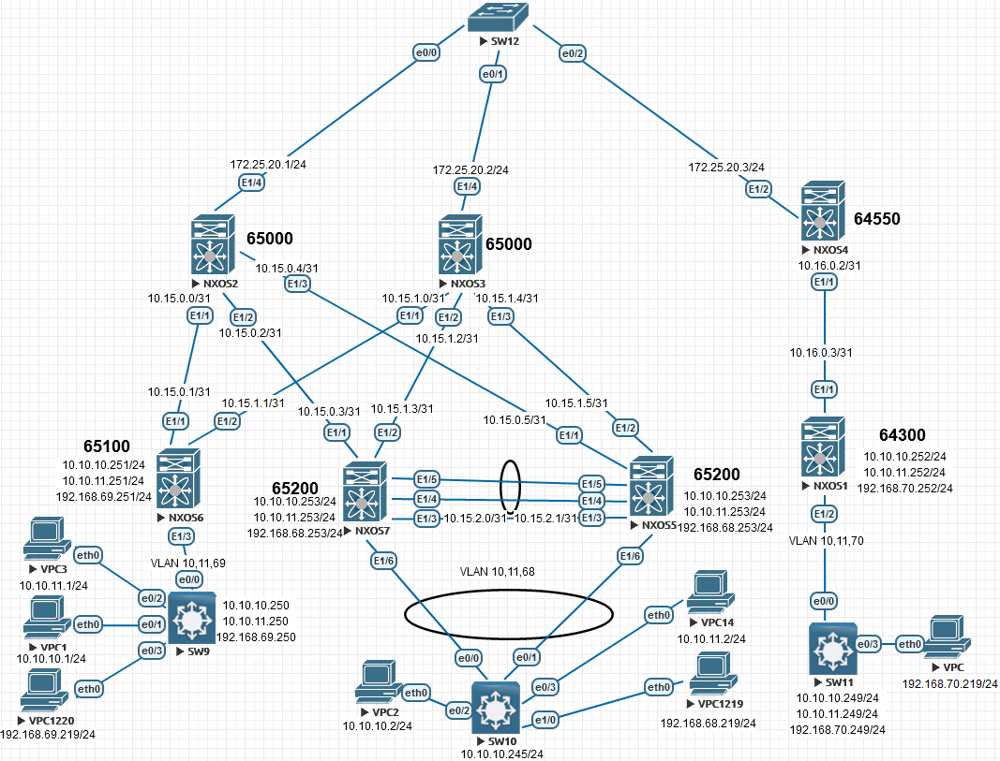

# VxLAN. Multipod

Цель:

Настроить L2 связанность по технологии Multipod

В этой  самостоятельной работе мы ожидаем, что вы самостоятельно:

1. Настроите BGP peering между Spine в одной зоне и во второй

2. Все клиенты имеют L2/L3 связанность

   

**Настройка NEXUS:**

  
NXOS1

<pre><code>
configure terminal
!
hostname NX1
!
nv overlay evpn
feature ospf
feature bgp
feature interface-vlan
feature vn-segment-vlan-based
feature nv overlay
!
no ip domain-lookup
!
fabric forwarding anycast-gateway-mac 0001.0001.0001
vlan 1,70,99
!
vlan 70
  vn-segment 10070
vlan 99
  vn-segment 9999
!
vrf context VXLAN_RT
  vni 9999
  address-family ipv4 unicast
    route-target import 9999:9999
    route-target import 9999:9999 evpn
    route-target export 9999:9999
    route-target export 9999:9999 evpn
    route-target both auto
    route-target both auto evpn
!
interface Vlan70
  no shutdown
  vrf member VXLAN_RT
  ip address 192.168.70.252/24
  fabric forwarding mode anycast-gateway
!
interface Vlan99
  no shutdown
  vrf member VXLAN_RT
  ip forward
!
interface nve1
  no shutdown
  host-reachability protocol bgp
  source-interface loopback0
  member vni 9999 associate-vrf
  member vni 10070
    ingress-replication protocol bgp
!
interface Ethernet1/1
  no switchport
  medium p2p
  ip unnumbered loopback0
  ip ospf authentication-key 3 e7cddfe7d0564e2c
  ip ospf network point-to-point
  no ip ospf passive-interface
  ip router ospf 1 area 0.0.0.1
  no shutdown
!
interface Ethernet1/2
  switchport mode trunk
  spanning-tree bpdufilter enable
!
interface loopback0
  ip address 1.1.1.1/24
  ip router ospf 1 area 0.0.0.1
!
cli alias name wr copy running-config startup-config
line console
  exec-timeout 0
line vty
  exec-timeout 0
!
router ospf 1
  router-id 1.1.1.1
  passive-interface default
!
router bgp 64300
  template peer SPINE
    update-source loopback0
    ebgp-multihop 5
    address-family l2vpn evpn
      send-community
      send-community extended
  neighbor 1.1.1.4
    inherit peer SPINE
    remote-as 64550
!
end
wr
</code></pre>

 

NXOS2

<pre><code>
configure terminal
hostname NX2
!
nv overlay evpn
feature ospf
feature bgp
feature nv overlay
!
route-map NH_UNCHANGED permit 10
  set ip next-hop unchanged
!
interface Ethernet1/1
  no switchport
  medium p2p
  ip unnumbered loopback0
  ip ospf authentication-key 3 e7cddfe7d0564e2c
  ip ospf network point-to-point
  no ip ospf passive-interface
  ip router ospf 1 area 0.0.0.0
  no shutdown
!
interface Ethernet1/2
  no switchport
  medium p2p
  ip unnumbered loopback0
  ip ospf authentication-key 3 e7cddfe7d0564e2c
  ip ospf network point-to-point
  no ip ospf passive-interface
  ip router ospf 1 area 0.0.0.0
  no shutdown
!
interface Ethernet1/3
  no switchport
  medium p2p
  ip unnumbered loopback0
  ip ospf authentication-key 3 e7cddfe7d0564e2c
  ip ospf network point-to-point
  no ip ospf passive-interface
  ip router ospf 1 area 0.0.0.0
  no shutdown
!
interface Ethernet1/4
  no switchport
  ip address 172.25.20.1/24
  ip ospf authentication-key 3 e7cddfe7d0564e2c
  ip ospf network broadcast
  no ip ospf passive-interface
  ip router ospf 1 area 0.0.0.1
  no shutdown
!
interface loopback0
  ip address 1.1.1.2/24
  ip router ospf 1 area 0.0.0.0
!
cli alias name wr copy running-config startup-config
line console
  exec-timeout 0
line vty
  exec-timeout 0
!
router ospf 1
  router-id 1.1.1.2
  passive-interface default
!
router bgp 65000
  address-family l2vpn evpn
    retain route-target all
  template peer UNIVERSAL
    update-source loopback0
    address-family l2vpn evpn
      send-community
      send-community extended
      route-map NH_UNCHANGED out
  neighbor 1.1.1.4
    inherit peer UNIVERSAL
    remote-as 64550
  neighbor 1.1.1.5
    inherit peer UNIVERSAL
    remote-as 65200
  neighbor 1.1.1.6
    inherit peer UNIVERSAL
    remote-as 65100
  neighbor 1.1.1.7
    inherit peer UNIVERSAL
    remote-as 65200
!
end
wr
</code></pre>

  
NXOS3

<pre><code>
configure terminal
hostname NX3
!
nv overlay evpn
feature ospf
feature bgp
feature nv overlay
!
route-map NH_UNCHANGED permit 10
  set ip next-hop unchanged
!
interface Ethernet1/1
  no switchport
  medium p2p
  ip unnumbered loopback0
  ip ospf authentication-key 3 e7cddfe7d0564e2c
  ip ospf network point-to-point
  no ip ospf passive-interface
  ip router ospf 1 area 0.0.0.0
  no shutdown
!
interface Ethernet1/2
  no switchport
  medium p2p
  ip unnumbered loopback0
  ip ospf authentication-key 3 e7cddfe7d0564e2c
  ip ospf network point-to-point
  no ip ospf passive-interface
  ip router ospf 1 area 0.0.0.0
  no shutdown
!
interface Ethernet1/3
  no switchport
  medium p2p
  ip unnumbered loopback0
  ip ospf authentication-key 3 e7cddfe7d0564e2c
  ip ospf network point-to-point
  no ip ospf passive-interface
  ip router ospf 1 area 0.0.0.0
  no shutdown
!
interface Ethernet1/4
  no switchport
  ip address 172.25.20.2/24
  ip ospf authentication-key 3 e7cddfe7d0564e2c
  ip ospf network broadcast
  no ip ospf passive-interface
  ip router ospf 1 area 0.0.0.1
  no shutdown
!
interface loopback0
  ip address 1.1.1.3/24
  ip router ospf 1 area 0.0.0.0
!
cli alias name wr copy running-config startup-config
line console
  exec-timeout 0
line vty
  exec-timeout 0
!
router ospf 1
  router-id 1.1.1.3
  passive-interface default
!
router bgp 65000
  address-family l2vpn evpn
    retain route-target all
  template peer UNIVERSAL
    update-source loopback0
    address-family l2vpn evpn
      send-community
      send-community extended
      route-map NH_UNCHANGED out
  neighbor 1.1.1.4
    inherit peer UNIVERSAL
    remote-as 64550
  neighbor 1.1.1.5
    inherit peer UNIVERSAL
    remote-as 65200
  neighbor 1.1.1.6
    inherit peer UNIVERSAL
    remote-as 65100
  neighbor 1.1.1.7
    inherit peer UNIVERSAL
    remote-as 65200
!
end
wr
</code></pre>

NXOS4

<pre><code>
configure terminal
!
hostname NX4
!
nv overlay evpn
feature ospf
feature bgp
feature nv overlay
!
route-map NH_UNCHANGED permit 10
  set ip next-hop unchanged
!
interface Ethernet1/1
  no switchport
  medium p2p
  ip unnumbered loopback0
  ip ospf authentication-key 3 e7cddfe7d0564e2c
  ip ospf network point-to-point
  no ip ospf passive-interface
  ip router ospf 1 area 0.0.0.1
  no shutdown
!
interface Ethernet1/2
  no switchport
  ip address 172.25.20.3/24
  ip ospf authentication-key 3 e7cddfe7d0564e2c
  ip ospf network broadcast
  no ip ospf passive-interface
  ip router ospf 1 area 0.0.0.1
  no shutdown
!
interface loopback0
  ip address 1.1.1.4/24
  ip router ospf 1 area 0.0.0.1
!
cli alias name wr copy running-config startup-config
line console
  exec-timeout 0
line vty
  exec-timeout 0
!
router ospf 1
  router-id 1.1.1.4
  passive-interface default
!
router bgp 64550
  address-family l2vpn evpn
    retain route-target all
  template peer UNIVERSAL
    update-source loopback0
    address-family l2vpn evpn
      send-community
      send-community extended
      route-map NH_UNCHANGED out
  neighbor 1.1.1.1
    inherit peer UNIVERSAL
    remote-as 64300
  neighbor 1.1.1.2
    inherit peer UNIVERSAL
    remote-as 65000
  neighbor 1.1.1.3
    inherit peer UNIVERSAL
    remote-as 65000
!
end
wr
</code></pre>

NXOS5

<pre><code>
configure terminal
hostname NX5
!
nv overlay evpn
feature ospf
feature bgp
feature interface-vlan
feature vn-segment-vlan-based
feature lacp
feature vpc
feature nv overlay
!
fabric forwarding anycast-gateway-mac 0001.0001.0001
vlan 1,10-11,68,88
vlan 10
  vn-segment 10010
vlan 11
  vn-segment 10011
vlan 68
  vn-segment 10068
vlan 88
  vn-segment 9999
!
vrf context VPC
vrf context VXLAN_RT
  vni 9999
  address-family ipv4 unicast
    route-target import 9999:9999
    route-target import 9999:9999 evpn
    route-target export 9999:9999
    route-target export 9999:9999 evpn
    route-target both auto
    route-target both auto evpn
!
vpc domain 1
  peer-keepalive destination 10.15.2.0 source 10.15.2.1 vrf VPC
!
interface Vlan10
  no shutdown
  ip address 10.10.10.253/24
  fabric forwarding mode anycast-gateway
!
interface Vlan11
  no shutdown
  ip address 10.10.11.253/24
  fabric forwarding mode anycast-gateway
!
interface Vlan68
  no shutdown
  vrf member VXLAN_RT
  ip address 192.168.68.253/24
  fabric forwarding mode anycast-gateway
!
interface Vlan88
  no shutdown
  vrf member VXLAN_RT
  ip forward
!
interface port-channel1
  switchport mode trunk
  spanning-tree port type network
  vpc peer-link
!
interface port-channel2
  switchport mode trunk
  vpc 1
!
interface nve1
  no shutdown
  host-reachability protocol bgp
  source-interface loopback0
  member vni 9999 associate-vrf
  member vni 10010
    ingress-replication protocol bgp
  member vni 10011
    ingress-replication protocol bgp
  member vni 10068
    ingress-replication protocol bgp
!
interface Ethernet1/1
  no switchport
  medium p2p
  ip unnumbered loopback0
  ip ospf authentication-key 3 e7cddfe7d0564e2c
  ip ospf network point-to-point
  no ip ospf passive-interface
  ip router ospf 1 area 0.0.0.0
  no shutdown
!
interface Ethernet1/2
  no switchport
  medium p2p
  ip unnumbered loopback0
  ip ospf authentication-key 3 e7cddfe7d0564e2c
  ip ospf network point-to-point
  no ip ospf passive-interface
  ip router ospf 1 area 0.0.0.0
  no shutdown
!
interface Ethernet1/3
  no switchport
  vrf member VPC
  ip address 10.15.2.1/31
  no shutdown
!
interface Ethernet1/4
  switchport mode trunk
  channel-group 1 mode active
!
interface Ethernet1/5
  switchport mode trunk
  channel-group 1 mode active
!
interface Ethernet1/6
  switchport mode trunk
  spanning-tree bpdufilter enable
  channel-group 2 mode active
!
interface loopback0
  ip address 1.1.1.5/24
  ip address 10.255.255.255/32 secondary
  ip router ospf 1 area 0.0.0.0
!
cli alias name wr copy running-config startup-config
line console
  exec-timeout 0
line vty
  exec-timeout 0
!
router ospf 1
  router-id 1.1.1.5
  passive-interface default
!
router bgp 65200
  address-family l2vpn evpn
  template peer SPINE
    remote-as 65000
    update-source loopback0
    ebgp-multihop 5
    address-family l2vpn evpn
      send-community
      send-community extended
  neighbor 1.1.1.2
    inherit peer SPINE
  neighbor 1.1.1.3
    inherit peer SPINE
!
end
wr
</code></pre>

NXOS6

<pre><code>
configure terminal
hostname NX6
!
nv overlay evpn
feature ospf
feature bgp
feature interface-vlan
feature vn-segment-vlan-based
feature nv overlay
!
fabric forwarding anycast-gateway-mac 0001.0001.0001
vlan 1,10-11,69,99
vlan 10
  vn-segment 10010
vlan 11
  vn-segment 10011
vlan 69
  vn-segment 10069
vlan 99
  vn-segment 9999
!
vrf context VXLAN_RT
  vni 9999
  address-family ipv4 unicast
    route-target import 9999:9999
    route-target import 9999:9999 evpn
    route-target export 9999:9999
    route-target export 9999:9999 evpn
    route-target both auto
    route-target both auto evpn
!
interface Vlan10
  no shutdown
  ip address 10.10.10.251/24
  fabric forwarding mode anycast-gateway
!
interface Vlan11
  no shutdown
  ip address 10.10.11.251/24
  fabric forwarding mode anycast-gateway
!
interface Vlan69
  no shutdown
  vrf member VXLAN_RT
  ip address 192.168.69.251/24
  fabric forwarding mode anycast-gateway
!
interface Vlan99
  no shutdown
  vrf member VXLAN_RT
  ip forward
!
interface nve1
  no shutdown
  host-reachability protocol bgp
  source-interface loopback0
  member vni 9999 associate-vrf
  member vni 10010
    ingress-replication protocol bgp
  member vni 10011
    ingress-replication protocol bgp
  member vni 10069
    ingress-replication protocol bgp
!
interface Ethernet1/1
  no switchport
  medium p2p
  ip unnumbered loopback0
  ip ospf authentication-key 3 e7cddfe7d0564e2c
  ip ospf network point-to-point
  no ip ospf passive-interface
  ip router ospf 1 area 0.0.0.0
  no shutdown
!
interface Ethernet1/2
  no switchport
  medium p2p
  ip unnumbered loopback0
  ip ospf authentication-key 3 e7cddfe7d0564e2c
  ip ospf network point-to-point
  no ip ospf passive-interface
  ip router ospf 1 area 0.0.0.0
  no shutdown
!
interface Ethernet1/3
  switchport mode trunk
  spanning-tree bpdufilter enable
!
interface loopback0
  ip address 1.1.1.6/24
  ip router ospf 1 area 0.0.0.0
!
cli alias name wr copy running-config startup-config
line console
  exec-timeout 0
line vty
  exec-timeout 0
!
router ospf 1
  router-id 1.1.1.6
  passive-interface default
!
router bgp 65100
  template peer SPINE
    remote-as 65000
    update-source loopback0
    ebgp-multihop 5
    address-family l2vpn evpn
      send-community
      send-community extended
  neighbor 1.1.1.2
    inherit peer SPINE
  neighbor 1.1.1.3
    inherit peer SPINE
!
end
wr
</code></pre>

NXOS7

<pre><code>
configure terminal
hostname NX7
!
nv overlay evpn
feature ospf
feature bgp
feature interface-vlan
feature vn-segment-vlan-based
feature lacp
feature vpc
feature nv overlay
!
fabric forwarding anycast-gateway-mac 0001.0001.0001
vlan 1,10-11,68,88
vlan 10
  vn-segment 10010
vlan 11
  vn-segment 10011
vlan 68
  vn-segment 10068
vlan 88
  vn-segment 9999
!
vrf context VPC
vrf context VXLAN_RT
  vni 9999
  address-family ipv4 unicast
    route-target import 9999:9999
    route-target import 9999:9999 evpn
    route-target export 9999:9999
    route-target export 9999:9999 evpn
    route-target both auto
    route-target both auto evpn
!
vpc domain 1
  peer-keepalive destination 10.15.2.1 source 10.15.2.0 vrf VPC
!
interface Vlan10
  no shutdown
  ip address 10.10.10.253/24
  fabric forwarding mode anycast-gateway
!
interface Vlan11
  no shutdown
  ip address 10.10.11.253/24
  fabric forwarding mode anycast-gateway
!
interface Vlan68
  no shutdown
  vrf member VXLAN_RT
  ip address 192.168.68.253/24
  fabric forwarding mode anycast-gateway
!
interface Vlan88
  no shutdown
  vrf member VXLAN_RT
  ip forward
!
interface port-channel1
  switchport mode trunk
  spanning-tree port type network
  vpc peer-link
!
interface port-channel2
  switchport mode trunk
  vpc 1
!
interface nve1
  no shutdown
  host-reachability protocol bgp
  source-interface loopback0
  member vni 9999 associate-vrf
  member vni 10010
    ingress-replication protocol bgp
  member vni 10011
    ingress-replication protocol bgp
  member vni 10068
    ingress-replication protocol bgp
!
interface Ethernet1/1
  no switchport
  medium p2p
  ip unnumbered loopback0
  ip ospf authentication-key 3 e7cddfe7d0564e2c
  ip ospf network point-to-point
  no ip ospf passive-interface
  ip router ospf 1 area 0.0.0.0
  no shutdown
!
interface Ethernet1/2
  no switchport
  medium p2p
  ip unnumbered loopback0
  ip ospf authentication-key 3 e7cddfe7d0564e2c
  ip ospf network point-to-point
  no ip ospf passive-interface
  ip router ospf 1 area 0.0.0.0
  no shutdown
!
interface Ethernet1/3
  no switchport
  vrf member VPC
  ip address 10.15.2.0/31
  no shutdown
!
interface Ethernet1/4
  switchport mode trunk
  channel-group 1 mode active
!
interface Ethernet1/5
  switchport mode trunk
  channel-group 1 mode active
!
interface Ethernet1/6
  switchport mode trunk
  spanning-tree bpdufilter enable
  channel-group 2 mode active
!
interface loopback0
  ip address 1.1.1.7/24
  ip address 10.255.255.255/32 secondary
  ip router ospf 1 area 0.0.0.0
!
cli alias name wr copy running-config startup-config
line console
  exec-timeout 0
line vty
  exec-timeout 0
!
router ospf 1
  router-id 1.1.1.7
  passive-interface default
!
router bgp 65200
  template peer SPINE
    remote-as 65000
    update-source loopback0
    ebgp-multihop 5
    address-family l2vpn evpn
      send-community
      send-community extended
  neighbor 1.1.1.2
    inherit peer SPINE
  neighbor 1.1.1.3
    inherit peer SPINE
!
end
wr
</code></pre>

**Настройка Switch:**

  
SW9

<pre><code>
enable
configure terminal
!
hostname SW9
!
interface Ethernet0/0
 switchport trunk encapsulation dot1q
 switchport mode trunk
 spanning-tree bpdufilter enable
!
interface Ethernet0/1
 switchport access vlan 10
 spanning-tree bpdufilter enable
!
interface Ethernet0/2
 switchport access vlan 11
 spanning-tree bpdufilter enable
!
interface Ethernet0/3
 switchport access vlan 69
 spanning-tree bpdufilter enable
!
interface Vlan10
 ip address 10.10.10.250 255.255.255.0
!
interface Vlan11
 ip address 10.10.11.250 255.255.255.0
!
interface Vlan69
 ip address 192.168.69.250 255.255.255.0
!
end
wr
</code></pre>

  
SW10

<pre><code>
enable
configure terminal
!
hostname SW10
!
interface Port-channel1
 switchport trunk encapsulation dot1q
 switchport mode trunk
 spanning-tree bpdufilter enable
!
interface Ethernet0/0
 switchport trunk encapsulation dot1q
 switchport mode trunk
 channel-group 1 mode active
 spanning-tree bpdufilter enable
!
interface Ethernet0/1
 switchport trunk encapsulation dot1q
 switchport mode trunk
 channel-group 1 mode active
 spanning-tree bpdufilter enable
!
interface Ethernet0/2
 switchport access vlan 10
!         
interface Ethernet0/3
 switchport access vlan 11
!
interface Ethernet1/0
 switchport access vlan 68
!
interface Vlan10
 ip address 10.10.10.245 255.255.255.0
!
interface Vlan11
 ip address 10.10.11.245 255.255.255.0
!
interface Vlan68
 ip address 192.168.68.245 255.255.255.0
!
end
wr
</code></pre>

SW11

<pre><code>
enable
configure terminal
!
hostname SW11
!
interface Ethernet0/0
 switchport trunk encapsulation dot1q
 switchport mode trunk
 spanning-tree bpdufilter enable
!
interface Ethernet0/3
 switchport access vlan 70
 spanning-tree bpdufilter enable
!
interface Vlan70
 ip address 192.168.70.249 255.255.255.0
!
end
wr
</code></pre>

**Настройка клиентов:**

  
VPC1

<pre><code>
ip 10.10.10.1/24 10.10.10.251
</code></pre>

  
VPC3

<pre><code>
ip 10.10.11.1/24 10.10.11.251
</code></pre>

  
VPC1120

<pre><code>
ip 192.168.69.219/24 192.168.69.251
</code></pre>

  
VPC2

<pre><code>
ip 10.10.10.2/24 10.10.10.253
</code></pre>

  
VPC14

<pre><code>
ip 10.10.11.2/24 10.10.11.253
</code></pre>

  
VPC1219

<pre><code>
ip 192.168.68.219/24 192.168.69.253
</code></pre>

  
VPC

<pre><code>
ip 192.168.7019/24 192.168.70.252
</code></pre>

Для начала проверим пиринг:

NXOS1

<pre><code>
NX1#  sh bgp l2vpn evpn summary
BGP summary information for VRF default, address family L2VPN EVPN
BGP router identifier 1.1.1.1, local AS number 64300
BGP table version is 563, L2VPN EVPN config peers 1, capable peers 1
11 network entries and 11 paths using 2420 bytes of memory
BGP attribute entries [6/984], BGP AS path entries [2/28]
BGP community entries [0/0], BGP clusterlist entries [0/0]
!
Neighbor        V    AS MsgRcvd MsgSent   TblVer  InQ OutQ Up/Down  State/PfxRcd
1.1.1.4         4 64550    3734     887      563    0    0 11:06:33 6     
</code></pre>

NXOS2

<pre><code>
NX2# sh bgp l2vpn evpn summary
BGP summary information for VRF default, address family L2VPN EVPN
BGP router identifier 1.1.1.2, local AS number 65000
BGP table version is 331, L2VPN EVPN config peers 4, capable peers 4
41 network entries and 41 paths using 9020 bytes of memory
BGP attribute entries [18/2952], BGP AS path entries [3/22]
BGP community entries [0/0], BGP clusterlist entries [0/0]
!
Neighbor        V    AS MsgRcvd MsgSent   TblVer  InQ OutQ Up/Down  State/PfxRcd
1.1.1.4         4 64550     100     158      331    0    0 00:57:18 5         
1.1.1.5         4 65200      85     119      331    0    0 00:57:17 10        
1.1.1.6         4 65100     182     125      331    0    0 00:57:19 15        
1.1.1.7         4 65200     142     119      331    0    0 00:57:17 11        
NX2#      
</code></pre>

NXOS3

<pre><code>
NX3# sh bgp l2vpn evpn summary
BGP summary information for VRF default, address family L2VPN EVPN
BGP router identifier 1.1.1.3, local AS number 65000
BGP table version is 331, L2VPN EVPN config peers 4, capable peers 4
41 network entries and 41 paths using 9020 bytes of memory
BGP attribute entries [18/2952], BGP AS path entries [3/22]
BGP community entries [0/0], BGP clusterlist entries [0/0]
!
Neighbor        V    AS MsgRcvd MsgSent   TblVer  InQ OutQ Up/Down  State/PfxRcd
1.1.1.4         4 64550      99     158      331    0    0 00:57:12 5         
1.1.1.5         4 65200      86     119      331    0    0 00:57:13 10        
1.1.1.6         4 65100     182     124      331    0    0 00:57:10 15        
1.1.1.7         4 65200     141     119      331    0    0 00:57:13 11
</code></pre>

NXOS4

<pre><code>
NX4# show bgp l2vpn evpn summary 
BGP summary information for VRF default, address family L2VPN EVPN
BGP router identifier 1.1.1.4, local AS number 64550
BGP table version is 5676, L2VPN EVPN config peers 3, capable peers 3
41 network entries and 77 paths using 13484 bytes of memory
BGP attribute entries [18/2952], BGP AS path entries [3/26]
BGP community entries [0/0], BGP clusterlist entries [0/0]
!
Neighbor        V    AS MsgRcvd MsgSent   TblVer  InQ OutQ Up/Down  State/PfxRcd
1.1.1.1         4 64300    1072    1777     5676    0    0 11:08:44 5         
1.1.1.2         4 65000    3252     808     5676    0    0 00:58:55 36        
1.1.1.3         4 65000    3250     807     5676    0    0 00:58:13 36   
</code></pre>

NXOS5

<pre><code>
NX5# show bgp l2vpn evpn summary 
BGP summary information for VRF default, address family L2VPN EVPN
BGP router identifier 1.1.1.5, local AS number 65200
BGP table version is 520, L2VPN EVPN config peers 2, capable peers 2
14 network entries and 18 paths using 3576 bytes of memory
BGP attribute entries [9/1476], BGP AS path entries [2/24]
BGP community entries [0/0], BGP clusterlist entries [0/0]
!
Neighbor        V    AS MsgRcvd MsgSent   TblVer  InQ OutQ Up/Down  State/PfxRcd
1.1.1.2         4 65000    3025    1056      520    0    0 00:59:22 4         
1.1.1.3         4 65000    2994    1051      520    0    0 00:58:42 4      
</code></pre>

NXOS6

<pre><code>
NX6# show bgp l2vpn evpn summary 
BGP summary information for VRF default, address family L2VPN EVPN
BGP router identifier 1.1.1.6, local AS number 65100
BGP table version is 2087, L2VPN EVPN config peers 2, capable peers 2
21 network entries and 27 paths using 5364 bytes of memory
BGP attribute entries [10/1640], BGP AS path entries [2/24]
BGP community entries [0/0], BGP clusterlist entries [0/0]
!
Neighbor        V    AS MsgRcvd MsgSent   TblVer  InQ OutQ Up/Down  State/PfxRcd
1.1.1.2         4 65000    2924    1542     2087    0    0 00:59:49 6         
1.1.1.3         4 65000    2879    1539     2087    0    0 00:59:06 6  
</code></pre>

 

NXOS7

<pre><code>
NX7# show bgp l2vpn evpn summary 
BGP summary information for VRF default, address family L2VPN EVPN
BGP router identifier 1.1.1.7, local AS number 65200
BGP table version is 1279, L2VPN EVPN config peers 2, capable peers 2
15 network entries and 19 paths using 3796 bytes of memory
BGP attribute entries [9/1476], BGP AS path entries [2/24]
BGP community entries [0/0], BGP clusterlist entries [0/0]
!
Neighbor        V    AS MsgRcvd MsgSent   TblVer  InQ OutQ Up/Down  State/PfxRcd
1.1.1.2         4 65000    3027    1295     1279    0    0 01:00:10 4         
1.1.1.3         4 65000    2998    1290     1279    0    0 00:59:31 4             
</code></pre>

 

Проверим формирование таблиц маршрутизации:

  
NXOS1

<pre><code>
NX1# show ip route vrf all 
IP Route Table for VRF "default"
'*' denotes best ucast next-hop
'**' denotes best mcast next-hop
'[x/y]' denotes [preference/metric]
'%<string>' in via output denotes VRF <string>
!
1.1.1.0/24, ubest/mbest: 1/0, attached
    *via 1.1.1.1, Lo0, [0/0], 18:53:46, direct
1.1.1.1/32, ubest/mbest: 1/0, attached
    *via 1.1.1.1, Lo0, [0/0], 18:53:46, local
1.1.1.2/32, ubest/mbest: 1/0
    *via 1.1.1.4, Eth1/1, [110/81], 18:52:14, ospf-1, inter
1.1.1.3/32, ubest/mbest: 1/0
    *via 1.1.1.4, Eth1/1, [110/81], 18:52:14, ospf-1, inter
1.1.1.4/32, ubest/mbest: 1/0
    *via 1.1.1.4, Eth1/1, [110/41], 18:52:14, ospf-1, intra
1.1.1.5/32, ubest/mbest: 1/0
    *via 1.1.1.4, Eth1/1, [110/121], 18:52:14, ospf-1, inter
1.1.1.6/32, ubest/mbest: 1/0
    *via 1.1.1.4, Eth1/1, [110/121], 18:52:14, ospf-1, inter
1.1.1.7/32, ubest/mbest: 1/0
    *via 1.1.1.4, Eth1/1, [110/121], 18:52:14, ospf-1, inter
10.10.10.0/24, ubest/mbest: 1/0, attached
    *via 10.10.10.252, Vlan10, [0/0], 17:57:47, direct
10.10.10.249/32, ubest/mbest: 1/0, attached
    *via 10.10.10.249, Vlan10, [190/0], 17:26:51, hmm
10.10.10.252/32, ubest/mbest: 1/0, attached
    *via 10.10.10.252, Vlan10, [0/0], 17:57:47, local
10.10.11.0/24, ubest/mbest: 1/0, attached
    *via 10.10.11.252, Vlan11, [0/0], 17:57:03, direct
10.10.11.249/32, ubest/mbest: 1/0, attached
    *via 10.10.11.249, Vlan11, [190/0], 17:26:45, hmm
10.10.11.252/32, ubest/mbest: 1/0, attached
    *via 10.10.11.252, Vlan11, [0/0], 17:57:03, local
10.255.255.255/32, ubest/mbest: 1/0
    *via 1.1.1.4, Eth1/1, [110/121], 18:52:14, ospf-1, inter
172.25.20.0/24, ubest/mbest: 1/0
    *via 1.1.1.4, Eth1/1, [110/80], 18:52:14, ospf-1, intra
!
IP Route Table for VRF "VXLAN_RT"
'*' denotes best ucast next-hop
'**' denotes best mcast next-hop
'[x/y]' denotes [preference/metric]
'%<string>' in via output denotes VRF <string>
!
192.168.68.219/32, ubest/mbest: 1/0
    *via 10.255.255.255%default, [20/0], 17:52:55, bgp-64300, external, tag 6455
0 (evpn) segid: 9999 tunnelid: 0xaffffff encap: VXLAN
! 
192.168.68.245/32, ubest/mbest: 1/0
    *via 10.255.255.255%default, [20/0], 17:52:55, bgp-64300, external, tag 6455
0 (evpn) segid: 9999 tunnelid: 0xaffffff encap: VXLAN
! 
192.168.69.219/32, ubest/mbest: 1/0
    *via 1.1.1.6%default, [20/0], 17:52:55, bgp-64300, external, tag 64550 (evpn
) segid: 9999 tunnelid: 0x1010106 encap: VXLAN
! 
192.168.69.250/32, ubest/mbest: 1/0
    *via 1.1.1.6%default, [20/0], 17:52:55, bgp-64300, external, tag 64550 (evpn
) segid: 9999 tunnelid: 0x1010106 encap: VXLAN
!
192.168.70.0/24, ubest/mbest: 1/0, attached
    *via 192.168.70.252, Vlan70, [0/0], 17:53:39, direct
192.168.70.219/32, ubest/mbest: 1/0, attached
    *via 192.168.70.219, Vlan70, [190/0], 17:23:14, hmm
192.168.70.249/32, ubest/mbest: 1/0, attached
    *via 192.168.70.249, Vlan70, [190/0], 17:26:40, hmm
192.168.70.252/32, ubest/mbest: 1/0, attached
    *via 192.168.70.252, Vlan70, [0/0], 17:53:39, local
</code></pre>

 

  
NXOS2

<pre><code>
NX2#  show ip route vrf all 
IP Route Table for VRF "default"
'*' denotes best ucast next-hop
'**' denotes best mcast next-hop
'[x/y]' denotes [preference/metric]
'%<string>' in via output denotes VRF <string>
!
1.1.1.0/24, ubest/mbest: 1/0, attached
    *via 1.1.1.2, Lo0, [0/0], 3d20h, direct
1.1.1.1/32, ubest/mbest: 1/0
    *via 172.25.20.3, Eth1/4, [110/81], 18:53:31, ospf-1, intra
1.1.1.2/32, ubest/mbest: 1/0, attached
    *via 1.1.1.2, Lo0, [0/0], 3d20h, local
1.1.1.3/32, ubest/mbest: 3/0
    *via 1.1.1.5, Eth1/3, [110/81], 2d16h, ospf-1, intra
    *via 1.1.1.6, Eth1/1, [110/81], 2d16h, ospf-1, intra
    *via 1.1.1.7, Eth1/2, [110/81], 2d16h, ospf-1, intra
1.1.1.4/32, ubest/mbest: 1/0
    *via 172.25.20.3, Eth1/4, [110/41], 19:01:31, ospf-1, intra
1.1.1.5/32, ubest/mbest: 1/0
    *via 1.1.1.5, Eth1/3, [110/41], 2d17h, ospf-1, intra
1.1.1.6/32, ubest/mbest: 1/0
    *via 1.1.1.6, Eth1/1, [110/41], 3d20h, ospf-1, intra
1.1.1.7/32, ubest/mbest: 1/0
    *via 1.1.1.7, Eth1/2, [110/41], 2d17h, ospf-1, intra
10.255.255.255/32, ubest/mbest: 2/0
    *via 1.1.1.5, Eth1/3, [110/41], 2d17h, ospf-1, intra
    *via 1.1.1.7, Eth1/2, [110/41], 2d17h, ospf-1, intra
172.25.20.0/24, ubest/mbest: 1/0, attached
    *via 172.25.20.1, Eth1/4, [0/0], 19:04:12, direct
172.25.20.1/32, ubest/mbest: 1/0, attached
    *via 172.25.20.1, Eth1/4, [0/0], 19:04:12, local
</code></pre>

  
NXOS3

<pre><code>
NX3# show ip route vrf all 
IP Route Table for VRF "default"
'*' denotes best ucast next-hop
'**' denotes best mcast next-hop
'[x/y]' denotes [preference/metric]
'%<string>' in via output denotes VRF <string>
!
1.1.1.0/24, ubest/mbest: 1/0, attached
    *via 1.1.1.3, Lo0, [0/0], 3d20h, direct
1.1.1.1/32, ubest/mbest: 1/0
    *via 172.25.20.3, Eth1/4, [110/81], 18:54:26, ospf-1, intra
1.1.1.2/32, ubest/mbest: 3/0
    *via 1.1.1.5, Eth1/3, [110/81], 2d16h, ospf-1, intra
    *via 1.1.1.6, Eth1/1, [110/81], 2d16h, ospf-1, intra
    *via 1.1.1.7, Eth1/2, [110/81], 2d16h, ospf-1, intra
1.1.1.3/32, ubest/mbest: 1/0, attached
    *via 1.1.1.3, Lo0, [0/0], 3d20h, local
1.1.1.4/32, ubest/mbest: 1/0
    *via 172.25.20.3, Eth1/4, [110/41], 19:03:06, ospf-1, intra
1.1.1.5/32, ubest/mbest: 1/0
    *via 1.1.1.5, Eth1/3, [110/41], 2d16h, ospf-1, intra
1.1.1.6/32, ubest/mbest: 1/0
    *via 1.1.1.6, Eth1/1, [110/41], 2d16h, ospf-1, intra
1.1.1.7/32, ubest/mbest: 1/0
    *via 1.1.1.7, Eth1/2, [110/41], 2d16h, ospf-1, intra
10.255.255.255/32, ubest/mbest: 2/0
    *via 1.1.1.5, Eth1/3, [110/41], 2d16h, ospf-1, intra
    *via 1.1.1.7, Eth1/2, [110/41], 2d16h, ospf-1, intra
172.25.20.0/24, ubest/mbest: 1/0, attached
    *via 172.25.20.2, Eth1/4, [0/0], 19:03:55, direct
172.25.20.2/32, ubest/mbest: 1/0, attached
    *via 172.25.20.2, Eth1/4, [0/0], 19:03:55, local
</code></pre>

  
NXOS4

<pre><code>
NX4# show ip route vrf all 
IP Route Table for VRF "default"
'*' denotes best ucast next-hop
'**' denotes best mcast next-hop
'[x/y]' denotes [preference/metric]
'%<string>' in via output denotes VRF <string>
!
1.1.1.0/24, ubest/mbest: 1/0, attached
    *via 1.1.1.4, Lo0, [0/0], 19:17:08, direct
1.1.1.1/32, ubest/mbest: 1/0
    *via 1.1.1.1, Eth1/1, [110/41], 18:55:25, ospf-1, intra
1.1.1.2/32, ubest/mbest: 1/0
    *via 172.25.20.1, Eth1/2, [110/41], 19:03:20, ospf-1, inter
1.1.1.3/32, ubest/mbest: 1/0
    *via 172.25.20.2, Eth1/2, [110/41], 19:04:06, ospf-1, inter
1.1.1.4/32, ubest/mbest: 1/0, attached
    *via 1.1.1.4, Lo0, [0/0], 19:17:08, local
1.1.1.5/32, ubest/mbest: 2/0
    *via 172.25.20.1, Eth1/2, [110/81], 19:03:20, ospf-1, inter
    *via 172.25.20.2, Eth1/2, [110/81], 19:03:20, ospf-1, inter
1.1.1.6/32, ubest/mbest: 2/0
    *via 172.25.20.1, Eth1/2, [110/81], 19:03:20, ospf-1, inter
    *via 172.25.20.2, Eth1/2, [110/81], 19:03:20, ospf-1, inter
1.1.1.7/32, ubest/mbest: 2/0
    *via 172.25.20.1, Eth1/2, [110/81], 19:03:20, ospf-1, inter
    *via 172.25.20.2, Eth1/2, [110/81], 19:03:20, ospf-1, inter
10.255.255.255/32, ubest/mbest: 2/0
    *via 172.25.20.1, Eth1/2, [110/81], 19:03:20, ospf-1, inter
    *via 172.25.20.2, Eth1/2, [110/81], 19:03:20, ospf-1, inter
172.25.20.0/24, ubest/mbest: 1/0, attached
    *via 172.25.20.3, Eth1/2, [0/0], 19:08:07, direct
172.25.20.3/32, ubest/mbest: 1/0, attached
    *via 172.25.20.3, Eth1/2, [0/0], 19:08:07, local
</code></pre>

  
NXOS5

<pre><code>
NX5# show ip route vrf all 
IP Route Table for VRF "default"
'*' denotes best ucast next-hop
'**' denotes best mcast next-hop
'[x/y]' denotes [preference/metric]
'%<string>' in via output denotes VRF <string>
!
1.1.1.0/24, ubest/mbest: 1/0, attached
    *via 1.1.1.5, Lo0, [0/0], 2d17h, direct
1.1.1.1/32, ubest/mbest: 2/0
    *via 1.1.1.2, Eth1/1, [110/121], 18:56:03, ospf-1, inter
    *via 1.1.1.3, Eth1/2, [110/121], 18:56:03, ospf-1, inter
1.1.1.2/32, ubest/mbest: 1/0
    *via 1.1.1.2, Eth1/1, [110/41], 2d17h, ospf-1, intra
1.1.1.3/32, ubest/mbest: 1/0
    *via 1.1.1.3, Eth1/2, [110/41], 2d17h, ospf-1, intra
1.1.1.4/32, ubest/mbest: 2/0
    *via 1.1.1.2, Eth1/1, [110/81], 19:04:03, ospf-1, inter
    *via 1.1.1.3, Eth1/2, [110/81], 19:04:03, ospf-1, inter
1.1.1.5/32, ubest/mbest: 1/0, attached
    *via 1.1.1.5, Lo0, [0/0], 2d17h, local
1.1.1.6/32, ubest/mbest: 2/0
    *via 1.1.1.2, Eth1/1, [110/81], 2d17h, ospf-1, intra
    *via 1.1.1.3, Eth1/2, [110/81], 2d17h, ospf-1, intra
1.1.1.7/32, ubest/mbest: 2/0
    *via 1.1.1.2, Eth1/1, [110/81], 2d17h, ospf-1, intra
    *via 1.1.1.3, Eth1/2, [110/81], 2d17h, ospf-1, intra
10.10.10.0/24, ubest/mbest: 1/0, attached
    *via 10.10.10.253, Vlan10, [0/0], 2d17h, direct
10.10.10.245/32, ubest/mbest: 1/0, attached
    *via 10.10.10.245, Vlan10, [190/0], 2d15h, hmm
10.10.10.253/32, ubest/mbest: 1/0, attached
    *via 10.10.10.253, Vlan10, [0/0], 2d17h, local
10.10.11.0/24, ubest/mbest: 1/0, attached
    *via 10.10.11.253, Vlan11, [0/0], 2d17h, direct
10.10.11.245/32, ubest/mbest: 1/0, attached
    *via 10.10.11.245, Vlan11, [190/0], 2d15h, hmm
10.10.11.253/32, ubest/mbest: 1/0, attached
    *via 10.10.11.253, Vlan11, [0/0], 2d17h, local
10.255.255.255/32, ubest/mbest: 2/0, attached
    *via 10.255.255.255, Lo0, [0/0], 2d17h, local
    *via 10.255.255.255, Lo0, [0/0], 2d17h, direct
172.25.20.0/24, ubest/mbest: 2/0
    *via 1.1.1.2, Eth1/1, [110/80], 19:04:43, ospf-1, inter
    *via 1.1.1.3, Eth1/2, [110/80], 19:04:43, ospf-1, inter
!
IP Route Table for VRF "VPC"
'*' denotes best ucast next-hop
'**' denotes best mcast next-hop
'[x/y]' denotes [preference/metric]
'%<string>' in via output denotes VRF <string>
!
10.15.2.0/31, ubest/mbest: 1/0, attached
    *via 10.15.2.1, Eth1/3, [0/0], 2d17h, direct
10.15.2.1/32, ubest/mbest: 1/0, attached
    *via 10.15.2.1, Eth1/3, [0/0], 2d17h, local
!
IP Route Table for VRF "VXLAN_RT"
'*' denotes best ucast next-hop
'**' denotes best mcast next-hop
'[x/y]' denotes [preference/metric]
'%<string>' in via output denotes VRF <string>
!
192.168.68.0/24, ubest/mbest: 1/0, attached
    *via 192.168.68.253, Vlan68, [0/0], 2d13h, direct
192.168.68.219/32, ubest/mbest: 1/0, attached
    *via 192.168.68.219, Vlan68, [190/0], 2d13h, hmm
192.168.68.245/32, ubest/mbest: 1/0, attached
    *via 192.168.68.245, Vlan68, [190/0], 2d13h, hmm
192.168.68.253/32, ubest/mbest: 1/0, attached
    *via 192.168.68.253, Vlan68, [0/0], 2d13h, local
192.168.69.219/32, ubest/mbest: 1/0
    *via 1.1.1.6%default, [20/0], 07:09:09, bgp-65200, external, tag 65000 (evpn
) segid: 9999 tunnelid: 0x1010106 encap: VXLAN
! 
192.168.69.250/32, ubest/mbest: 1/0
    *via 1.1.1.6%default, [20/0], 07:09:09, bgp-65200, external, tag 65000 (evpn
) segid: 9999 tunnelid: 0x1010106 encap: VXLAN
! 
192.168.70.219/32, ubest/mbest: 1/0
    *via 1.1.1.1%default, [20/0], 17:27:02, bgp-65200, external, tag 65000 (evpn
) segid: 9999 tunnelid: 0x1010101 encap: VXLAN
!
192.168.70.249/32, ubest/mbest: 1/0
    *via 1.1.1.1%default, [20/0], 17:30:28, bgp-65200, external, tag 65000 (evpn
) segid: 9999 tunnelid: 0x1010101 encap: VXLAN
</code></pre>

  
NXOS6

<pre><code>
NX6# show ip route vrf all 
IP Route Table for VRF "default"
'*' denotes best ucast next-hop
'**' denotes best mcast next-hop
'[x/y]' denotes [preference/metric]
'%<string>' in via output denotes VRF <string>
!
1.1.1.0/24, ubest/mbest: 1/0, attached
    *via 1.1.1.6, Lo0, [0/0], 3d20h, direct
1.1.1.1/32, ubest/mbest: 2/0
    *via 1.1.1.2, Eth1/1, [110/121], 18:57:10, ospf-1, inter
    *via 1.1.1.3, Eth1/2, [110/121], 18:57:10, ospf-1, inter
1.1.1.2/32, ubest/mbest: 1/0
    *via 1.1.1.2, Eth1/1, [110/41], 3d20h, ospf-1, intra
1.1.1.3/32, ubest/mbest: 1/0
    *via 1.1.1.3, Eth1/2, [110/41], 2d17h, ospf-1, intra
1.1.1.4/32, ubest/mbest: 2/0
    *via 1.1.1.2, Eth1/1, [110/81], 19:05:10, ospf-1, inter
    *via 1.1.1.3, Eth1/2, [110/81], 19:05:10, ospf-1, inter
1.1.1.5/32, ubest/mbest: 2/0
    *via 1.1.1.2, Eth1/1, [110/81], 2d17h, ospf-1, intra
    *via 1.1.1.3, Eth1/2, [110/81], 2d17h, ospf-1, intra
1.1.1.6/32, ubest/mbest: 1/0, attached
    *via 1.1.1.6, Lo0, [0/0], 3d20h, local
1.1.1.7/32, ubest/mbest: 2/0
    *via 1.1.1.2, Eth1/1, [110/81], 2d17h, ospf-1, intra
    *via 1.1.1.3, Eth1/2, [110/81], 2d17h, ospf-1, intra
10.10.10.0/24, ubest/mbest: 1/0, attached
    *via 10.10.10.251, Vlan10, [0/0], 2d16h, direct
10.10.10.1/32, ubest/mbest: 1/0, attached
    *via 10.10.10.1, Vlan10, [190/0], 2d16h, hmm
10.10.10.250/32, ubest/mbest: 1/0, attached
    *via 10.10.10.250, Vlan10, [190/0], 2d16h, hmm
10.10.10.251/32, ubest/mbest: 1/0, attached
    *via 10.10.10.251, Vlan10, [0/0], 2d16h, local
10.10.11.0/24, ubest/mbest: 1/0, attached
    *via 10.10.11.251, Vlan11, [0/0], 2d16h, direct
10.10.11.1/32, ubest/mbest: 1/0, attached
    *via 10.10.11.1, Vlan11, [190/0], 2d16h, hmm
10.10.11.250/32, ubest/mbest: 1/0, attached
    *via 10.10.11.250, Vlan11, [190/0], 2d16h, hmm
10.10.11.251/32, ubest/mbest: 1/0, attached
    *via 10.10.11.251, Vlan11, [0/0], 2d16h, local
10.255.255.255/32, ubest/mbest: 2/0
    *via 1.1.1.2, Eth1/1, [110/81], 2d17h, ospf-1, intra
    *via 1.1.1.3, Eth1/2, [110/81], 2d17h, ospf-1, intra
172.25.20.0/24, ubest/mbest: 2/0
    *via 1.1.1.2, Eth1/1, [110/80], 19:05:50, ospf-1, inter
    *via 1.1.1.3, Eth1/2, [110/80], 19:05:50, ospf-1, inter
!
IP Route Table for VRF "VXLAN_RT"
'*' denotes best ucast next-hop
'**' denotes best mcast next-hop
'[x/y]' denotes [preference/metric]
'%<string>' in via output denotes VRF <string>
!
192.168.68.219/32, ubest/mbest: 1/0
    *via 10.255.255.255%default, [20/0], 20:00:52, bgp-65100, external, tag 6500
0 (evpn) segid: 9999 tunnelid: 0xaffffff encap: VXLAN
! 
192.168.68.245/32, ubest/mbest: 1/0
    *via 10.255.255.255%default, [20/0], 20:00:52, bgp-65100, external, tag 6500
0 (evpn) segid: 9999 tunnelid: 0xaffffff encap: VXLAN
! 
192.168.69.0/24, ubest/mbest: 1/0, attached
    *via 192.168.69.251, Vlan69, [0/0], 2d13h, direct
192.168.69.219/32, ubest/mbest: 1/0, attached
    *via 192.168.69.219, Vlan69, [190/0], 2d13h, hmm
192.168.69.250/32, ubest/mbest: 1/0, attached
    *via 192.168.69.250, Vlan69, [190/0], 2d09h, hmm
192.168.69.251/32, ubest/mbest: 1/0, attached
    *via 192.168.69.251, Vlan69, [0/0], 2d13h, local
192.168.70.219/32, ubest/mbest: 1/0
    *via 1.1.1.1%default, [20/0], 17:28:09, bgp-65100, external, tag 65000 (evpn
) segid: 9999 tunnelid: 0x1010101 encap: VXLAN
!
192.168.70.249/32, ubest/mbest: 1/0
    *via 1.1.1.1%default, [20/0], 17:31:34, bgp-65100, external, tag 65000 (evpn
) segid: 9999 tunnelid: 0x1010101 encap: VXLAN
</code></pre>

  
NXOS7

<pre><code>
NX7# show ip route vrf all 
IP Route Table for VRF "default"
'*' denotes best ucast next-hop
'**' denotes best mcast next-hop
'[x/y]' denotes [preference/metric]
'%<string>' in via output denotes VRF <string>
!
1.1.1.0/24, ubest/mbest: 1/0, attached
    *via 1.1.1.7, Lo0, [0/0], 2d17h, direct
1.1.1.1/32, ubest/mbest: 2/0
    *via 1.1.1.2, Eth1/1, [110/121], 18:58:34, ospf-1, inter
    *via 1.1.1.3, Eth1/2, [110/121], 18:58:34, ospf-1, inter
1.1.1.2/32, ubest/mbest: 1/0
    *via 1.1.1.2, Eth1/1, [110/41], 2d17h, ospf-1, intra
1.1.1.3/32, ubest/mbest: 1/0
    *via 1.1.1.3, Eth1/2, [110/41], 2d17h, ospf-1, intra
1.1.1.4/32, ubest/mbest: 2/0
    *via 1.1.1.2, Eth1/1, [110/81], 19:06:34, ospf-1, inter
    *via 1.1.1.3, Eth1/2, [110/81], 19:06:34, ospf-1, inter
1.1.1.5/32, ubest/mbest: 2/0
    *via 1.1.1.2, Eth1/1, [110/81], 2d17h, ospf-1, intra
    *via 1.1.1.3, Eth1/2, [110/81], 2d17h, ospf-1, intra
1.1.1.6/32, ubest/mbest: 2/0
    *via 1.1.1.2, Eth1/1, [110/81], 2d17h, ospf-1, intra
    *via 1.1.1.3, Eth1/2, [110/81], 2d17h, ospf-1, intra
1.1.1.7/32, ubest/mbest: 1/0, attached
    *via 1.1.1.7, Lo0, [0/0], 2d17h, local
10.10.10.0/24, ubest/mbest: 1/0, attached
    *via 10.10.10.253, Vlan10, [0/0], 2d17h, direct
10.10.10.245/32, ubest/mbest: 1/0, attached
    *via 10.10.10.245, Vlan10, [190/0], 2d15h, hmm
10.10.10.253/32, ubest/mbest: 1/0, attached
    *via 10.10.10.253, Vlan10, [0/0], 2d17h, local
10.10.11.0/24, ubest/mbest: 1/0, attached
    *via 10.10.11.253, Vlan11, [0/0], 2d17h, direct
10.10.11.245/32, ubest/mbest: 1/0, attached
    *via 10.10.11.245, Vlan11, [190/0], 2d15h, hmm
10.10.11.253/32, ubest/mbest: 1/0, attached
    *via 10.10.11.253, Vlan11, [0/0], 2d17h, local
10.255.255.255/32, ubest/mbest: 2/0, attached
    *via 10.255.255.255, Lo0, [0/0], 2d17h, local
    *via 10.255.255.255, Lo0, [0/0], 2d17h, direct
172.25.20.0/24, ubest/mbest: 2/0
    *via 1.1.1.2, Eth1/1, [110/80], 19:07:14, ospf-1, inter
    *via 1.1.1.3, Eth1/2, [110/80], 19:07:14, ospf-1, inter
!
IP Route Table for VRF "VPC"
'*' denotes best ucast next-hop
'**' denotes best mcast next-hop
'[x/y]' denotes [preference/metric]
'%<string>' in via output denotes VRF <string>
!
10.15.2.0/31, ubest/mbest: 1/0, attached
    *via 10.15.2.0, Eth1/3, [0/0], 2d17h, direct
10.15.2.0/32, ubest/mbest: 1/0, attached
    *via 10.15.2.0, Eth1/3, [0/0], 2d17h, local
!
IP Route Table for VRF "VXLAN_RT"
'*' denotes best ucast next-hop
'**' denotes best mcast next-hop
'[x/y]' denotes [preference/metric]
'%<string>' in via output denotes VRF <string>
!
192.168.68.0/24, ubest/mbest: 1/0, attached
    *via 192.168.68.253, Vlan68, [0/0], 2d13h, direct
192.168.68.219/32, ubest/mbest: 1/0, attached
    *via 192.168.68.219, Vlan68, [190/0], 2d13h, hmm
192.168.68.245/32, ubest/mbest: 1/0, attached
    *via 192.168.68.245, Vlan68, [190/0], 2d13h, hmm
192.168.68.253/32, ubest/mbest: 1/0, attached
    *via 192.168.68.253, Vlan68, [0/0], 2d13h, local
192.168.69.219/32, ubest/mbest: 1/0
    *via 1.1.1.6%default, [20/0], 07:11:40, bgp-65200, external, tag 65000 (evpn
) segid: 9999 tunnelid: 0x1010106 encap: VXLAN
! 
192.168.69.250/32, ubest/mbest: 1/0
    *via 1.1.1.6%default, [20/0], 07:11:40, bgp-65200, external, tag 65000 (evpn
) segid: 9999 tunnelid: 0x1010106 encap: VXLAN
! 
192.168.70.219/32, ubest/mbest: 1/0
    *via 1.1.1.1%default, [20/0], 17:29:33, bgp-65200, external, tag 65000 (evpn
) segid: 9999 tunnelid: 0x1010101 encap: VXLAN
!
192.168.70.249/32, ubest/mbest: 1/0
    *via 1.1.1.1%default, [20/0], 17:32:58, bgp-65200, external, tag 65000 (evpn
) segid: 9999 tunnelid: 0x1010101 encap: VXLAN
</code></pre>

Теперь проверим nve peers и таблицу для BGP EVPN:

  
NXOS1

<pre><code>
NX1# show nve peers 
Interface Peer-IP          State LearnType Uptime   Router-Mac       
--------- ---------------  ----- --------- -------- -----------------
nve1      1.1.1.6          Up    CP        18:01:03 5000.0006.0007   
nve1      10.255.255.255   Up    CP        18:01:03 5000.0007.0007  
!
!
NX1# show bgp l2vpn evpn
BGP routing table information for VRF default, address family L2VPN EVPN
BGP table version is 863, Local Router ID is 1.1.1.1
Status: s-suppressed, x-deleted, S-stale, d-dampened, h-history, *-valid, >-best
Path type: i-internal, e-external, c-confed, l-local, a-aggregate, r-redist, I-i
njected
Origin codes: i - IGP, e - EGP, ? - incomplete, | - multipath, & - backup, 2 - b
est2
!
   Network            Next Hop            Metric     LocPrf     Weight Path
Route Distinguisher: 1.1.1.1:32837    (L2VNI 10070)
*>l[2]:[0]:[0]:[48]:[0050.7966.6815]:[0]:[0.0.0.0]/216
                      1.1.1.1                           100      32768 i
*>l[2]:[0]:[0]:[48]:[aabb.cc80.b000]:[0]:[0.0.0.0]/216
                      1.1.1.1                           100      32768 i
*>l[2]:[0]:[0]:[48]:[0050.7966.6815]:[32]:[192.168.70.219]/272
                      1.1.1.1                           100      32768 i
*>l[2]:[0]:[0]:[48]:[aabb.cc80.b000]:[32]:[192.168.70.249]/272
                      1.1.1.1                           100      32768 i
*>l[3]:[0]:[32]:[1.1.1.1]/88
                      1.1.1.1                           100      32768 i
!
Route Distinguisher: 1.1.1.5:32835
*>e[2]:[0]:[0]:[48]:[0050.7966.6813]:[32]:[192.168.68.219]/272
                      10.255.255.255                                 0 64550 650
00 65200 i
*>e[2]:[0]:[0]:[48]:[aabb.cc80.a000]:[32]:[192.168.68.245]/272
                      10.255.255.255                                 0 64550 650
00 65200 i
!
Route Distinguisher: 1.1.1.6:32836
*>e[2]:[0]:[0]:[48]:[0050.7966.6814]:[32]:[192.168.69.219]/272
                      1.1.1.6                                        0 64550 650
00 65100 i
*>e[2]:[0]:[0]:[48]:[aabb.cc80.9000]:[32]:[192.168.69.250]/272
                      1.1.1.6                                        0 64550 650
00 65100 i
!
Route Distinguisher: 1.1.1.7:32835
*>e[2]:[0]:[0]:[48]:[0050.7966.6813]:[32]:[192.168.68.219]/272
                      10.255.255.255                                 0 64550 650
00 65200 i
*>e[2]:[0]:[0]:[48]:[aabb.cc80.a000]:[32]:[192.168.68.245]/272
                      10.255.255.255                                 0 64550 650
00 65200 i
</code></pre>

  
NXOS5

<pre><code>
NX5# show nve peers 
Interface Peer-IP          State LearnType Uptime   Router-Mac       
--------- ---------------  ----- --------- -------- -----------------
nve1      1.1.1.1          Up    CP        17:35:56 5000.0001.0007   
nve1      1.1.1.6          Up    CP        20:32:50 5000.0006.0007   
!
!
NX5# show bgp l2vpn evpn 
BGP routing table information for VRF default, address family L2VPN EVPN
BGP table version is 752, Local Router ID is 1.1.1.5
Status: s-suppressed, x-deleted, S-stale, d-dampened, h-history, *-valid, >-best
Path type: i-internal, e-external, c-confed, l-local, a-aggregate, r-redist, I-i
njected
Origin codes: i - IGP, e - EGP, ? - incomplete, | - multipath, & - backup, 2 - b
est2
!
   Network            Next Hop            Metric     LocPrf     Weight Path
Route Distinguisher: 1.1.1.1:32837
* e[2]:[0]:[0]:[48]:[0050.7966.6815]:[32]:[192.168.70.219]/272
                      1.1.1.1                                        0 65000 645
50 64300 i
*>e                   1.1.1.1                                        0 65000 645
50 64300 i
* e[2]:[0]:[0]:[48]:[aabb.cc80.b000]:[32]:[192.168.70.249]/272
                      1.1.1.1                                        0 65000 645
50 64300 i
*>e                   1.1.1.1                                        0 65000 645
50 64300 i
!
Route Distinguisher: 1.1.1.5:32777    (L2VNI 10010)
*>l[2]:[0]:[0]:[48]:[aabb.cc80.a000]:[0]:[0.0.0.0]/216
                      10.255.255.255                    100      32768 i
*>l[2]:[0]:[0]:[48]:[aabb.cc80.a000]:[32]:[10.10.10.245]/248
                      10.255.255.255                    100      32768 i
*>l[3]:[0]:[32]:[10.255.255.255]/88
                      10.255.255.255                    100      32768 i
!
Route Distinguisher: 1.1.1.5:32778    (L2VNI 10011)
*>l[2]:[0]:[0]:[48]:[aabb.cc80.a000]:[32]:[10.10.11.245]/248
                      10.255.255.255                    100      32768 i
*>l[3]:[0]:[32]:[10.255.255.255]/88
                      10.255.255.255                    100      32768 i
!
Route Distinguisher: 1.1.1.5:32835    (L2VNI 10068)
*>l[2]:[0]:[0]:[48]:[0050.7966.6813]:[0]:[0.0.0.0]/216
                      10.255.255.255                    100      32768 i
*>l[2]:[0]:[0]:[48]:[aabb.cc80.a000]:[0]:[0.0.0.0]/216
                      10.255.255.255                    100      32768 i
*>l[2]:[0]:[0]:[48]:[0050.7966.6813]:[32]:[192.168.68.219]/272
                      10.255.255.255                    100      32768 i
*>l[2]:[0]:[0]:[48]:[aabb.cc80.a000]:[32]:[192.168.68.245]/272
                      10.255.255.255                    100      32768 i
*>l[3]:[0]:[32]:[10.255.255.255]/88
                      10.255.255.255                    100      32768 i
!
Route Distinguisher: 1.1.1.6:32836
*>e[2]:[0]:[0]:[48]:[0050.7966.6814]:[32]:[192.168.69.219]/272
                      1.1.1.6                                        0 65000 651
00 i
* e                   1.1.1.6                                        0 65000 651
00 i
*>e[2]:[0]:[0]:[48]:[aabb.cc80.9000]:[32]:[192.168.69.250]/272
                      1.1.1.6                                        0 65000 651
00 i
* e                   1.1.1.6                                        0 65000 651
00 i
</code></pre>

  
NXOS6

<pre><code>
NX6# show nve peers 
Interface Peer-IP          State LearnType Uptime   Router-Mac       
--------- ---------------  ----- --------- -------- -----------------
nve1      1.1.1.1          Up    CP        17:37:28 5000.0001.0007   
nve1      10.255.255.255   Up    CP        20:34:22 5000.0005.0007   
!
!
NX6(config)# show bgp l2vpn evpn 
NX6#  show bgp l2vpn evpn 
BGP routing table information for VRF default, address family L2VPN EVPN
BGP table version is 2979, Local Router ID is 1.1.1.6
Status: s-suppressed, x-deleted, S-stale, d-dampened, h-history, *-valid, >-best
Path type: i-internal, e-external, c-confed, l-local, a-aggregate, r-redist, I-i
njected
Origin codes: i - IGP, e - EGP, ? - incomplete, | - multipath, & - backup, 2 - b
est2
!
   Network            Next Hop            Metric     LocPrf     Weight Path
Route Distinguisher: 1.1.1.1:32837
* e[2]:[0]:[0]:[48]:[0050.7966.6815]:[32]:[192.168.70.219]/272
                      1.1.1.1                                        0 65000 645
50 64300 i
*>e                   1.1.1.1                                        0 65000 645
50 64300 i
* e[2]:[0]:[0]:[48]:[aabb.cc80.b000]:[32]:[192.168.70.249]/272
                      1.1.1.1                                        0 65000 645
50 64300 i
*>e                   1.1.1.1                                        0 65000 645
50 64300 i
!
Route Distinguisher: 1.1.1.5:32835
*>e[2]:[0]:[0]:[48]:[0050.7966.6813]:[32]:[192.168.68.219]/272
                      10.255.255.255                                 0 65000 652
00 i
* e                   10.255.255.255                                 0 65000 652
00 i
*>e[2]:[0]:[0]:[48]:[aabb.cc80.a000]:[32]:[192.168.68.245]/272
                      10.255.255.255                                 0 65000 652
00 i
* e                   10.255.255.255                                 0 65000 652
00 i
!
Route Distinguisher: 1.1.1.6:32777    (L2VNI 10010)
*>l[2]:[0]:[0]:[48]:[0050.7966.680c]:[0]:[0.0.0.0]/216
                      1.1.1.6                           100      32768 i
*>l[2]:[0]:[0]:[48]:[aabb.cc80.9000]:[0]:[0.0.0.0]/216
                      1.1.1.6                           100      32768 i
*>l[2]:[0]:[0]:[48]:[0050.7966.680c]:[32]:[10.10.10.1]/248
                      1.1.1.6                           100      32768 i
*>l[2]:[0]:[0]:[48]:[aabb.cc80.9000]:[32]:[10.10.10.250]/248
                      1.1.1.6                           100      32768 i
*>l[3]:[0]:[32]:[1.1.1.6]/88
                      1.1.1.6                           100      32768 i
!
Route Distinguisher: 1.1.1.6:32778    (L2VNI 10011)
*>l[2]:[0]:[0]:[48]:[0050.7966.6811]:[0]:[0.0.0.0]/216
                      1.1.1.6                           100      32768 i
*>l[2]:[0]:[0]:[48]:[aabb.cc80.9000]:[0]:[0.0.0.0]/216
                      1.1.1.6                           100      32768 i
*>l[2]:[0]:[0]:[48]:[0050.7966.6811]:[32]:[10.10.11.1]/248
                      1.1.1.6                           100      32768 i
*>l[2]:[0]:[0]:[48]:[aabb.cc80.9000]:[32]:[10.10.11.250]/248
                      1.1.1.6                           100      32768 i
*>l[3]:[0]:[32]:[1.1.1.6]/88
                      1.1.1.6                           100      32768 i
!
Route Distinguisher: 1.1.1.6:32836    (L2VNI 10069)
*>l[2]:[0]:[0]:[48]:[0050.7966.6814]:[0]:[0.0.0.0]/216
                      1.1.1.6                           100      32768 i
*>l[2]:[0]:[0]:[48]:[aabb.cc80.9000]:[0]:[0.0.0.0]/216
                      1.1.1.6                           100      32768 i
*>l[2]:[0]:[0]:[48]:[0050.7966.6814]:[32]:[192.168.69.219]/272
                      1.1.1.6                           100      32768 i
*>l[2]:[0]:[0]:[48]:[aabb.cc80.9000]:[32]:[192.168.69.250]/272
                      1.1.1.6                           100      32768 i
*>l[3]:[0]:[32]:[1.1.1.6]/88
                      1.1.1.6                           100      32768 i
!
Route Distinguisher: 1.1.1.7:32835
*>e[2]:[0]:[0]:[48]:[0050.7966.6813]:[32]:[192.168.68.219]/272
                      10.255.255.255                                 0 65000 652
00 i
* e                   10.255.255.255                                 0 65000 652
00 i
*>e[2]:[0]:[0]:[48]:[aabb.cc80.a000]:[32]:[192.168.68.245]/272
                      10.255.255.255                                 0 65000 652
00 i
* e                   10.255.255.255                                 0 65000 652
00 i
</code></pre>

  
NXOS7

<pre><code>
NX7(config)# show nve peers 
Interface Peer-IP          State LearnType Uptime   Router-Mac       
--------- ---------------  ----- --------- -------- -----------------
nve1      1.1.1.1          Up    CP        17:39:20 5000.0001.0007   
nve1      1.1.1.6          Up    CP        20:36:14 5000.0006.0007   
! 
!
NX7(config)# show bgp l2vpn evpn 
BGP routing table information for VRF default, address family L2VPN EVPN
BGP table version is 1823, Local Router ID is 1.1.1.7
Status: s-suppressed, x-deleted, S-stale, d-dampened, h-history, *-valid, >-best
Path type: i-internal, e-external, c-confed, l-local, a-aggregate, r-redist, I-i
njected
Origin codes: i - IGP, e - EGP, ? - incomplete, | - multipath, & - backup, 2 - b
est2
!
   Network            Next Hop            Metric     LocPrf     Weight Path
Route Distinguisher: 1.1.1.1:32837
* e[2]:[0]:[0]:[48]:[0050.7966.6815]:[32]:[192.168.70.219]/272
                      1.1.1.1                                        0 65000 645
50 64300 i
*>e                   1.1.1.1                                        0 65000 645
50 64300 i
* e[2]:[0]:[0]:[48]:[aabb.cc80.b000]:[32]:[192.168.70.249]/272
                      1.1.1.1                                        0 65000 645
50 64300 i
*>e                   1.1.1.1                                        0 65000 645
50 64300 i
!
Route Distinguisher: 1.1.1.6:32836
* e[2]:[0]:[0]:[48]:[0050.7966.6814]:[32]:[192.168.69.219]/272
                      1.1.1.6                                        0 65000 651
00 i
*>e                   1.1.1.6                                        0 65000 651
00 i
* e[2]:[0]:[0]:[48]:[aabb.cc80.9000]:[32]:[192.168.69.250]/272
                      1.1.1.6                                        0 65000 651
00 i
*>e                   1.1.1.6                                        0 65000 651
00 i
!
Route Distinguisher: 1.1.1.7:32777    (L2VNI 10010)
*>l[2]:[0]:[0]:[48]:[aabb.cc80.a000]:[0]:[0.0.0.0]/216
                      10.255.255.255                    100      32768 i
*>l[2]:[0]:[0]:[48]:[aabb.cc80.a000]:[32]:[10.10.10.245]/248
                      10.255.255.255                    100      32768 i
*>l[3]:[0]:[32]:[10.255.255.255]/88
                      10.255.255.255                    100      32768 i
!
Route Distinguisher: 1.1.1.7:32778    (L2VNI 10011)
*>l[2]:[0]:[0]:[48]:[aabb.cc80.a000]:[0]:[0.0.0.0]/216
                      10.255.255.255                    100      32768 i
*>l[2]:[0]:[0]:[48]:[aabb.cc80.a000]:[32]:[10.10.11.245]/248
                      10.255.255.255                    100      32768 i
*>l[3]:[0]:[32]:[10.255.255.255]/88
                      10.255.255.255                    100      32768 i
!
Route Distinguisher: 1.1.1.7:32835    (L2VNI 10068)
*>l[2]:[0]:[0]:[48]:[0050.7966.6813]:[0]:[0.0.0.0]/216
                      10.255.255.255                    100      32768 i
*>l[2]:[0]:[0]:[48]:[aabb.cc80.a000]:[0]:[0.0.0.0]/216
                      10.255.255.255                    100      32768 i
*>l[2]:[0]:[0]:[48]:[0050.7966.6813]:[32]:[192.168.68.219]/272
                      10.255.255.255                    100      32768 i
*>l[2]:[0]:[0]:[48]:[aabb.cc80.a000]:[32]:[192.168.68.245]/272
                      10.255.255.255                    100      32768 i
*>l[3]:[0]:[32]:[10.255.255.255]/88
                      10.255.255.255                    100      32768 i
</code></pre>

Проверка связности через утилиту ping

  
VPC

<pre><code>
VPCS> show ip
!
NAME        : VPCS[1]
IP/MASK     : 192.168.70.219/24
GATEWAY     : 192.168.70.252
DNS         : 
MAC         : 00:50:79:66:68:15
LPORT       : 20000
RHOST:PORT  : 127.0.0.1:30000
MTU         : 1500
!
VPCS> ping 192.168.68.219
!
84 bytes from 192.168.68.219 icmp_seq=1 ttl=62 time=46.546 ms
84 bytes from 192.168.68.219 icmp_seq=2 ttl=62 time=37.931 ms
84 bytes from 192.168.68.219 icmp_seq=3 ttl=62 time=45.442 ms
84 bytes from 192.168.68.219 icmp_seq=4 ttl=62 time=30.613 ms
84 bytes from 192.168.68.219 icmp_seq=5 ttl=62 time=42.804 ms
!
VPCS> ping 192.168.69.219
!
84 bytes from 192.168.69.219 icmp_seq=1 ttl=62 time=33.773 ms
84 bytes from 192.168.69.219 icmp_seq=2 ttl=62 time=28.281 ms
84 bytes from 192.168.69.219 icmp_seq=3 ttl=62 time=32.808 ms
84 bytes from 192.168.69.219 icmp_seq=4 ttl=62 time=33.742 ms
84 bytes from 192.168.69.219 icmp_seq=5 ttl=62 time=46.666 ms
</code></pre>

Вывод:

- Настроил BGP peering между Spine в одной зоне и во второй
- Все клиенты имеют L2/L3 связанность
