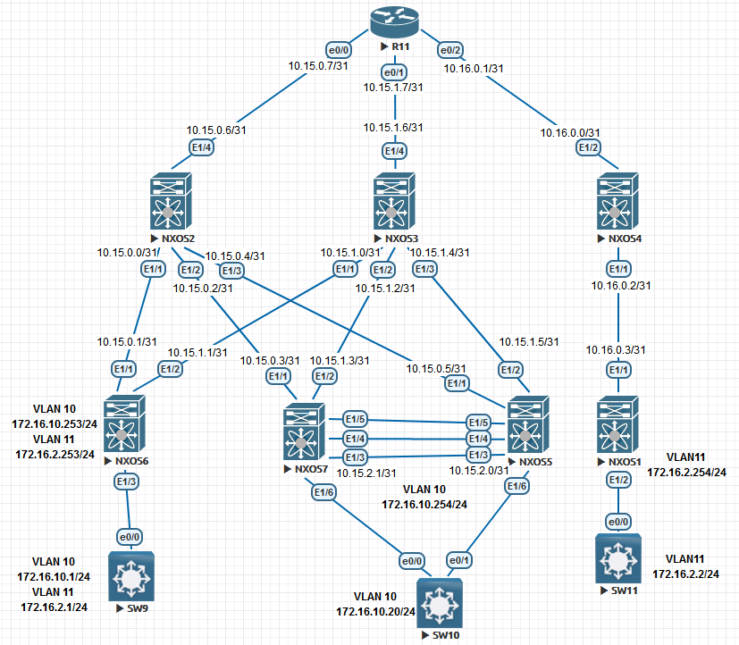
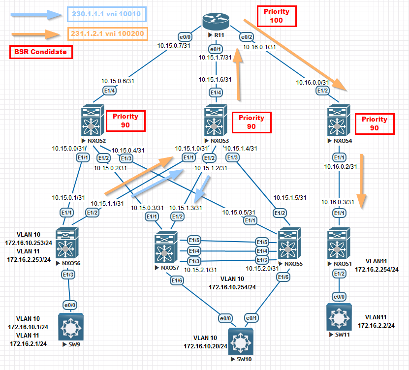

# VxLAN. Миграция Control Plane c Multicast на EVPN

Цель:

Составить план перехода от CP Multicast к EVPN

План работы:

1. Настроить схему сети для VxLAN CP Multicast.
2. Предоставить план перехода на EVPN.
3. Настроить схему сети для VxLAN Multipod.

## Настроить схему сети для VxLAN CP Multicast.

Описание:

На данный момент буду приводить конфигурацию VxLAN через мультикаст, то есть передача информации в сети об определенном VNI будет распространяться через многоадресную рассылку в режиме **sparse mode**. В данном примере мне потребуется решить следующие задачи: кто будет участвовать в качестве RP(и как получить эту информацию), многоадресная IP адресация(чтобы по сети не гуляли одинаковые mac-адреса) и так далее. 

Что не получилось:

Для данной схемы получилось настроить только L2 связь, так как при настройке L3 получил сообщение:

TRM not supported on this platform

А также в образах отсутствует поддержка bfd(команды есть, но самих пакетов нет) 

**Приступим к настройке :**

  
NXOS1

<pre><code>
configure terminal
!
hostname NX1
!
feature bgp
feature pim
feature interface-vlan
feature vn-segment-vlan-based
feature nv overlay
!
no ip domain-lookup
!
fabric forwarding anycast-gateway-mac 0001.0001.0001
!
ip pim log-neighbor-changes
ip pim ssm range 232.0.0.0/8
ip pim bsr listen
vlan 1,11
vlan 11
  vn-segment 100200
!
ip prefix-list LOOPBACK seq 5 permit 1.1.1.1/32 
ip prefix-list LOOPBACK seq 10 permit 10.1.1.1/32 
ip prefix-list P2P seq 5 permit 10.16.0.2/31 
ip prefix-list P2P seq 10 permit 172.16.2.0/31 
route-map BGP-OUT permit 10
  match ip address prefix-list LOOPBACK P2P 
!
interface Vlan11
  no shutdown
  ip address 172.16.2.254/24
  ip pim sparse-mode
  fabric forwarding mode anycast-gateway
!
interface nve1
  no shutdown
  source-interface loopback0
  member vni 100200 mcast-group 231.1.2.1
!
interface Ethernet1/1
  no switchport
  ip address 10.16.0.3/31
  ip pim sparse-mode
  no shutdown
!
interface Ethernet1/2
  switchport mode trunk
!
interface loopback0
  ip address 1.1.1.1/32
  ip address 10.1.1.1/32 secondary
  ip pim sparse-mode
!
cli alias name wr copy running-config startup-config
line console
  exec-timeout 0
line vty
  exec-timeout 0
!
boot nxos bootflash:/nxos.9.2.2.bin 
!
router bgp 64551
  router-id 1.1.1.1
  bestpath as-path multipath-relax
  address-family ipv4 unicast
    redistribute direct route-map BGP-OUT
    maximum-paths 4
  template peer NXOS4
    remote-as 64554
    log-neighbor-changes
    password 3 9125d59c18a9b015
    address-family ipv4 unicast
  neighbor 10.16.0.2
    inherit peer NXOS4
!
end
wr
</code></pre>

 

NXOS2

<pre><code>
configure terminal
hostname NX2
!
feature bgp
feature pim
!
ip pim bsr bsr-candidate loopback1 priority 90
ip pim bsr rp-candidate loopback1 group-list 224.0.0.0/4 priority 90
ip pim log-neighbor-changes
ip pim ssm range 232.0.0.0/8
ip pim bsr forward listen
!
ip prefix-list LOOPBACK seq 5 permit 1.1.1.2/32 
ip prefix-list LOOPBACK seq 10 permit 10.12.10.1/32 
ip prefix-list P2P seq 5 permit 10.15.0.0/31 
ip prefix-list P2P seq 10 permit 10.15.0.2/31 
ip prefix-list P2P seq 15 permit 10.15.0.4/31 
ip prefix-list P2P seq 20 permit 10.15.0.6/31 
route-map BGP-OUT permit 10
  match ip address prefix-list LOOPBACK P2P 
!
interface Ethernet1/1
  no switchport
  ip address 10.15.0.0/31
  ip pim sparse-mode
  no shutdown
!
interface Ethernet1/2
  no switchport
  ip address 10.15.0.2/31
  ip pim sparse-mode
  no shutdown
!
interface Ethernet1/3
  no switchport
  ip address 10.15.0.4/31
  ip pim sparse-mode
  no shutdown
!
interface Ethernet1/4
  no switchport
  ip address 10.15.0.6/31
  ip pim sparse-mode
  no shutdown
!
interface loopback0
  ip address 1.1.1.2/32
  ip pim sparse-mode
!
interface loopback1
  ip address 10.12.10.1/32
  ip pim sparse-mode
!
cli alias name wr copy running-config startup-config
line console
  exec-timeout 0
line vty
  exec-timeout 0
!
boot nxos bootflash:/nxos.9.2.2.bin 
!
router bgp 64552
  router-id 1.1.1.2
  bestpath as-path multipath-relax
  address-family ipv4 unicast
    redistribute direct route-map BGP-OUT
    maximum-paths 4
!
  template peer LEAF_VPC
    remote-as 64555
    log-neighbor-changes
    password 3 9125d59c18a9b015
    address-family ipv4 unicast
!
  template peer NXOS6
    remote-as 64556
    log-neighbor-changes
    password 3 9125d59c18a9b015
    address-family ipv4 unicast
!
  template peer R11
    remote-as 64777
    log-neighbor-changes
    password 3 9125d59c18a9b015
    address-family ipv4 unicast
!
  neighbor 10.15.0.1
    inherit peer NXOS6
  neighbor 10.15.0.3
    inherit peer LEAF_VPC
  neighbor 10.15.0.5
    inherit peer LEAF_VPC
  neighbor 10.15.0.7
    inherit peer R11
end
wr
</code></pre>

  
NXOS3

<pre><code>
configure terminal
hostname NX3
!
nv overlay evpn
feature bgp
feature pim
feature nv overlay
!
no ip domain-lookup
!
ip pim bsr bsr-candidate loopback0 priority 90
ip pim bsr rp-candidate loopback0 group-list 224.0.0.0/4 priority 90
ip pim log-neighbor-changes
ip pim ssm range 232.0.0.0/8
ip pim bsr forward listen
!
ip prefix-list LOOPBACK seq 5 permit 1.1.1.3/32 
ip prefix-list P2P permit 10.15.1.0/31
ip prefix-list P2P permit 10.15.1.2/31 
ip prefix-list P2P permit 10.15.1.4/31 
ip prefix-list P2P permit 10.15.1.6/31 
route-map BGP-OUT permit 10
  match ip address prefix-list LOOPBACK P2P 
!
interface Ethernet1/1
  no switchport
  ip address 10.15.1.0/31
  ip pim sparse-mode
  no shutdown
!
interface Ethernet1/2
  no switchport
  ip address 10.15.1.2/31
  ip pim sparse-mode
  no shutdown
!
interface Ethernet1/3
  no switchport
  ip address 10.15.1.4/31
  ip pim sparse-mode
  no shutdown
!
interface Ethernet1/4
  no switchport
  ip address 10.15.1.6/31
  ip pim sparse-mode
  no shutdown
!
interface loopback0
  ip address 1.1.1.3/32
  ip pim sparse-mode
!
cli alias name wr copy running-config startup-config
line console
  exec-timeout 0
line vty
  exec-timeout 0
!
router bgp 64552
  router-id 1.1.1.3
  bestpath as-path multipath-relax
  address-family ipv4 unicast
    redistribute direct route-map BGP-OUT
    maximum-paths 4
!
  template peer LEAF_VPC
    remote-as 64555
    log-neighbor-changes
    password 3 9125d59c18a9b015
    address-family ipv4 unicast
!
  template peer NXOS6
    remote-as 64556
    log-neighbor-changes
    password 3 9125d59c18a9b015
    address-family ipv4 unicast
!
  template peer R11
    remote-as 64777
    log-neighbor-changes
    password 3 9125d59c18a9b015
    address-family ipv4 unicast
!
  neighbor 10.15.1.1
    inherit peer NXOS6
  neighbor 10.15.1.3
    inherit peer LEAF_VPC
  neighbor 10.15.1.5
    inherit peer LEAF_VPC
  neighbor 10.15.1.7
    inherit peer R11
end
wr
</code></pre>

NXOS4

<pre><code>
configure terminal
hostname NX4
!
feature bgp
feature pim
!
ip pim bsr bsr-candidate loopback0 priority 90
ip pim bsr rp-candidate loopback0 group-list 224.0.0.0/4 priority 90
ip pim log-neighbor-changes
ip pim ssm range 232.0.0.0/8
ip pim bsr forward listen
!
ip prefix-list LOOPBACK seq 5 permit 1.1.1.4/32 
ip prefix-list P2P seq 5 permit 10.16.0.2/31 
ip prefix-list P2P seq 10 permit 10.16.0.0/31 
route-map BGP-OUT permit 10
  match ip address prefix-list LOOPBACK P2P 
!
interface Ethernet1/1
  no switchport
  ip address 10.16.0.2/31
  ip pim sparse-mode
  no shutdown
!
interface Ethernet1/2
  no switchport
  ip address 10.16.0.0/31
  ip pim sparse-mode
  no shutdown
!
interface loopback0
  ip address 1.1.1.4/32
  ip pim sparse-mode
!
cli alias name wr copy running-config startup-config
line console
  exec-timeout 0
line vty
  exec-timeout 0
!
router bgp 64554
  router-id 1.1.1.4
  bestpath as-path multipath-relax
  address-family ipv4 unicast
    redistribute direct route-map BGP-OUT
    maximum-paths 4
!
  template peer NXOS1
    remote-as 64551
    log-neighbor-changes
    password 3 9125d59c18a9b015
    address-family ipv4 unicast
  template peer R11
    remote-as 64777
    log-neighbor-changes
    password 3 9125d59c18a9b015
    address-family ipv4 unicast
  neighbor 10.16.0.1
    inherit peer R11
  neighbor 10.16.0.3
    inherit peer NXOS1
!
end
wr
</code></pre>

NXOS5

<pre><code>
configure terminal
hostname NX5
!
cfs eth distribute
nv overlay evpn
feature bgp
feature pim
feature interface-vlan
feature vn-segment-vlan-based
feature lacp
feature vpc
feature nv overlay
!
fabric forwarding anycast-gateway-mac 0001.0001.0001
ip pim log-neighbor-changes
ip pim ssm range 232.0.0.0/8
ip pim bsr listen
vlan 1,10
vlan 10
  vn-segment 10010
!
ip prefix-list LOOPBACK seq 5 permit 1.1.1.5/32 
ip prefix-list LOOPBACK seq 10 permit 10.1.1.5/32 
ip prefix-list P2P seq 5 permit 10.15.0.4/31 
ip prefix-list P2P seq 10 permit 10.15.1.4/31 
ip prefix-list P2P seq 15 permit 10.15.2.0/31 
!
vrf context VPC
vpc domain 1
  peer-keepalive destination 10.15.2.0 source 10.15.2.1 vrf VPC
!
interface Vlan10
  no shutdown
  ip address 172.16.10.254/24
  ip pim sparse-mode
  fabric forwarding mode anycast-gateway
!
interface port-channel1
  switchport mode trunk
  spanning-tree port type network
  vpc peer-link
!
interface port-channel2
  switchport mode trunk
  vpc 1
!
interface nve1
  no shutdown
  source-interface loopback0
  member vni 10010 mcast-group 230.1.1.1
!
interface Ethernet1/1
  no switchport
  ip address 10.15.0.5/31
  ip pim sparse-mode
  no shutdown
!
interface Ethernet1/2
  no switchport
  ip address 10.15.1.5/31
  ip pim sparse-mode
  no shutdown
!
interface Ethernet1/3
  no switchport
  vrf member VPC
  ip address 10.15.2.1/31
  no shutdown
!
interface Ethernet1/4
  switchport mode trunk
  channel-group 1 mode active
!
interface Ethernet1/5
  switchport mode trunk
  channel-group 1 mode active
!
interface Ethernet1/6
  switchport mode trunk
  spanning-tree bpdufilter enable
  channel-group 2 mode active
!
interface loopback0
  ip address 1.1.1.5/32
  ip address 10.1.1.5/32 secondary
  ip pim sparse-mode
!
cli alias name wr copy running-config startup-config
line console
  exec-timeout 0
line vty
  exec-timeout 0
!
router bgp 64555
  router-id 1.1.1.5
  bestpath as-path multipath-relax
  address-family ipv4 unicast
    redistribute direct route-map BGP-OUT
    maximum-paths 4
!
  template peer SPINE
    remote-as 64552
    log-neighbor-changes
    password 3 9125d59c18a9b015
    address-family ipv4 unicast
!
  neighbor 10.15.0.4
    inherit peer SPINE
  neighbor 10.15.1.4
    inherit peer SPINE
end
wr
</code></pre>

NXOS6

<pre><code>
configure terminal
hostname NX6
!
feature bgp
feature pim
feature interface-vlan
feature vn-segment-vlan-based
feature nv overlay
!
ip pim log-neighbor-changes
ip pim ssm range 232.0.0.0/8
ip pim bsr listen
!
fabric forwarding anycast-gateway-mac 0001.0001.0001
!
vlan 1,10-11
vlan 10
  vn-segment 10010
vlan 11
  vn-segment 100200
!
ip prefix-list LOOPBACK seq 5 permit 1.1.1.6/32 
ip prefix-list LOOPBACK seq 10 permit 10.1.1.6/32 
ip prefix-list P2P seq 5 permit 10.15.0.0/31 
!
route-map BGP-OUT permit 10
  match ip address prefix-list LOOPBACK P2P 
!
interface Vlan10
  no shutdown
  ip address 172.16.10.253/24
  ip pim sparse-mode
  fabric forwarding mode anycast-gateway
!
interface Vlan11
  no shutdown
  ip address 172.16.2.253/24
  ip pim sparse-mode
  fabric forwarding mode anycast-gateway
!
interface nve1
  no shutdown
  source-interface loopback0
  member vni 10010 mcast-group 230.1.1.1
  member vni 100200 mcast-group 231.1.2.1
!
interface Ethernet1/1
  no switchport
  ip address 10.15.0.1/31
  ip pim sparse-mode
  no shutdown
!
interface Ethernet1/2
  no switchport
  ip address 10.15.1.1/31
  ip pim sparse-mode
  no shutdown
!
interface Ethernet1/3
  switchport mode trunk
!
interface loopback0
  ip address 1.1.1.6/32
  ip address 10.1.1.6/32 secondary
  ip pim sparse-mode
!
cli alias name wr copy running-config startup-config
line console
  exec-timeout 0
line vty
  exec-timeout 0
!
boot nxos bootflash:/nxos.9.2.2.bin 
router bgp 64556
  router-id 1.1.1.6
  bestpath as-path multipath-relax
  address-family ipv4 unicast
    redistribute direct route-map BGP-OUT
    maximum-paths 4
!
  template peer SPINE
    remote-as 64552
    log-neighbor-changes
    password 3 9125d59c18a9b015
    address-family ipv4 unicast
!
  neighbor 10.15.0.0
    inherit peer SPINE
  neighbor 10.15.1.0
    inherit peer SPINE
end
wr
</code></pre>

NXOS7

<pre><code>
configure terminal
hostname NX7
!
cfs eth distribute
nv overlay evpn
feature bgp
feature pim
feature interface-vlan
feature vn-segment-vlan-based
feature lacp
feature vpc
feature nv overlay
!
fabric forwarding anycast-gateway-mac 0001.0001.0001
ip pim log-neighbor-changes
ip pim ssm range 232.0.0.0/8
ip pim bsr listen
vlan 1,10
vlan 10
  vn-segment 10010
!
ip prefix-list LOOPBACK seq 5 permit 1.1.1.7/32 
ip prefix-list LOOPBACK seq 10 permit 10.1.1.5/32 
ip prefix-list P2P seq 5 permit 10.15.0.2/31 
route-map BGP-OUT permit 10
  match ip address prefix-list LOOPBACK P2P 
!
vrf context VPC
vpc domain 1
  peer-keepalive destination 10.15.2.1 source 10.15.2.0 vrf VPC
!
interface Vlan10
  no shutdown
  ip address 172.16.10.254/24
  ip pim sparse-mode
  fabric forwarding mode anycast-gateway
!
interface port-channel1
  switchport mode trunk
  spanning-tree port type network
  vpc peer-link
!
interface port-channel2
  switchport mode trunk
  vpc 1
!
interface nve1
  no shutdown
  source-interface loopback0
  member vni 10010 mcast-group 230.1.1.1
!
interface Ethernet1/1
  no switchport
  ip address 10.15.0.3/31
  ip pim sparse-mode
  no shutdown
!
interface Ethernet1/2
  no switchport
  ip address 10.15.1.3/31
  ip pim sparse-mode
  no shutdown
!
interface Ethernet1/3
  no switchport
  vrf member VPC
  ip address 10.15.2.0/31
  no shutdown
!
interface Ethernet1/4
  switchport mode trunk
  channel-group 1 mode active
!
interface Ethernet1/5
  switchport mode trunk
  channel-group 1 mode active
!
interface Ethernet1/6
  switchport mode trunk
  spanning-tree bpdufilter enable
  channel-group 2 mode active
!
interface loopback0
  ip address 1.1.1.7/32
  ip address 10.1.1.5/32 secondary
  ip pim sparse-mode
!
cli alias name wr copy running-config startup-config
line console
  exec-timeout 0
line vty
  exec-timeout 0
!
router bgp 64555
  router-id 1.1.1.7
  bestpath as-path multipath-relax
  address-family ipv4 unicast
    redistribute direct route-map BGP-OUT
    maximum-paths 4
!
  template peer SPINE
    remote-as 64552
    password 3 9125d59c18a9b015
    address-family ipv4 unicast
  neighbor 10.15.0.2
    inherit peer SPINE
  neighbor 10.15.1.2
    inherit peer SPINE
end
wr
</code></pre>

  
R11

<pre><code>
enable
configure terminal
!
hostname R11
!
no ip domain lookup
ip multicast-routing
!
interface Loopback0
 ip address 1.1.1.11 255.255.255.255
 ip pim sparse-mode
!
interface Ethernet0/0
 ip address 10.15.0.7 255.255.255.254
 ip pim sparse-mode
!
interface Ethernet0/1
 ip address 10.15.1.7 255.255.255.254
 ip pim sparse-mode
!
interface Ethernet0/2
 ip address 10.16.0.1 255.255.255.254
 ip pim sparse-mode
!
router bgp 64777
 template peer-session NXOS2
  remote-as 64552
  password 7 070C285F4D06
 exit-peer-session
 !
 template peer-session NXOS3
  remote-as 64552
  password 7 1511021F0725
 exit-peer-session
 !
 template peer-session NXOS4
  remote-as 64554
  password 7 1511021F0725
 exit-peer-session
 !
 bgp log-neighbor-changes
 no bgp default ipv4-unicast
 neighbor 10.15.0.6 inherit peer-session NXOS2
 neighbor 10.15.1.6 inherit peer-session NXOS3
 neighbor 10.16.0.0 inherit peer-session NXOS4
 !
 address-family ipv4
  redistribute connected route-map BGP-OUT
  neighbor 10.15.0.6 activate
  neighbor 10.15.1.6 activate
  neighbor 10.16.0.0 activate
  maximum-paths 4
 exit-address-family
!
ip pim bsr-candidate Loopback0 32 100
ip pim rp-candidate Loopback0 priority 100
!
ip prefix-list LOOPBACK seq 5 permit 1.1.1.11/32
!
ip prefix-list P2P seq 5 permit 10.15.0.6/31
ip prefix-list P2P seq 10 permit 10.15.1.6/31
ip prefix-list P2P seq 15 permit 10.16.0.0/31
!
route-map BGP-OUT permit 10
 match ip address prefix-list LOOPBACK P2P
!
line con 0
 exec-timeout 0 0
!
end
wr
</code></pre>

**Настройка Switch:**

  
SW9

<pre><code>
enable
configure terminal
!
hostname SW9
!
interface Ethernet0/0
 switchport trunk encapsulation dot1q
 switchport mode trunk
 spanning-tree bpdufilter enable
!
interface Vlan10
 ip address 172.16.10.1 255.255.255.0
!
interface Vlan11
 ip address 172.16.2.2 255.255.255.0
!
end
wr
</code></pre>

  
SW10

<pre><code>
enable
configure terminal
!
hostname SW10
!
interface Port-channel1
 switchport trunk encapsulation dot1q
 switchport mode trunk
 spanning-tree bpdufilter enable
!
interface Ethernet0/0
 switchport trunk encapsulation dot1q
 switchport mode trunk
 channel-group 1 mode active
 spanning-tree bpdufilter enable
!
interface Ethernet0/1
 switchport trunk encapsulation dot1q
 switchport mode trunk
 channel-group 1 mode active
 spanning-tree bpdufilter enable
!
interface Vlan10
 ip address 172.16.10.20 255.255.255.0
!
end
wr
</code></pre>

SW11

<pre><code>
enable
configure terminal
!
hostname SW11
!
interface Ethernet0/0
 switchport trunk encapsulation dot1q
 switchport mode trunk
!
interface Vlan11
 ip address 172.16.2.1 255.255.255.0
!
end
wr
</code></pre>

А теперь покажу 2 простроенных туннеля nve и вывод устройств:

NX1

<pre><code>
NX1# show nve peers 
Interface Peer-IP          State LearnType Uptime   Router-Mac       
--------- ---------------  ----- --------- -------- -----------------
nve1      10.1.1.6         Up    DP        02:58:21 n/a     
</code></pre>

NX5-NX7(VPC пара)

<pre><code>
NX5(config-if)# show nve peers 
Interface Peer-IP          State LearnType Uptime   Router-Mac       
--------- ---------------  ----- --------- -------- -----------------
nve1      10.1.1.6         Up    DP        06:01:34 n/a  
</code></pre>

NX6

<pre><code>
NX6(config-if)# end
NX6# show nve peers 
Interface Peer-IP          State LearnType Uptime   Router-Mac       
--------- ---------------  ----- --------- -------- -----------------
nve1      10.1.1.1         Up    DP        02:56:01 n/a              
nve1      10.1.1.5         Up    DP        03:32:54 n/a       
</code></pre>

Чтобы не загромождать проект лишними выводами, вставлю далее картинку с указанием построенного пути:

Multicast на данный момент считается уже устаревшим решением, поэтому главной задачей данного проекта перевести сеть на EVPN

## Предоставить план перехода на EVPN.

- Номера автономных систем останется прежним.
- Номера vni тоже.
- На всех устройствах будет отключаться фича отвечающая за pim.
- Будут убираться все соединения ipv4 unicast и заменяться на l2 evpn.
- Будет строиться сеть Underlay
- Также будет решаться задача по увеличению TTL UPDATE сообщений.
- В интерфейсах nve1 будет явно указываться распространение меток vni через BGP.
- Для построения пиринга, будем явноуказывать указывать route-target в evpn.
- Для более плавного перехода, потребуется заранее подготовить конфигурацию.

## Настройка схемы сети для VxLAN Multipod.

  
NXOS1

<pre><code>
configure terminal
hostname NX1
!
nv overlay evpn
feature ospf
feature bgp
feature interface-vlan
feature vn-segment-vlan-based
feature nv overlay
!
vlan 1,11,98
vlan 11
  vn-segment 100200
vlan 98
  vn-segment 9898
!
interface Vlan11
  no shutdown
  ip address 172.16.2.254/24
!
interface nve1
  no shutdown
  host-reachability protocol bgp
  source-interface loopback0
  member vni 100200
    ingress-replication protocol bgp
!
interface Ethernet1/1
  no switchport
  ip address 10.16.0.3/31
  ip ospf network point-to-point
  no ip ospf passive-interface
  ip router ospf 1 area 0.0.0.1
  no shutdown
!
interface Ethernet1/2
  switchport mode trunk
  spanning-tree bpdufilter enable
!
interface loopback0
  ip address 1.1.1.1/24
  ip address 10.255.255.253/32 secondary
  ip router ospf 1 area 0.0.0.1
!
cli alias name wr copy running-config startup-config
line console
  exec-timeout 0
line vty
  exec-timeout 0
!
router ospf 1
  router-id 1.1.1.1
  passive-interface default
!
router bgp 64551
  template peer SPINE
    update-source loopback0
    ebgp-multihop 5
    address-family l2vpn evpn
      send-community
      send-community extended
  neighbor 1.1.1.4
    inherit peer SPINE
    remote-as 64554
evpn
  vni 100200 l2
    route-target import auto
    route-target import 9898:100200
    route-target export auto
    route-target export 9898:100200
!
end
wr
</code></pre>

 

NXOS2

<pre><code>
configure terminal
hostname NX2
!
nv overlay evpn
feature ospf
feature bgp
feature nv overlay
!
route-map NH_UNCHANGED permit 10
  set ip next-hop unchanged
vrf context management
!
interface Ethernet1/1
  no switchport
  ip address 10.15.0.0/31
  ip ospf authentication-key 3 e7cddfe7d0564e2c
  ip ospf network point-to-point
  no ip ospf passive-interface
  ip router ospf 1 area 0.0.0.0
  no shutdown
!
interface Ethernet1/2
  no switchport
  ip address 10.15.0.2/31
  ip ospf authentication-key 3 e7cddfe7d0564e2c
  ip ospf network point-to-point
  no ip ospf passive-interface
  ip router ospf 1 area 0.0.0.0
  no shutdown
!
interface Ethernet1/3
  no switchport
  ip address 10.15.0.4/31
  ip ospf authentication-key 3 e7cddfe7d0564e2c
  ip ospf network point-to-point
  no ip ospf passive-interface
  ip router ospf 1 area 0.0.0.0
  no shutdown
!
interface Ethernet1/4
  no switchport
  ip address 172.25.20.1/24
  ip ospf authentication-key 3 e7cddfe7d0564e2c
  ip ospf network broadcast
  no ip ospf passive-interface
  ip router ospf 1 area 0.0.0.1
  no shutdown
!
interface loopback0
  ip address 1.1.1.2/24
  ip router ospf 1 area 0.0.0.0
!
cli alias name wr copy running-config startup-config
line console
  exec-timeout 0
line vty
  exec-timeout 0
!
router ospf 1
  router-id 1.1.1.2
  passive-interface default
!
router bgp 64552
  address-family l2vpn evpn
    retain route-target all
  template peer UNIVERSAL
    update-source loopback0
    address-family l2vpn evpn
      send-community
      send-community extended
      route-map NH_UNCHANGED out
  neighbor 1.1.1.4
    inherit peer UNIVERSAL
    remote-as 64554
  neighbor 1.1.1.5
    inherit peer UNIVERSAL
    remote-as 64555
  neighbor 1.1.1.6
    inherit peer UNIVERSAL
    remote-as 64556
  neighbor 1.1.1.7
    inherit peer UNIVERSAL
    remote-as 64555
!
end
wr
</code></pre>

  
NXOS3

<pre><code>
configure terminal
hostname NX3
!
nv overlay evpn
feature ospf
feature bgp
feature nv overlay
!
route-map NH_UNCHANGED permit 10
  set ip next-hop unchanged
!
interface Ethernet1/1
  no switchport
  ip address 10.15.1.0/31
  ip ospf authentication-key 3 e7cddfe7d0564e2c
  ip ospf network point-to-point
  no ip ospf passive-interface
  ip router ospf 1 area 0.0.0.0
  no shutdown
!
interface Ethernet1/2
  no switchport
  ip address 10.15.1.2/31
  ip ospf authentication-key 3 e7cddfe7d0564e2c
  ip ospf network point-to-point
  no ip ospf passive-interface
  ip router ospf 1 area 0.0.0.0
  no shutdown
!
interface Ethernet1/3
  no switchport
  ip address 10.15.1.4/31
  ip ospf authentication-key 3 e7cddfe7d0564e2c
  ip ospf network point-to-point
  no ip ospf passive-interface
  ip router ospf 1 area 0.0.0.0
  no shutdown
!
interface Ethernet1/4
  no switchport
  ip address 172.25.20.2/24
  ip ospf authentication-key 3 e7cddfe7d0564e2c
  ip ospf network broadcast
  no ip ospf passive-interface
  ip router ospf 1 area 0.0.0.1
  no shutdown
!
interface loopback0
  ip address 1.1.1.3/24
  ip router ospf 1 area 0.0.0.0
!
cli alias name wr copy running-config startup-config
line console
  exec-timeout 0
line vty
  exec-timeout 0
!
router ospf 1
  router-id 1.1.1.3
  passive-interface default
!
router bgp 64552
  address-family l2vpn evpn
    retain route-target all
  template peer UNIVERSAL
    update-source loopback0
    address-family l2vpn evpn
      send-community
      send-community extended
      route-map NH_UNCHANGED out
  neighbor 1.1.1.4
    inherit peer UNIVERSAL
    remote-as 64554
  neighbor 1.1.1.5
    inherit peer UNIVERSAL
    remote-as 64555
  neighbor 1.1.1.6
    inherit peer UNIVERSAL
    remote-as 64556
  neighbor 1.1.1.7
    inherit peer UNIVERSAL
    remote-as 64555
!
end
wr
</code></pre>

NXOS4

<pre><code>
configure terminal
hostname NX4
!
nv overlay evpn
feature ospf
feature bgp
feature nv overlay
!
route-map NH_UNCHANGED permit 10
  set ip next-hop unchanged
!
interface Ethernet1/1
  no switchport
  ip address 10.16.0.2/31
  ip ospf network point-to-point
  no ip ospf passive-interface
  ip router ospf 1 area 0.0.0.1
  no shutdown
!
interface Ethernet1/2
  no switchport
  ip address 172.25.20.3/24
  ip ospf authentication-key 3 e7cddfe7d0564e2c
  ip ospf network broadcast
  no ip ospf passive-interface
  ip router ospf 1 area 0.0.0.1
  no shutdown
!
interface loopback0
  ip address 1.1.1.4/24
  ip router ospf 1 area 0.0.0.1
!
cli alias name wr copy running-config startup-config
line console
  exec-timeout 0
line vty
  exec-timeout 0
no feature signature-verification
router ospf 1
  router-id 1.1.1.4
  passive-interface default
router bgp 64554
  address-family l2vpn evpn
    retain route-target all
  template peer UNIVERSAL
    update-source loopback0
    address-family l2vpn evpn
      send-community
      send-community extended
      route-map NH_UNCHANGED out
  neighbor 1.1.1.1
    inherit peer UNIVERSAL
    remote-as 64551
  neighbor 1.1.1.2
    inherit peer UNIVERSAL
    remote-as 64552
  neighbor 1.1.1.3
    inherit peer UNIVERSAL
    remote-as 64552
!
end
wr
</code></pre>

NXOS5

<pre><code>
configure terminal
hostname NX5
!
cfs eth distribute
nv overlay evpn
feature ospf
feature bgp
feature interface-vlan
feature vn-segment-vlan-based
feature lacp
feature vpc
feature nv overlay
!
fabric forwarding anycast-gateway-mac 0001.0001.0001
system vlan nve-overlay id 1
vlan 1,10,88
vlan 10
  vn-segment 10010
vlan 88
  vn-segment 9999
!
vrf context VPC
vpc domain 1
  peer-keepalive destination 10.15.2.0 source 10.15.2.1 vrf VPC
!
interface Vlan10
  no shutdown
  ip address 10.10.10.253/24
  fabric forwarding mode anycast-gateway
!
interface Vlan11
  no shutdown
  ip address 10.10.11.253/24
  fabric forwarding mode anycast-gateway
!
interface port-channel1
  switchport mode trunk
  spanning-tree port type network
  vpc peer-link
!
interface port-channel2
  switchport mode trunk
  vpc 1
!
interface nve1
  no shutdown
  host-reachability protocol bgp
  source-interface loopback0
  member vni 10010
    ingress-replication protocol bgp
!
interface Ethernet1/1
  no switchport
  ip address 10.15.0.5/31
  ip ospf authentication-key 3 e7cddfe7d0564e2c
  ip ospf network point-to-point
  no ip ospf passive-interface
  ip router ospf 1 area 0.0.0.0
  no shutdown
!
interface Ethernet1/2
  no switchport
  ip address 10.15.1.5/31
  ip ospf authentication-key 3 e7cddfe7d0564e2c
  ip ospf network point-to-point
  no ip ospf passive-interface
  ip router ospf 1 area 0.0.0.0
  no shutdown
!
interface Ethernet1/3
  no switchport
  vrf member VPC
  ip address 10.15.2.1/31
  no shutdown
!
interface Ethernet1/4
  switchport mode trunk
  channel-group 1 mode active
!
interface Ethernet1/5
  switchport mode trunk
  channel-group 1 mode active
!
interface Ethernet1/6
  switchport mode trunk
  spanning-tree bpdufilter enable
  channel-group 2 mode active
!
interface loopback0
  ip address 1.1.1.5/24
  ip address 10.255.255.255/32 secondary
  ip router ospf 1 area 0.0.0.0
!
cli alias name wr copy running-config startup-config
line console
  exec-timeout 0
line vty
  exec-timeout 0
!
router ospf 1
  router-id 1.1.1.5
  passive-interface default
!
router bgp 64555
  template peer SPINE
    remote-as 64552
    update-source loopback0
    ebgp-multihop 5
    address-family l2vpn evpn
      send-community
      send-community extended
  neighbor 1.1.1.2
    inherit peer SPINE
  neighbor 1.1.1.3
    inherit peer SPINE
evpn
  vni 10010 l2
    route-target import auto
    route-target import 9999:10010
    route-target export auto
    route-target export 9999:10010
!
end
wr
</code></pre>

NXOS6

<pre><code>
configure terminal
hostname NX6
!
nv overlay evpn
feature ospf
feature bgp
feature interface-vlan
feature vn-segment-vlan-based
feature nv overlay
!
fabric forwarding anycast-gateway-mac 0001.0001.0001
vlan 1,10-11,98-99
vlan 10
  vn-segment 10010
vlan 11
  vn-segment 100200
vlan 98
  vn-segment 9898
vlan 99
  vn-segment 9999
!
interface Vlan10
  no shutdown
  ip address 10.10.10.251/24
  fabric forwarding mode anycast-gateway
!
interface Vlan11
  no shutdown
  ip address 10.10.11.251/24
  fabric forwarding mode anycast-gateway
!
interface nve1
  no shutdown
  host-reachability protocol bgp
  source-interface loopback0
  member vni 10010
    ingress-replication protocol bgp
  member vni 100200
    ingress-replication protocol bgp
!
interface Ethernet1/1
  no switchport
  ip address 10.15.0.1/31
  ip ospf authentication-key 3 e7cddfe7d0564e2c
  ip ospf network point-to-point
  no ip ospf passive-interface
  ip router ospf 1 area 0.0.0.0
  no shutdown
!
interface Ethernet1/2
  no switchport
  ip address 10.15.1.1/31
  ip ospf authentication-key 3 e7cddfe7d0564e2c
  ip ospf network point-to-point
  no ip ospf passive-interface
  ip router ospf 1 area 0.0.0.0
  no shutdown
!
interface Ethernet1/3
  switchport mode trunk
  spanning-tree bpdufilter enable
!
interface loopback0
  ip address 1.1.1.6/24
  ip address 10.255.255.254/32 secondary
  ip router ospf 1 area 0.0.0.0
!
cli alias name wr copy running-config startup-config
line console
  exec-timeout 0
line vty
  exec-timeout 0
!
router ospf 1
  router-id 1.1.1.6
  passive-interface default
!
router bgp 64556
  template peer SPINE
    remote-as 64552
    update-source loopback0
    ebgp-multihop 5
    address-family l2vpn evpn
      send-community
      send-community extended
  neighbor 1.1.1.2
    inherit peer SPINE
  neighbor 1.1.1.3
    inherit peer SPINE
evpn
  vni 10010 l2
    route-target import auto
    route-target import 9999:10010
    route-target export auto
    route-target export 9999:10010
  vni 100200 l2
    route-target import auto
    route-target import 9898:100200
    route-target export auto
    route-target export 9898:100200
!
end
wr
</code></pre>

NXOS7

<pre><code>
configure terminal
hostname NX7
!
cfs eth distribute
nv overlay evpn
feature ospf
feature bgp
feature interface-vlan
feature vn-segment-vlan-based
feature lacp
feature vpc
feature nv overlay
!
fabric forwarding anycast-gateway-mac 0001.0001.0001
vlan 1,10,68,88
vlan 10
  vn-segment 10010
vlan 68
  vn-segment 10068
vlan 88
  vn-segment 9999
!
vrf context VPC
vrf context management
vpc domain 1
  peer-keepalive destination 10.15.2.1 source 10.15.2.0 vrf VPC
!
interface Vlan10
  no shutdown
  ip address 10.10.10.253/24
  fabric forwarding mode anycast-gateway
!
interface Vlan11
  no shutdown
  ip address 10.10.11.253/24
  fabric forwarding mode anycast-gateway
!
interface Vlan68
  no shutdown
  vrf member VXLAN_RT
  ip address 192.168.68.253/24
  fabric forwarding mode anycast-gateway
!
interface Vlan88
  no shutdown
  vrf member VXLAN_RT
  ip forward
!
interface port-channel1
  switchport mode trunk
  spanning-tree port type network
  vpc peer-link
!
interface port-channel2
  switchport mode trunk
  vpc 1
!
interface nve1
  no shutdown
  host-reachability protocol bgp
  source-interface loopback0
  member vni 10010
    ingress-replication protocol bgp
!
interface Ethernet1/1
  no switchport
  ip address 10.15.0.3/31
  ip ospf authentication-key 3 e7cddfe7d0564e2c
  ip ospf network point-to-point
  no ip ospf passive-interface
  ip router ospf 1 area 0.0.0.0
  no shutdown
!
interface Ethernet1/2
  no switchport
  ip address 10.15.1.3/31
  ip ospf authentication-key 3 e7cddfe7d0564e2c
  ip ospf network point-to-point
  no ip ospf passive-interface
  ip router ospf 1 area 0.0.0.0
  no shutdown
!
interface Ethernet1/3
  no switchport
  vrf member VPC
  ip address 10.15.2.0/31
  no shutdown
!
interface Ethernet1/4
  switchport mode trunk
  channel-group 1 mode active
!
interface Ethernet1/5
  switchport mode trunk
  channel-group 1 mode active
!
interface Ethernet1/6
  switchport mode trunk
  spanning-tree bpdufilter enable
  channel-group 2 mode active
!
interface loopback0
  ip address 1.1.1.7/24
  ip address 10.255.255.255/32 secondary
  ip router ospf 1 area 0.0.0.0
!
cli alias name wr copy running-config startup-config
line console
  exec-timeout 0
line vty
  exec-timeout 0
!
router ospf 1
  router-id 1.1.1.7
  passive-interface default
!
router bgp 64555
  template peer SPINE
    remote-as 64552
    update-source loopback0
    ebgp-multihop 5
    address-family l2vpn evpn
      send-community
      send-community extended
  neighbor 1.1.1.2
    inherit peer SPINE
  neighbor 1.1.1.3
    inherit peer SPINE
evpn
  vni 10010 l2
    route-target import auto
    route-target import 9999:10010
    route-target export auto
    route-target export 9999:10010
!
end
wr
</code></pre>

**Настройка Switch:**

  
SW9

<pre><code>
enable
configure terminal
!
hostname SW9
!
vlan 10,11
!
interface Ethernet0/0
 switchport trunk encapsulation dot1q
 switchport mode trunk
 spanning-tree bpdufilter enable
!
interface Ethernet0/1
 switchport access vlan 10
 spanning-tree bpdufilter enable
!
interface Ethernet0/2
 switchport access vlan 11
 spanning-tree bpdufilter enable
!
interface Ethernet0/3
 switchport access vlan 69
 spanning-tree bpdufilter enable
!
interface Vlan10
 ip address 10.10.10.250 255.255.255.0
!
interface Vlan11
 ip address 10.10.11.250 255.255.255.0
!
end
wr
</code></pre>

  
SW10

<pre><code>
enable
configure terminal
!
hostname SW10
!
interface Port-channel1
 switchport trunk encapsulation dot1q
 switchport mode trunk
 spanning-tree bpdufilter enable
!
interface Ethernet0/0
 switchport trunk encapsulation dot1q
 switchport mode trunk
 channel-group 1 mode active
 spanning-tree bpdufilter enable
!
interface Ethernet0/1
 switchport trunk encapsulation dot1q
 switchport mode trunk
 channel-group 1 mode active
 spanning-tree bpdufilter enable
!
interface Ethernet0/2
 switchport access vlan 10
!         
interface Ethernet0/3
 switchport access vlan 11
!
interface Vlan10
 ip address 10.10.10.245 255.255.255.0
!
interface Vlan11
 ip address 10.10.11.245 255.255.255.0
!
end
wr
</code></pre>

SW11

<pre><code>
enable
configure terminal
!
hostname SW11
!
interface Ethernet0/0
 switchport trunk encapsulation dot1q
 switchport mode trunk
 spanning-tree bpdufilter enable
!
interface Ethernet0/3
 switchport access vlan 11
 spanning-tree bpdufilter enable
!
interface Vlan11
 ip address 10.10.11.250 255.255.255.0
!
end
wr
</code></pre>

